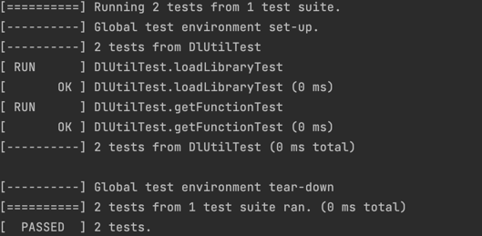

# GTest接入应用指导

### 介绍

本示例主要介绍如何在HarmonyOS NEXT应用中使用GTest测试C++代码。目前鸿蒙没有提供官方C++测试框架，部分Native开发为主的应用可以参考本文接入三方测试框架保证C++代码质量。GTest 是 C++ 测试框架，具有稳定、跨平台、快速等特点，能够为 C++ 开发人员提供有效的单元测试和集成测试工具。GTest 支持 Linux、macOS 和 Windows 操作系统，同时支持 gcc、clang 和 MSVC 等多种编译器和构建系统。GTest 还提供了大量的失败信息，方便开发人员排查问题。


### 测试效果预览




### GTest接入流程说明：

1. 编译GTest
下载好[压缩包](https://github.com/google/googletest/releases/tag/v1.14.0)解压，按照[三方库适配](https://gitee.com/openharmony-sig/tpc_c_cplusplus/tree/master#三方库适配)的内容构建产物，把对应的平台（arm64-v8a）产物放到对应的lib目录下。本文以CMake交叉编译构建为例。

2. 引入头文件和链接库
引入压缩包include下的GTest头文件，可以放在cpp目录下，并将第一步构建好的gtest和gtest_main动态链接库和对应的软链接放到模块下的libs相应目录。

3. 编写测试代码 
这里用[nativesavepictosandbox](../feature/nativesavepictosandbox)的[dl_util.cpp](../feature/nativesavepictosandbox/src/main/cpp/dl_util.cpp)文件为例。
   ```c++
   #include "gtest/ohosTest.h"
   #include "dl_util.h"
   #include <dlfcn.h>
   #include <ostream>
   const char libCurlDownload[256] = "libcurlDownload.so";
   typedef std::string (*DownloadInternetFileFunc)(char *, char *);

   /**
   * TestSuiteName_TestCaseName 的组合应该是唯一的。
   * GTest 生成的类名是带下划线的，所以些名字里不建议有下划线
   * TestSuiteName 用来汇总 test case，相关的 test case 应该是相同的 TestSuiteName。一个文件里只能有一个 TestSuiteName，建议命名为这个文件测试的类名。
   * TestCaseName 是测试用例的名称。建议有意义，比如“被测试的函数名称”，或者被测试的函数名的不同输入的情况。
   */
   TEST(DlUtilTest, loadLibraryTest) {
      void *handler = load_library(libCurlDownload);
      // 判断返回不为空指针
      ASSERT_NE(handler, nullptr);
      dlclose(handler);
   }

   GTEST_API_ int main(int args, char **argv) {
      printf("Running main() from %s\n", __FILE__);
      testing::InitGoogleTest(&args, argv);
      return RUN_ALL_TESTS();
   }
   ```
4. 添加CMakeLists代码
在CMakeLists中添加用于测试的可执行文件编译逻辑。
   ```bash
   # 设置动态链接库位置
   link_directories(${CMAKE_CURRENT_SOURCE_DIR}/../../../libs/${OHOS_ARCH}/)
   # 设置测试文件的检索范围
   set(TEST_SRC_DIR ${CMAKE_CURRENT_SOURCE_DIR}/../../)
   # 获取文件下所有的.cpp后缀的源文件
   file(GLOB_RECURSE TEST_SRC_FILES ${TEST_SRC_DIR}/*.cpp)
   # 测试文件和源文件打到一个可执行测试文件中
   add_executable(util_test ${TEST_SRC_FILES} dl_util.cpp)
   target_link_libraries(util_test PUBLIC gtest gtest_main libace_napi.z.so libcurlDownload.so libhilog_ndk.z.so librawfile.z.so)
   ```
5. 生成可执行文件
点击运行，会自动生成build文件夹，在build/default/intermediates/cmake/default/obj/arm64-v8a/路径下会生成 util_test.exe 可执行测试文件。如果流水线化测试诉求，可以使用SDK文件下的CMake工具（native/build-tools/cmake/bin/cmake）用命令生成可执行文件，命令参考如下。
   ```bash
   # HARMONY_SDK就是是鸿蒙SDK目录
   ${HARMONY_SDK}/native/build-tools/cmake/bin/cmake \
   -DCMAKE_SYSROOT=${HARMONY_SDK}/native/sysroot \
   -DOHOS_STL=c++_static \
   -DCMAKE_TOOLCHAIN_FILE=${HARMONY_SDK}/native/build/cmake/ohos.toolchain.cmake \
   -DOHOS_ARCH=arm64-v8a \
   -DOHOS_PLATFORM=OHOS \
   -DCMAKE_BUILD_TYPE=Debug \
   ```
6. 获取测试结果
执行测试命令，命令参考如下。
   ```bash
   #!/bin/bash
   # 设置默认名称，和CMakelist保持一致
   EXECUTABLE_FILE_NAME=util_test
   # 动态链接库的位置
   LIB_DIR="libs/arm64-v8a"
   # 可执行文件的位置，必须要先生成
   EXE_DIR="build/default/intermediates/cmake/default/obj/arm64-v8a"
   LIB_DIR=$(cd "$LIB_DIR" && pwd)
   EXE_DIR=$(cd "$EXE_DIR" && pwd)
   # 推送动态链接库到设备上
   for file in "$LIB_DIR"/*; do
   if [ -f "$file" ]; then
      echo "推送 $file 到设备..."
      hdc file send "$file" "/data/local/tmp/"
   fi
   done

   # 推送可执行测试文件到设备上
   hdc file send "${EXE_DIR}/${EXECUTABLE_FILE_NAME}" /data/local/tmp/
   # 设置可执行权限
   hdc shell chmod +x /data/local/tmp/${EXECUTABLE_FILE_NAME}
   hdc shell "export LD_LIBRARY_PATH=/data/local/tmp; /data/local/tmp/${EXECUTABLE_FILE_NAME}"  
   ```
### 高性能知识点

**不涉及**

### 工程结构&模块类型

**不涉及**

### 模块依赖
无

### 参考资料
[三方库适配](https://gitee.com/openharmony-sig/tpc_c_cplusplus/tree/master#三方库适配)
[GoogleTest](https://github.com/google/googletest/releases/tag/v1.14.0)