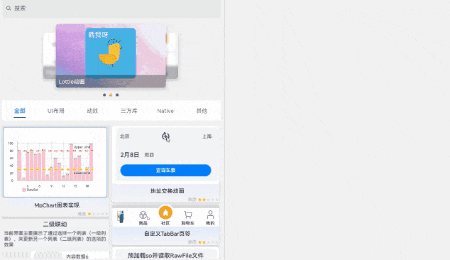

# Navigation实现多设备适配案例

### 介绍

在应用开发时，一个应用需要适配多终端的设备，使用`Navigation`的`mode`属性来实现一套代码，多终端适配。

### 效果图预览



### 使用说明

1. 将程序运行在折叠屏手机或者平板上观看适配效果。

### 实现思路

本例涉及的关键特性和实现方案如下：

#### 1.分屏的使用
首先介绍的是本案例的关键特性`Navigation`的`mode`属性，原先采用的是`NavigationMode.Stack`，导航栏与内容区独立显示，相当于两个页面。
现在采用当设备宽度>=600vp时，采用`Split`模式显示；设备宽度<600vp时，采用`Stack`模式显示。通过display.isFoldable()判断是否设备可折叠，如果可折叠
通过display.on('foldStatusChange')来开启折叠设备折叠状态变化的监听，折叠时是`Stack`模式，半折叠和完全展开时采用`Split`模式。
<br>源码参考[EntryView.ets](../product/entry/src/main/ets/pages/EntryView.ets)

```ts

if (display.isFoldable()) {
   this.regDisplayListener();
} else {
   if (this.screenW >= this.DEVICESIZE) {
     this.navigationMode = NavigationMode.Split;
   } else {
     this.navigationMode = NavigationMode.Stack;
   }
}

/**
* 注册屏幕状态监听
* @returns {void}
*/
regDisplayListener(): void {
   this.changeNavigationMode(display.getFoldStatus());
   display.on('foldStatusChange', async (curFoldStatus: display.FoldStatus) => {
      // 同一个状态重复触发不做处理
      if (this.curFoldStatus === curFoldStatus) {
         return;
      }
      // 缓存当前折叠状态
      this.curFoldStatus = curFoldStatus;
      this.changeNavigationMode(this.curFoldStatus);
   })
}

// 更改NavigationMode
changeNavigationMode(status: number): void {
   if (status === display.FoldStatus.FOLD_STATUS_FOLDED) {
      this.navigationMode = NavigationMode.Stack;
   } else {
      this.navigationMode = NavigationMode.Split;
   }
}
...
Navigation(this.pageStack) { ... }
   .backgroundColor($r('app.color.main_background_color'))
   .hideTitleBar(true)
   .navBarWidth($r('app.string.entry_half_size'))
   .hideNavBar(this.isFullScreen)
   .navDestination(this.pageMap)
   .mode(this.navigationMode)
```


#### 2.模块全屏的使用以及Bug解决
在`EntryView`的`Navigation`中设置`hideNavBar`，其值设置为由`@Provide`装饰器装饰过的变量，默认值为false，作用是为了适配需要全屏的模块。
在对应模块的实现文件声明由`@Consume`装饰器装饰过的变量，更改变量的值就可以实现与后代组件双向同步的通信，从而实时确定是否需要
`hideNavBar`。<br>源码参考:<br>
[MusicPlayerInfoComp.ets](../feature/foldablescreencases/src/main/ets/components/MusicPlayerInfoComp.ets)<br>[EntryView.ets](../product/entry/src/main/ets/pages/EntryView.ets)

```ts
 // EntryView.ets
 ...
 @Provide('isFullScreen') isFullScreen: boolean = false;
 ...
 Navigation(this.pageStack) { ... }
   .backgroundColor($r('app.color.main_background_color'))
   .hideTitleBar(true)
   .navBarWidth($r('app.string.entry_half_size'))
   .hideNavBar(this.isFullScreen)
   .navDestination(this.pageMap)
   .mode(this.navigationMode)
 ...
 
 // FunctionalScenes.ets
  if (this.isNeedClear) {
     DynamicsRouter.clear();
  }
  if (this.listData !== undefined) {
     // 点击瀑布流Item时，根据点击的模块信息，将页面放入路由栈
     DynamicsRouter.push(this.listData.routerInfo, this.listData.param);
  }
 
 // MusicPlayerInfoComp.ets
 ...
 // 通知Navigation组件隐藏导航栏
 @Consume('isFullScreen') isFullScreen: boolean;
 ...
 navigationAnimation(isFullScreen: boolean): void {
    animateTo({
       duration: 200,
       curve: Curve.EaseInOut,
    }, () => {
       this.isFullScreen = isFullScreen;
    })
 }
```

#### 3.主页Navigation弹出路由栈
手机的`Navigation`采用`Stack`模式，手势右滑退出会自动`pop`路由栈，但是采用分栏可以直接点击跳转到下一模块，那么就需要在点击瀑布流的`FlowItem`的时刻`clear`上一个路由栈。<br>源码参考[FunctionalScenes.ets](../feature/functionalscenes/src/main/ets/FunctionalScenes.ets)。

```ts
  @Builder
  methodPoints(listData: SceneModuleInfo) {
     ...
     .onClick(() => {
       // 平板采用点击切换案例，需要pop，手机则不需要，左滑时已pop。
       if (this.isNeedClear) {
          DynamicsRouter.clear();
       }
       if (this.listData !== undefined) {
          // 点击瀑布流Item时，根据点击的模块信息，将页面放入路由栈
          DynamicsRouter.push(this.listData.routerInfo, this.listData.param);
       }
     })
  }
```

### FAQ

#### 1.页面间共享组件实例模块的适配问题
页面间共享组件实例模块中也写了`Navigation`组件，想要展示的效果是`Stack`模式，但是半屏的平板的宽度也大于600，被系统自动认为采用`Split`模式。<br>
页面间共享组件实例模块中还绑定了半模态，并未设置`preferType`(半模态页面的样式)。设备宽度小于600vp时，默认显示底部弹窗样式。
设备宽度在600-840vp间时，默认显示居中弹窗样式。设备宽度大于840vp时，默认显示跟手弹窗样式，跟手弹窗显示在`bindSheet`绑定的节点下方。平板宽度大于840vp，跟手弹窗显示在节点下方导致弹窗不可见。
所以通过设备宽度来设置`preferType`的样式。 <br>源码参考:<br>[ComponentSharedInPages.ets](../feature/componentinstancesharedinpages/src/main/ets/pages/ComponentSharedInPages.ets)<br>
   [TakeTaxiDetailPage.ets](../feature/componentinstancesharedinpages/src/main/ets/pages/TakeTaxiDetailPage.ets)
```ts
  //ComponentSharedInPages.ets
  build() {
    Stack({alignContent: Alignment.Bottom}) {
      ...
      // 应用主页用NavDestination承载，Navigation为空页面直接跳转到MainPage主页面
      Navigation(this.pageStackForComponentSharedPages) {
      }
      ...
      .mode(NavigationMode.Stack)
    }
    ...
  }
  
  
  //TakeTaxiDetailPage.ets
  ...
  aboutToAppear() {
     if (display.isFoldable()) {
        this.regDisplayListener();
     } else {
        if (this.screenW >= this.DEVICESIZE) {
           this.isCenter = true;
        } else {
           this.isCenter = false;
        }
     }
  }
  ...
  build() {
    NavDestination() {
      ...
      // 绑定上半模态页面，用于显示内容
      .bindSheet($$this.isShow, this.taxiContentBuilder(),
        {
          detents: TakeTaxiPageCommonConstants.SHEET_DETENTS,
           preferType: this.isCenter ? SheetType.CENTER : SheetType.POPUP,
          ...
        }
      )
    }
    ...
  }
```

#### 2.底部抽屉滑动效果模块的适配问题
底部抽屉滑动效果模块中写了一个`Image`组件，其资源是一个很大的地图图片，在分栏效果展示时`Image`图片资源会拦截`Navigation`导航栏的点击或者拖拽事件，可以采用`Column`的`clip`属性将超出`Image`的图片裁掉。<br>
源码参考:[Component.ets](../feature/bottomdrawerslidecase/src/main/ets/components/Component.ets)。
```ts
 build() {
   Column() {
     // 背景地图图片
     Image($r('app.media.map'))
       .id("bg_img")
       .height($r('app.integer.number_2000'))
       .width($r('app.integer.number_2000'))
       .translate({ x: this.offsetX, y: this.offsetY })// 以组件左上角为坐标原点进行移动
       .draggable(false) // 单指操作拖动背景地图
    }.width('100%')
    .height('100%')
    .clip(true) // 地图图片超出页面区域时裁剪掉
    ...
 }
```

#### 3.适配挖孔屏模块的适配问题
适配挖孔屏模块`Image`组件采用`ImageFit.Cover`填充图片，导致图片显示不完整，采用`ImageFit.Fill`，虽然图片变扁了，但是能完整显示，不影响具体功能。<br>
   源码参考:[DiggingHoleScreen.ets](../feature/diggingholescreen/src/main/ets/components/mainpage/DiggingHoleScreen.ets)。
```ts
Image($r('app.media.2048game'))
  .objectFit(ImageFit.Fill)
  .width('100%')
  .height('100%')
```

#### 4.左右拖动切换图片模块的适配问题
左右拖动切换图片模块主要功能要实时记录手势拖动的距离，以此来进行计算，所以宽度和高度要写固定数值，不能使用百分比。但是折叠屏手机折叠后会出现超出屏幕的情况，可采用缩小组件宽度的方式适配。<br>
   源码参考:<br>[DragToSwitchPicturesView.ets](../feature/dragtoswitchpictures/src/main/ets/components/view/DragToSwitchPicturesView.ets)<br>
   [Constants.ets](../feature/dragtoswitchpictures/src/main/ets/components/common/Constants.ets)<br>
   [integer.json](../feature/dragtoswitchpictures/src/main/resources/base/element/integer.json)<br>
```ts
// DragToSwitchPicturesView.ets
@State dragRefOffset: number = 0; // 用来记录每次图标拖动的距离
@State imageWidth: number = 160; // 用来记录每次图标拖动完成后左侧Image的width宽度
@State leftImageWidth: number = 160; // 用来记录每次图标拖动时左侧Image的实时width宽度
@State rightImageWidth: number = 160; // 用来记录每次图标拖动时右侧Image的实时width宽度
...
PanGesture({ fingers: CONFIGURATION.PANGESTURE_FINGERS, distance: CONFIGURATION.PANGESTURE_DISTANCE })
  .onActionStart(() => {
    this.dragRefOffset = CONFIGURATION.INIT_VALUE; // 每次拖动开始时将图标拖动的距离初始化。
  })
    // TODO: 性能知识点: 该函数是系统高频回调函数，避免在函数中进行冗余或耗时操作，例如应该减少或避免在函数打印日志，会有较大的性能损耗。
  .onActionUpdate((event: GestureEvent) => {
    // 通过监听GestureEvent事件，实时监听图标拖动距离
    this.dragRefOffset = event.offsetX;
    this.leftImageWidth = this.imageWidth + this.dragRefOffset;
    this.rightImageWidth = CONFIGURATION.IMAGE_FULL_SIZE - this.leftImageWidth;
    if (this.leftImageWidth >= CONFIGURATION.LEFT_IMAGE_RIGHT_LIMIT_SIZE) { // 当leftImageWidth大于等于310vp时，设置左右Image为固定值，实现停止滑动效果。
      this.leftImageWidth = CONFIGURATION.LEFT_IMAGE_RIGHT_LIMIT_SIZE;
      this.rightImageWidth = CONFIGURATION.RIGHT_IMAGE_RIGHT_LIMIT_SIZE;
    } else if (this.leftImageWidth <= CONFIGURATION.LEFT_IMAGE_LEFT_LIMIT_SIZE) { // 当leftImageWidth小于等于30vp时，设置左右Image为固定值，实现停止滑动效果。
      this.leftImageWidth = CONFIGURATION.LEFT_IMAGE_LEFT_LIMIT_SIZE;
      this.rightImageWidth = CONFIGURATION.RIGHT_IMAGE_LEFT_LIMIT_SIZE;
    }
  })
  .onActionEnd((event: GestureEvent) => {
    if (this.leftImageWidth <= CONFIGURATION.LEFT_IMAGE_LEFT_LIMIT_SIZE) {
      this.leftImageWidth = CONFIGURATION.LEFT_IMAGE_LEFT_LIMIT_SIZE;
      this.rightImageWidth = CONFIGURATION.RIGHT_IMAGE_LEFT_LIMIT_SIZE;
      this.imageWidth = CONFIGURATION.LEFT_IMAGE_LEFT_LIMIT_SIZE;
    } else if (this.leftImageWidth >= CONFIGURATION.LEFT_IMAGE_RIGHT_LIMIT_SIZE) {
      this.leftImageWidth = CONFIGURATION.LEFT_IMAGE_RIGHT_LIMIT_SIZE;
      this.rightImageWidth = CONFIGURATION.RIGHT_IMAGE_RIGHT_LIMIT_SIZE;
      this.imageWidth = CONFIGURATION.LEFT_IMAGE_RIGHT_LIMIT_SIZE;
    } else {
      this.leftImageWidth = this.imageWidth + this.dragRefOffset; // 滑动结束时leftImageWidth等于左边原有Width+拖动距离。
      this.rightImageWidth = CONFIGURATION.IMAGE_FULL_SIZE - this.leftImageWidth; // 滑动结束时rightImageWidth等于340-leftImageWidth。
      this.imageWidth = this.leftImageWidth; // 滑动结束时ImageWidth等于leftImageWidth。
    }
  })
     
```

#### 5.图片压缩模块的适配问题
图片压缩模块中`Text`组件的字号在折叠手机屏折叠状态下过大，文本会超出屏幕，可采取缩小字号适配。<br>
   源码参考:[ImageCompression.ets](../feature/imagecompression/src/main/ets/view/ImageCompression.ets)

#### 6.图片缩放模块的适配问题
图片缩放模块中`Image`组件的宽度和高度由窗口的宽度和高度决定。由于屏幕宽度大于600vp要分栏，会导致图片过大。所以要判断是否分栏，若分栏则`windowWidth`的宽度减半。<br>
   源码参考:[ImageContentView.ets](../feature/imageviewer/src/main/ets/view/ImageContentView.ets)
```ts
   ...
   @State windowWidth: number = 0;
   @State windowHeight: number = 0;
   ...
   /**
   * 获取应用主窗口的宽高
   */
  aboutToAppear() {
    window.getLastWindow(getContext(this), (err: BusinessError, data: window.Window) => {
      let rect: window.Rect = data.getWindowProperties().windowRect;
      this.windowWidth = px2vp(rect.width);
      this.windowHeight = px2vp(rect.height);
      if (this.windowWidth > this.componentsWindowWidth) {
        this.windowWidth = this.windowWidth / 2;
      }
      data.on("windowSizeChange", (size: window.Size) => {
        this.windowWidth = px2vp(size.width);
        this.windowHeight = px2vp(size.height);
        if (this.windowWidth > this.componentsWindowWidth) {
          this.windowWidth = this.windowWidth / 2;
        }
      })
    })
  }
  ...
  Image(this.image)
    .width(this.windowWidth * this.imageScale.scaleValue)
    .height(this.windowHeight * this.imageScale.scaleValue)
    ...
    
```

#### 7.元素超出List区域模块的适配问题
元素超出List区域模块中使用`ListitemGroup`组件实现卡片样式，在折叠屏中展开时并未布局满全屏，原因是设置`ListItemGroupStyle.CARD`时，必须配合`ListItem`的`ListItemStyle.CARD`使用。<br>
    源码参考:[AboutMe.ets](../feature/listitemoverflow/src/main/ets/pages/AboutMe.ets)
```ts
ListItemGroup({ style: ListItemGroupStyle.CARD }) {
  ListItem({ style: ListItemStyle.CARD }) {
    ...
  }.height($r("app.integer.itemoverflow_default_item_height"))
  .toastOnClick($r("app.string.listitem_overflow_toast_no_edit"))

  ListItem({ style: ListItemStyle.CARD }) {
    ...
  }.height($r("app.integer.itemoverflow_default_item_height"))
  .toastOnClick($r("app.string.listitem_overflow_toast_no_edit"))
}
.divider({ strokeWidth: 1, color: $r('app.color.aboubtme_pageBcColor') })

ListItemGroup({ style: ListItemGroupStyle.CARD }) {
  ListItem({ style: ListItemStyle.CARD }) {
    ...
  }.height($r("app.integer.itemoverflow_default_item_height"))
  .toastOnClick($r("app.string.listitem_overflow_toast_no_card"))
}
    ...

ListItemGroup({ style: ListItemGroupStyle.CARD }) {
  ListItem({ style: ListItemStyle.CARD }) {
    ...
  .toastOnClick($r("app.string.listitem_overflow_toast_no_favorite"))

  ListItem({ style: ListItemStyle.CARD }) {
    ...
  }.height($r("app.integer.itemoverflow_default_item_height"))
  .toastOnClick($r("app.string.listitem_overflow_toast_no_settings"))

  ListItem({ style: ListItemStyle.CARD }) {
    ...
  }.height($r("app.integer.itemoverflow_default_item_height"))
  .toastOnClick($r("app.string.listitem_overflow_toast_about"))
}
    ...
```

#### 8.听歌识曲水波纹特效模块的适配问题
听歌识曲水波纹特效模块中使用`Column`容器搭配`margin`进行布局，但是在不同设备中就不适配了。可以使用`justifyContent`属性设置子组件在垂直方向上的对齐格式，再搭配`margin`就可适配多种终端。<br>
    源码参考:[WaterRipples.ets](../feature/waterripples/src/main/ets/WaterRipples.ets)
```ts
Column() {
  Text($r('app.string.sound_hound'))
    .fontColor(Color.White)
    .fontSize(18)
    .margin({ top: $r('app.integer.margin_large') })

  ButtonWithWaterRipples({ isListening: this.isListening })

  Text(this.isListening ? $r('app.string.is_listening') : $r('app.string.click_to_listen'))
    .fontColor(Color.White)
    .margin({ bottom: $r('app.integer.margin_large') })
}
.backgroundColor(Color.Black)
.justifyContent(FlexAlign.SpaceBetween)
.width("100%")
.height("100%")
```
#### 9.模块资源命名重名
模块资源重复导致模块显示错误，修改资源命名，最好在新命名前面加上自己的模块名称。

```ts
{
  "name": "navigationparametertransferview_user_name",
  "value": "用户姓名："
}

{
  "name": "aboubtme_pageBcColor",
  "value": "#fff1f3f5"
}

{
  "name": "customsafekeyboard_placeholder",
  "value": "请输入密码"
}
```

### 参考资料

[Navigation](https://developer.huawei.com/consumer/cn/doc/harmonyos-references/ts-basic-components-navigation-0000001815927580)

[clip](https://developer.huawei.com/consumer/cn/doc/harmonyos-references-V5/ts-universal-attributes-sharp-clipping-0000001861966437-V5#ZH-CN_TOPIC_0000001861966437__clip)

[@Provide装饰器和@Consume装饰器：与后代组件双向同步](https://developer.huawei.com/consumer/cn/doc/harmonyos-guides/arkts-provide-and-consume-0000001820879589)

[半模态转场](https://developer.huawei.com/consumer/cn/doc/harmonyos-references/ts-universal-attributes-sheet-transition-0000001862687569)

[Image](https://developer.huawei.com/consumer/cn/doc/harmonyos-references/ts-basic-components-image-0000001815927572)

[Column](https://developer.huawei.com/consumer/cn/doc/harmonyos-references/ts-container-column-0000001862607437)

[ListItemGroup](https://developer.huawei.com/consumer/cn/doc/harmonyos-references/ts-container-listitemgroup-0000001862687653)

