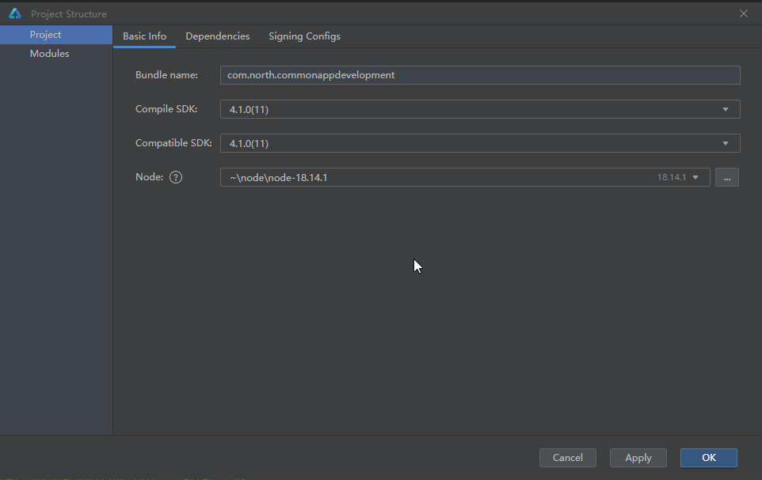
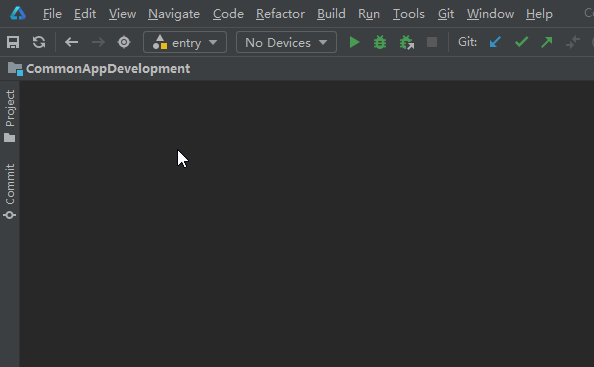

# 定制HAP多目标构建产物

### 介绍

应用厂商会根据不同的部署环境，不同的目标人群，不同的运行环境等，将同一个应用定制为不同的版本，如国内版、国际版、普通版、VIP版、免费版、付费版等。针对以上场景，DevEco Studio支持通过少量的代码差异化配置处理，在编译构建过程中实现一个应用构建出不同的目标产物版本，从而实现源代码、资源文件等的高效复用。 

本案例展示如何将工程打包成不同版本，并单独配置资源文件，实现[定制多目标构建产物](https://developer.huawei.com/consumer/cn/doc/harmonyos-guides-V2/customized-multi-targets-and-products-0000001430013853-V2)功能。

### 实现思路

在了解HarmonyOS应用的多目标构建产物如何定制前，先了解product和target的概念：

* 一个HarmonyOS工程由一个或多个模块组成，工程的构建产物为APP包，APP包用于应用/服务发布上架应用市场。由于不同的业务场景，需要定制不同的应用包，因此引入product概念。一个工程可以定义多个product，每个product对应一个定制化应用包，通过配置可以实现一个工程构建出多个不同的应用包。
* 工程内的每一个Entry/Feature模块，对应的构建产物为HAP，HAP是应用/服务可以独立运行在设备中的形态。由于在不同的业务场景中，同一个模块可能需要定制不同的功能或资源，因此引入target的概念。一个模块可以定义多个target，每个target对应一个定制的HAP，通过配置可以实现一个模块构建出不同的HAP。

#### 1.定义目标产物target

每一个Entry/Feature模块均支持定制不同的target，通过在模块中的build-profile.json5文件中实现差异化定制，当前支持设备类型（deviceType）、源码集（source）、资源（resource）、C++依赖的.so（buildOption）的定制。  

每一个target对应一个定制的HAP，因此，在定制HAP多目标构建产物前，应提前规划好需要定制的target名称。例如，以本工程为例，定义一个默认版和适配tablet版，源码参考：[build_profile.json5](../product/entry/build-profile.json5)。示例如下：

```json5
{
  ...
  "targets": [
    {
      // 默认版target名称。
      "name": "default",
      "runtimeOS": "HarmonyOS",
    },
    {
      // tablet版target名称。
      "name": "tablet_target",
      "runtimeOS": "HarmonyOS",
    }
  ]
}
```

* 注意：本工程使用的是多Har静态共享包，Har模块只有默认配置的default Target，不支持定制其它Target。

#### 2.定义产物的deviceType

每一个target均可以指定支持的设备类型deviceType，也可以不定义。如果不定义，则该target默认支持config.json或module.json5中定义的设备类型。

例如，在上述定义的2个target中，分别定义default默认支持所有设备类型，tablet版本只支持tablet设备。

```json5
{
  ...
  "targets": [
    {
      // 未定义deviceType，默认支持config.json或module.json5中定义的设备类型。
      "name": "default",
      "runtimeOS": "HarmonyOS"
    },
    {
      "name": "tablet_target",
      "runtimeOS": "HarmonyOS",
      "config": {
        "deviceType": [
          // 定义支持的设备类型为tablet，支持的设备类型必须在config.json或module.json5中已经定义。
          "tablet"
        ]
      }
    }
  ]
}
```

在[module.json5](../product/entry/src/main/module.json5)中定义设备类型的示例如下：

```json5
{
  "module": {
    ...
    "deviceTypes": [
      "default",
      "tablet"
    ],
  }
}
```

#### 3.定义产物的source源码集

对于source源码集的定制，Stage模型支持对pages源码目录的page页面进行定制。示例如下：

```json5
{
  "targets": [
    {
      // 会员版target名称
      "name": "tablet_target",
      "runtimeOS": "HarmonyOS",
      "source": {
        // 定义stage模型中tablet版本target的pages源码文件，可根据需求选择区别于默认版本的源码文件。
        "pages": [
          "pages/TabletEntryView"
        ]
      }
    }
  ]
}
```

#### 4.定义产物的resource资源

每个target使用的资源文件可能存在差异，在开发过程中，开发者可以将每个target所使用的资源存放在不同的资源目录下。

本工程为ArkTS工程，仅支持对main目录下的资源文件目录（resource）进行定制。示例如下：

```json5
{
  "targets": [
    {
      "name": "default",
      "runtimeOS": "HarmonyOS",
    },
    {
      // 会员版target名称
      "name": "tablet_target",
      "runtimeOS": "HarmonyOS",
      "resource": {
        // 定义tablet版本使用的资源文件目录，该功能在API 9及以上版本的工程中生效，可根据需求选择区别于默认版本的资源文件。
        "directories": [
          "./src/main/resources"
        ]
      }
    }
  ]
}
```

#### 5.定义目标产物product

APP用于应用/服务上架发布，针对不同的应用场景，可以定制不同的product，每个product中支持对bundleName、签名信息以及包含的target进行定制。  

每一个product对应一个定制的APP包，因此，在定制APP多目标构建产物前，应提前规划好需要定制的product名称。例如定义tablet product包。 源码参考：[build-profile.json5](../build-profile.json5)。示例如下：

```json5
{
  "app": {
    "products": [
      {
        "name": "default",
        "signingConfig": "default",
        "compileSdkVersion": '4.1.0(11)',
        "compatibleSdkVersion": '4.1.0(11)',
        "runtimeOS": "HarmonyOS"
      },
      {
        "name": "tablet_product",
        // 定义tablet版本的包名
        "bundleName": "com.north.commonappdevelopmenttablet",
        // 定义tablet版本的签名文件信息
        "signingConfig": "tablet",
        "compileSdkVersion": '4.1.0(11)',
        "compatibleSdkVersion": '4.1.0(11)',
        "runtimeOS": "HarmonyOS"
      }
    ],
  },
}
```

* 上述示例同时定义了tablet版本的bundleName为`com.north.commonappdevelopmenttablet`，针对每个定义的product，均可以定制不同的bundleName。如果product未定义bundleName，则采用工程默认的bundleName。
* 注意：本案例已实现根据product自动更换bundleName，若需要手动修改bundleName，需要同时修改[entry/hvigorfile.ts](../product/entry/hvigorfile.ts)文件。也可选择手动修改[app.json5](../AppScope/app.json5)示例如下:

```json5
{
  "app": {
    "bundleName": "com.north.commonappdevelopmenttablet",
    ...
  }
}
```

#### 6.定义product的签名配置信息

针对每个定义的product，均可以定制不同的signingConfig签名文件，如果product未定义signingConfig，则构建生成未签名的APP包。

首先需要在签名配置界面或工程的build-profile.json5文件中配置签名信息：



#### 7.定义product中包含的target

开发者可以选择需要将定义的target分别打包到哪一个product中，每个product可以指定一个或多个target，同时每个target也可以打包到不同的product中， 但是同一个module的不同target不能打包到同一个product中。

本工程前面定义了default和tablet两个版本的target，此时需要将不同的target打包到不同的product中,源码参考：[build-profile.json5](../build-profile.json5)。示例如下：

```json5
{
  "modules": [
    {
      "name": "entry",
      "srcPath": "./product/entry",
      "targets": [
        {
          // 将default target 打包到default版本的APP中
          "name": "default",
          "applyToProducts": [
            "default"
          ]
        },
        {
          // 将tablet target 打包到tablet_product版本的APP中
          "name": "tablet_target",
          // 设置该target适用于tablet_product版本的APP
          "applyToProducts": [
            "tablet_product"
          ]
        }
      ]
    }
  ]
}
```

#### 8.构建定义的目标产物

每个target对应一个HAP，每个product对应一个APP包，在编译构建时，如果存在多product或多target时，可以指定编译具体的包。方法如下：



### 参考资料

[定制多目标构建产物](https://developer.huawei.com/consumer/cn/doc/harmonyos-guides-V2/customized-multi-targets-and-products-0000001430013853-V2)