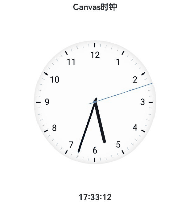

# Canvas实现模拟时钟案例

### 介绍

本示例介绍利用[Canvas](https://developer.huawei.com/consumer/cn/doc/harmonyos-references/ts-components-canvas-canvas-0000001862607477)
和定时器实现模拟时钟场景，该案例多用于用户需要显示自定义模拟时钟的场景。

### 效果图预览




**使用说明**

无需任何操作，进入本案例页面后，所见即模拟时钟的展示。

### 实现思路

本例的的主要实现思路如下：
- 利用CanvasRenderingContext2D中的drawImage将表盘和表针绘制出来；
- 利用定时器每秒刷新一次，计算好时针、分针、秒针对应的偏移量，重新绘制表盘和表针，实现表针的转动。

本例中代码详情可参考[AnalogClock.ets](src/main/ets/pages/AnalogClock.ets)和[TimeChangeListener.ets](src/main/ets/pages/TimeChangeListener.ets)


1.在aboutToAppear中执行init函数，初始化表盘和表针对应的pixelMap，并首次绘制表盘和表针，保证进入页面即展示时钟。

```typescript
// 初始化表盘和表针对应的变量，并首次绘制。
private init() {
  let clockBgSource = image.createImageSource(this.resourceDir + '/' + CLOCK_BG_PATH);
  let hourSource = image.createImageSource(this.resourceDir + '/' + CLOCK_HOUR_PATH);
  let minuteSource = image.createImageSource(this.resourceDir + '/' + CLOCK_MINUTE_PATH);
  let secondSource = image.createImageSource(this.resourceDir + '/' + CLOCK_SECOND_PATH);

  const now = new Date();
  const currentHour = now.getHours();
  const currentMinute = now.getMinutes();
  const currentSecond = now.getSeconds();
  this.time = this.getTime(currentHour, currentMinute, currentSecond);

  // 创建表盘对应的PixelMap并绘制。
  let paintDial = clockBgSource.createPixelMap().then((pixelMap: image.PixelMap) => {
    this.clockPixelMap = pixelMap;
    this.paintDial();
  }).catch((err: BusinessError) => {
    logger.error(`[error]error at clockBgSource.createPixelMap:${err.message}`);
  });

  // 创建时针对应的PixelMap并绘制。
  hourSource.createPixelMap().then(async (pixelMap: image.PixelMap) => {
    await paintDial;
    const hourOffset = currentMinute / 2;
    this.paintPin(ANGLE_PRE_HOUR * currentHour + hourOffset, pixelMap);
    this.hourPixelMap = pixelMap;
  }).catch((err: BusinessError) => {
    logger.error(`[error]error at hourSource.createPixelMap:${err.message}`);
  });

  ...
}
```

2.为表盘和表针的绘制注册监听，每秒钟重新绘制一次，实现时钟的转动。

```typescript
// 2.监听时间变化，每秒重新绘制一次
this.timeListener = new TimeChangeListener(
  (hour: number, minute: number, second: number) => {
    this.renderContext.clearRect(-this.clockRadius, -this.clockRadius, this.canvasSize, this.canvasSize);
    this.paintDial();
    this.timeChanged(hour, minute, second);
    this.time = this.getTime(hour, minute, second);
  },
);
```

3.表针的绘制逻辑也是关键的一部分，因表针的绘制涉及旋转场景，需每次在旋转前先保存当前的绘制状态，旋转绘制结束后再恢复，防止多次旋转导致时间错乱。

```typescript
// 绘制表针
private paintPin(degree: number, pinImgRes: image.PixelMap | null) {
  // TODO：知识点：先将当前绘制上下文保存再旋转画布，先保存旋转前的状态，避免状态混乱。
  this.renderContext.save();
  const angleToRadian = Math.PI / 180;
  let theta = degree * angleToRadian;
  this.renderContext.rotate(theta);
  this.renderContext.beginPath();
  if (pinImgRes) {
    this.renderContext.drawImage(
      pinImgRes,
      -IMAGE_WIDTH / 2,
      -this.clockRadius,
      IMAGE_WIDTH,
      this.canvasSize);
  } else {
    logger.error('PixelMap is null!');
  }
  this.renderContext.restore();
}
```

### 高性能知识点

不涉及

### 工程结构&模块类型

```
analogclock                             // har类型
|---src/main/ets/pages
|   |---AnalogClock.ets                 // 页面及时钟绘制的主要逻辑
|   |---TimeChangeListener.ets          // 时间变化监听文件
```

### 模块依赖

[路由管理模块](../../feature/routermodule)

[utils](../../common/utils)

### 参考资料

[canvas](https://developer.huawei.com/consumer/cn/doc/harmonyos-references/ts-components-canvas-canvas-0000001862607477)

[CanvasRenderingContext2D](https://developer.huawei.com/consumer/cn/doc/harmonyos-references/ts-canvasrenderingcontext2d-0000001815767860)

[image](https://developer.huawei.com/consumer/cn/doc/harmonyos-references/js-apis-image-0000001821001457)