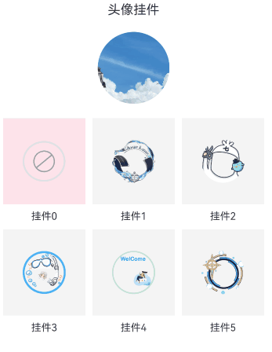

# 图片混合案例

### 介绍

本实例主要通过BlendMode属性来实现挂件和图片的混合，通过更改不同的混合参数，能够展示不同的混合效果。

### 效果图预览

 

**使用说明**：

1. 进入页面，点击挂件区域，进行挂件和图片的混合，点击不同的挂件，展示不同的挂件和混合效果，再次点击取消混合效果以及挂件。

### 实现思路

首先将挂件Image组件绑定BlendMode属性，currentBlendMode控制混合模式更改的变量，初始化为BlendMode.NONE，不进行任何混合操作，
点击挂件区域，切换不同的混合模式达到不同的混合效果。

1. 挂件Image组件绑定BlendMode属性，属性值初始化为BlendMode.NONE。源码参考[BlendModeView.ets](./src/main/ets/view/BlendModeView.ets)。
```typescript
 Image(this.currentUserPendant)
  .width($r('app.integer.blend_mode_image_size'))
  .height($r('app.integer.blend_mode_image_size'))
  .borderRadius($r('app.integer.blend_mode_image_border_radius'))
  .blendMode(this.currentBlendMode, BlendApplyType.OFFSCREEN)
```
2. 点击挂件区域，通过currentBlendMode变量来改变混合模式。源码参考[BlendModeView.ets](./src/main/ets/view/BlendModeView.ets)。
```typescript
if (this.currentBlendMode === item.blendMode) {
  this.currentBlendMode = BlendMode.DST;
  this.currentUserPendant = '';
  this.currentIndex = -1;
  return;
}
// TODO:知识点:点击切换混合模式
this.currentIndex = index;
this.currentUserPendant = item.pendantImage;
this.currentBlendMode = item.blendMode;
 
```

### 高性能知识点

数据通过[LazyForEach](https://developer.huawei.com/consumer/cn/doc/harmonyos-guides-V1/arkts-rendering-control-lazyforeach-0000001580345086-V1)进行遍历。

### 工程结构&模块类型

```
blendmode                                // har类型
|---model
|   |---DataSource.ets                   // 数据资源
|   |---DataType.ets                     // 数据类型
|   |---MockData.ets                     // 模拟数据
|---view
|   |---BlendModeView.ets                // 视图层-应用主页面
```

### 模块依赖

本实例依赖[common模块](../../common/utils)来实现日志的打印、资源 的调用、依赖[动态路由模块](../../feature/routermodule/src/main/ets/router/DynamicsRouter.ets)来实现页面的动态加载。

### 参考资料

[BlendMode](https://developer.huawei.com/consumer/cn/doc/harmonyos-references-V5/ts-universal-attributes-image-effect-0000001881250565-V5#ZH-CN_TOPIC_0000001881250565__blendmode11%E6%9E%9A%E4%B8%BE%E8%AF%B4%E6%98%8E)
