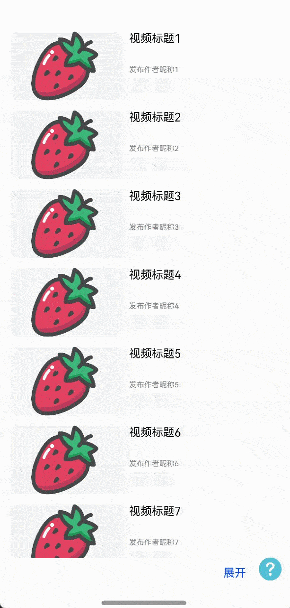

# 底部面板嵌套列表滑动案例

### 介绍

本示例主要介绍了利用panel实现底部面板内嵌套列表，分阶段滑动效果场景。
### 效果图预览



**使用说明**

1. 点击底部“展开”，弹出panel面板。
2. 在panel半展开时，手指向上滑动panel高度充满页面，手指向下滑动panel隐藏。
3. 在panel完全展开时，panel内部列表不处于首项时，panel内列表跟随手指滑动；当列表位于首项，且手指向下滑动时，panel高度减小到半展开。

### 实现思路

本例涉及的关键特性和实现方案如下：

1. 通过mode属性设置panel的不同展开模式，miniHeight属性设置PanelMode.Mini模式的高度，halfHeight属性设置PanelMode.Half高度。通过onChange事件监听panel展开模式的变化，实现根据不同的panel模式来变化panel的高度。

```typescript
Panel(this.show) { 
  // panel内组件内容
}
.miniHeight(MINI_PANEL_HEIGHT) // panel最小高度
.type(PanelType.Foldable)
.mode(this.mode)
.draggable(false) // 关闭拖拽panel
.halfHeight(HALF_PANEL_HEIGHT) // panel一半高度
.onChange((width: number, height: number, mode: PanelMode) => {
  switch (mode) {
    case PanelMode.Full: {
      this.mode = PanelMode.Full;
      this.isOpen = true;
      break;
    }
    case PanelMode.Half: {
      this.mode = PanelMode.Half;
      this.isOpen = false;
      break;
    }
    case PanelMode.Mini: {
      this.show = false;
    }
  }
})
```
2. 通过this.isOpen状态变量，来控制panel中嵌套的列表是否可以滑动。

```typescript
loadMyPanelList() {
  List({ initialIndex: 0, scroller: this.listScroller }) {
    LazyForEach(this.panelList, (item: PanelDataType) => {
      ListItem() {
        panelListItem({ desc: item.desc, include: item.include })
      }
      .width(FULL_SIZE)
    }, (item: PanelDataType) => item.desc)
  }
  ...
  .enabled(this.isOpen)
}

```
3. 通过panel中嵌套的列表的onTouch事件，来控制嵌套的列表在滑动时，panel的展开模式。

```typescript
.onTouch((event?: TouchEvent) => {
  // panel展开时滑动事件
  if (event) {
    switch (event.type) {
      case TouchType.Down: {
        // 记录手机按下屏幕时的纵坐标
        this.yStart = event.touches[0].y;
        break;
      }
      case TouchType.Up: {
        break;
      }
      case TouchType.Move: {
        let yEnd: number = event.touches[0].y;
        // 判断是上滑还是下滑
        if (this.yStart < yEnd) {
          // 下滑
          this.isUp = false;
          // 在手指下滑且panel内列表达到顶部的情况下，panel回到half模式
          if (this.startIndex === 0 && this.isUp === false) {
            this.mode = PanelMode.Half;
          }
          return;
        } else {
          // 上滑
          this.isUp = true;
          return;
        }
      }
    }
  }
})

```

### 高性能知识点

本示例使用了LazyForEach进行数据懒加载，List布局时会根据可视区域按需创建ListItem组件，并在ListItem滑出可视区域外时销毁以降低内存占用。

### 工程结构&模块类型

   ```
   bottompanelsilde                     // har类型
   |---src/main/ets/components
   |   |---Component                    // 自定义组件
   |---src/main/ets/view
   |   |---BottomPanelSilde.ets         // panel嵌套列表滑动界面
   ```

### 模块依赖

- 依赖[路由管理模块](../../feature/routermodule)

### 参考资料

- [panel](https://developer.huawei.com/consumer/cn/doc/harmonyos-references/ts-container-panel-0000001774121290)
- [触摸事件](https://developer.huawei.com/consumer/cn/doc/harmonyos-references/ts-universal-events-touch-0000001774121158)
