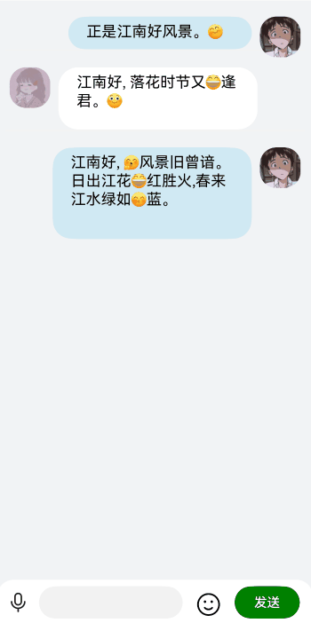

# 表情聊天案例

### 介绍

本示例主要介绍如何在聊天信息中加入表情图片。通过使用CustomDialog创建表情键盘对话框，使用RichEdit接收所选表情的ImageSpan。在发送信息时将图片和文字消息分别通过ImageSpan、Span加入到消息列表中，显示的时候将消息列表中的ImageSpan、Span包裹在Text中进行显示。

### 效果图预览



**使用说明**

1. 进入页面，在底部输入框中输入文字，点击输入框右边的表情图片按钮弹出表情键盘，在表情键盘中选择表情图片后点击发送，在聊天对话框中会显示聊天文字以及表情。

### 实现思路

1. 在CustomDialog中通过Grid创建表情键盘，选中表情图片后，将表情通过imageSpan的方式加到RichEditor输入框中。源码参考[CustomFaceDialog.ets](./src/main/ets/components/CustomFaceDialog.ets)
    ```typescript
      Grid() {
        // TODO: 性能知识点：使用ForEach组件循环渲染数据
        ForEach(EmojiData, (item: EmojiModel) => {
          GridItem() {
            Image(item.imgSrc)
              .width(FaceGridConstants.EMOJI_IMAGE_SIZE)
              .height(FaceGridConstants.EMOJI_IMAGE_SIZE)
              .onClick(() => {
                // TODO 知识点：将表情热键添加到输入框中
                this.controller.addImageSpan(item.imgSrc, {
                  imageStyle: { size: [this.imageSize, this.imageSize], verticalAlign: ImageSpanAlignment.CENTER }
                });
              })
          }
        })
      }
      .maxCount(GRID_MAX_COUNT)
    ```
   
2. 点击发送时，通过RichEditorController的getSpans方法，将聊天信息中ImageSpan、Span分别push到要发送的信息的spanItems中。源码参考[ChatWithExpression.ets的sendChatMsg方法](./src/main/ets/view/ChatWithExpression.ets)
    ```typescript
     let msgBase = new MessageBase(true, USER_NAME_MYSELF, HEAD_IMAGE_MYSELF, this.msgMaxWidth);
    // 获取发送信息
    this.controllerRich.getSpans({
      start: this.start,
      end: this.end
    }).forEach(item => {
      if (typeof (item as RichEditorImageSpanResult)['imageStyle'] !== 'undefined') {
        // TODO 知识点：处理imagespan信息
        const imageMsg: ResourceStr | undefined = (item as RichEditorImageSpanResult).valueResourceStr;
        if (imageMsg !== undefined) {
          const spanItem: SpanItem = new SpanItem(SpanType.IMAGE, '', imageMsg.toString().substring(EMOJI_SRC_POS));
          msgBase.spanItems.push(spanItem);
        }
      } else {
        // TODO 知识点：处理文字span信息
        const textMsg: string = (item as RichEditorTextSpanResult).value;
        const spanItem: SpanItem = new SpanItem(SpanType.TEXT, textMsg, '');
        msgBase.spanItems.push(spanItem);
      }
    })
    logger.info(TAG, 'sendChatMsg spanItems:' + msgBase.spanItems.length.toString());
    // 发送
    if (msgBase.spanItems.length !== 0) {
      this.textDetailData.pushData(msgBase);
      this.msgNums = this.textDetailData.totalCount();
      this.scroller.scrollToIndex(this.msgNums - 1);
      this.controllerRich.deleteSpans();
      this.controllerRich.setCaretOffset(-1);
    }
    this.customFaceDialogCtl.close();
    this.isFaceDlgOpen = false;
    this.marginBottomInput = 0;
    focusControl.requestFocus(this.focusKey);
    ```
   
3. 在聊天对话框中通过LazyForEach循环加载聊天信息。
    ```typescript
       // 聊天对话框
      List({
        scroller: this.scroller,
        initialIndex: this.msgNums - 1
      }) {
        // 性能知识点：使用懒加载组件渲染数据。参考资料：https://developer.huawei.com/consumer/cn/doc/harmonyos-guides/arkts-rendering-control-lazyforeach-0000001820879609
        LazyForEach(this.textDetailData, (msg: MessageBase) => {
          ListItem() {
            if (msg.isSelf) {
              MessageItemSelfView({ msg: msg });
            } else {
              MessageItemView({ msg: msg });
            }
          }
        })
      }
    ```
   
4. 将聊天信息的SpanItems根据spanType在Text中分别包裹为ImageSpan跟Span。
    ```typescript
      // 聊天信息
      Row() {
        Text(undefined) {
          // TODO: 性能知识点：使用ForEach组件循环渲染数据
          ForEach(this.msg.spanItems, (item: SpanItem) => {
            // TODO 知识点：分别使用ImageSpan、Span渲染图片、文字信息
            if (item.spanType === SpanType.IMAGE) {
              ImageSpan($rawfile(item.imgSrc as string))
                .width($r('app.integer.chat_font_size'))
                .height($r('app.integer.chat_font_size'))
                .verticalAlign(ImageSpanAlignment.BOTTOM).objectFit(ImageFit.Cover)
            } else if (item.spanType === SpanType.TEXT) {
              Span(item.text)
            }
          })
        }.constraintSize({
          minHeight: $r('app.integer.chat_inline_height'),
          maxWidth: this.msg.maxWidth
        })
        .textAlign(TextAlign.Start)
      }
    ```

### 高性能知识点

本示例使用了[LazyForEach](https://developer.huawei.com/consumer/cn/doc/harmonyos-guides/arkts-rendering-control-lazyforeach-0000001820879609)进行数据懒加载，同时搭配[组件复用](https://developer.huawei.com/consumer/cn/doc/harmonyos-guides/best-practices-long-list-0000001728333749#section36781044162218)能力以达到性能最优效果。

### 工程结构&模块类型
   ```
   chatwithexpression                            // har类型
   |---view
   |   |---ChatWithExpression.ets               // 视图层-表情聊天界面
   |---constants
   |   |---ChatConstants.ets                    // 常量
   |---model
   |   |---Emoji.ets                            // 表情资源
   |   |---Message.ets                          // 消息结构
   |   |---BasicDataSource.ets                  // 数据类型文件
   |---components
   |   |---CustomFaceDialog.ets                 // 表情键盘
   ```

### 模块依赖

本实例依赖[动态路由模块](../../feature/routermodule)实现页面的动态加载。   
本实例依赖[har包-common库中日志打印模块](../../common/utils/src/main/ets/log/Logger.ets)进行日志打印。 


### 参考资料

[richtext组件](https://developer.huawei.com/consumer/cn/doc/harmonyos-references/ts-basic-components-richtext-0000001815767796)      
[LazyForEach](https://developer.huawei.com/consumer/cn/doc/harmonyos-guides/arkts-rendering-control-lazyforeach-0000001820879609)
