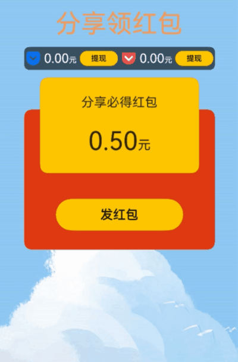

# 全局弹窗封装案例

### 介绍

本示例介绍两种弹窗的封装案例。一种是自定义弹窗封装成自定义组件的方式，使用一句代码即可控制显示；一种是使用子窗口的方式实现弹窗，使用一句代码即可展示。

### 效果预览图



**使用说明**
1. 进入首页会立马弹出一个子窗口弹窗，点×关闭弹窗。
2. 点击“发红包”会展示子窗口方式实现的弹窗。
3. 点击“提现”会显示自定义弹窗。

### 实现思路
自定义弹窗封装成自定义组件的方式
1. 创建自定义弹窗组件。源码参考[CustomDialogView.ets](src/main/ets/components/CustomDialogView.ets)。
```ts
@CustomDialog
export struct CustomDialogView {
  @Link visible: boolean;
  controller: CustomDialogController;
  // 弹窗交互事件参数，点击确认和取消按钮时的回调函数
  onCancel?: () => void;
  onConfirm?: () => void;

  build() {
    Row() {
      Button()
        .onClick(() => {
          this.visible = false;
          this.onCancel?.();
        })
    }
  }
}
```
2. 自定义组件Dialog，对自定义弹窗组件进行二次封装。源码参考[Dialog.ets](src/main/ets/components/Dialog.ets)。
```ts
@Component
export struct Dialog {
  // 监听外部传入的visible变量，visible值发生变化时触发onChange回调函数
  @Watch("onChange") @Link visible: boolean;
  onCancel?: () => void;
  onConfirm?: () => void;
  // 通过CustomDialogController的builder参数绑定弹窗组件CustomDialogView
  private controller = new CustomDialogController({
    builder: CustomDialogView({
      visible: $visible,
      onCancel: this.onCancel,
      onConfirm: this.onConfirm,
    }),
  })

  /**
   * 当visible的值变化时触发回调
   */
  onChange(): void{
    if (this.visible) {
      this.controller.open();
    } else {
      this.controller.close();
    }
  }

  // 二次封装的Dialog组件主要通过控制器控制弹窗，不需要任何界面
  build() {
  }
}
```
3. 使用方导入自定义组件Dialog并传入相应入参。源码参考[CustomDialog.ets](src/main/ets/view/CustomDialog.ets)。
```ts
@Component
export struct CustomDialog {
  // 外部定义visible变量作为弹窗组件入参，控制弹窗显隐
  @State visible: boolean = false;

  build() {
    Column({ space: 20 }) {
      Button()
        // 点击修改visible变量后，visible的值可以被Dialog组件监听并响应
        .onClick(() => this.visible = !this.visible)

      // 通过双向绑定visible变量，实现外部控制弹窗
      Dialog({
        visible: $visible,
      })
    }
  }
}
```
使用子窗口的方式实现弹窗
1. 创建子窗口。源码参考[SubWindowApi.ets](src/main/ets/components/SubWindowApi.ets)。
```ts
  // 创建子窗口
  private createSubWindow(windowStage: window.WindowStage | null) {
    try {
      if (!windowStage) {
        return;
      }
      windowStage.createSubWindow('mySubWindow', (err: BusinessError, data) => {
        if (err.code) {
          console.error("Failed to create the subwindow, Cause: " + JSON.stringify(err));
          return;
        }
      });
    } catch (exception) {
      console.error("Failed to create the window, Cause: " + JSON.stringify(exception));
    }
  }
```
2. 为子窗口单独加载命名路由页面。源码参考[SubWindowApi.ets](src/main/ets/components/SubWindowApi.ets)。
```ts
  // 为当前WindowStage加载命名路由页面
  private loadContent(path: string) {
    if (this.subWindow) {
      // TODO: 知识点: 用loadContentByName为当前窗口加载命名路由页面，通过LocalStorage传递状态属性给加载的页面
      this.subWindow.loadContentByName(path, this.Storage, (err: BusinessError) => {
        if (this.subWindow) {
          try {
            this.subWindow.setWindowBackgroundColor(maskColor);
          } catch (exception) {
            console.error('Failed to set the background color. Cause: ' + JSON.stringify(exception));
          };
        }
        if (err.code) {
          console.error("Failed to load the content. Cause:" + JSON.stringify(err));
          return;
        }
      });
    }
  }
```
3. 展示子窗口。源码参考[SubWindowApi.ets](src/main/ets/components/SubWindowApi.ets)。
```ts
  // 显示当前窗口
  private showSubWindow() {
    if (this.subWindow) {
      this.subWindow.showWindow((err: BusinessError) => {
        if (err.code) {
          console.error('Fail to show window, Cause: ' + JSON.stringify(err));
        }
      })
    }
  }
```
4. 销毁子窗口。源码参考[SubWindowApi.ets](src/main/ets/components/SubWindowApi.ets)。
```ts
  // 销毁当前窗口
  private destroySubWindow() {
    if (this.subWindow) {
      this.subWindow.destroyWindow((err) => {
        if (err.code) {
          console.error('Fail to destroy the window. Cause:' + JSON.stringify(err));
          return;
        }
        this.subWindow = null;
      });
    }
  }
```
### 高性能知识点

不涉及

### 工程结构&模块类型

   ```
   customdialog                                   // har类型
   |---components
   |   |---CustomDialogView.ets                   // 自定义弹窗
   |   |---Dialog.ets                             // 弹窗封装
   |   |---LoadContentWindow.ets                  // 子窗口
   |   |---SubWindowApi.ets                       // 弹窗封装
   |   |---SubWindowFunction.ets                  // 方法调用
   |---view
   |   |---CustomDialog.ets                       // 主页面
   ```

### 模块依赖

本实例依赖common模块来实现[资源](../../common/utils/src/main/resources/base/element)的调用。
依赖[动态路由模块](../../feature/routermodule/src/main/ets/router/DynamicsRouter.ets)来实现页面的动态加载。

### 参考资料

[loadContentByName](https://developer.huawei.com/consumer/cn/doc/harmonyos-references/js-apis-window-0000001820880785#ZH-CN_TOPIC_0000001811317218__loadcontentbyname11-3)

[弹窗组件封装](https://developer.huawei.com/consumer/cn/doc/harmonyos-guides-V5/bpta-ui-component-encapsulation-and-reuse-0000001814743802-V5#section12821174710485)
