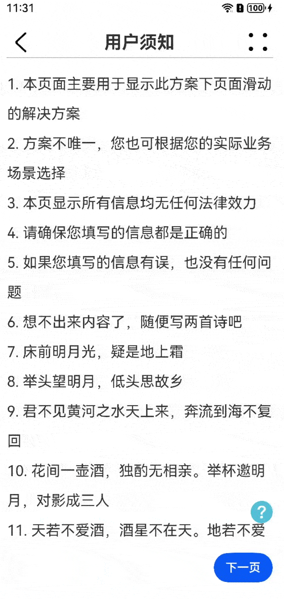

# 自定义Stepper

### 介绍

在许多场景下，我们都需要引导用户按照步骤完成任务，此功能在HarmonyOS Next中可以使用[Stepper](https://developer.huawei.com/consumer/cn/doc/harmonyos-references-V1/ts-basic-components-stepper-0000001580185758-V1)来实现，但是Stepper的定制化能力较弱，开发者无法定制上下页切换按钮的样式、位置，因此本例介绍了如何基于Swiper实现Stepper的能力。

### 效果图预览



**使用说明**

1. 在案例第一页，中间内容区域可以上下滑动。
2. 点击第一页的右下角的“下一页”，会进入到本案例的第二页。
3. 在案例第二页，必须选择一项数据之后才能进入案例第三页。
4. 第三页与第二页类似，必须所有数据填写完整才能提交（仅通过toast模拟）。

### 实现思路

1. 通过Swiper实现按步骤完成任务，各个页面内容由Swiper的Item承载，禁用掉Swiper的滑动切换等功能，仅通过Controller控制Swiper的Item切换；由于HeaderView中的返回/更多按钮在各个页面中是相同的，因此这里将其置于Swiper同级；但是为了便于进行各个页面的数据处理与校验，页面下方的上下页切换功能在Swiper内实现。
```typescript
// TODO 知识点：页面上方的返回/更多按钮在各个页面是一样的，因此这里将其与页面Title一起置于Swiper同级
HeaderView({ titleArray: this.pageTitleArray, currentIndex: this.currentIndex })
// TODO 知识点：页面主体内容由Swiper承载，通过Swiper的Controller来通知页面去前进/后退        
Swiper(this.controller) {
  UserNoticeView()
  CategoryView()
  TableView()
}
.layoutWeight(1)
.duration(0)
.cachedCount(1)
.disableSwipe(true)
.backgroundColor(Color.Transparent)
.index($$this.currentIndex)
.width('100%')
.loop(false)
.autoPlay(false)
.indicator(false)
```

2. 在Swiper的每个Item中，只有在当前Item的数据都已填写时，才能通过`controller.showNext()`切换到Swiper的下一个Item继续操作。源码见[CategoryView.ets](./src/main/ets/view/CategoryView.ets)与[FooterView.ets](./src/main/ets/view/FooterView.ets)。
```typescript
// CategoryView.ets
export struct CategoryView {
  submitInfo: SubmitInfoWrapper | undefined = undefined;

  build() {
    Column() {
      // ...
      FooterView({
        // 各个页面定义自己的数据校验函数，只有当校验通过，返回true时，FooterView中才会通过Controller切换到下一页
        nextCb: () => {
          let verified: boolean = this.submitInfo?.category !== undefined;
          if (!verified) {
            promptAction.showToast({ message: $r("app.string.stepper_info_not_filled") });
          }
          return verified;
        }
      })
    }
  }
}

// FooterView.ets
@Component
export struct FooterView {
  controller: SwiperController | undefined = undefined;
  nextCb: Function | undefined = undefined;

  build() {
    Row() {
      // ...
      Button()
        // 只有没有定义校验函数或者校验通过，才能切换到下一页
        .onClick(() => {
          if (this.nextCb === undefined) {
            this.controller?.showNext();
          } else if (this.nextCb()) {
            this.controller?.showNext();
          }
        })
    }
  }
}
```

3. 每个Item的主体内容由Scroll承载（也可根据实际就情况使用其他方案），与上下页切换功能同级，确认主体内容超出页面后仍可正常显示且不会被上下页切换的按钮所遮挡。源码见[UserNoticeView.ets](./src/main/ets/view/UserNoticeView.ets)。

```typescript
@Component
export struct UserNoticeView {
  noticeItem: number[] = [];

  build() {
    Column() {
      Scroll() {
        Column({ space: this.ITEM_SPACE }) {
          ForEach(this.noticeItem, (_: number, __: number) => {
            Row()
              .height($r("app.integer.stepper_usernotice_item_height"))
              .width(getRandomNumber())
              .backgroundColor($r("sys.color.ohos_id_color_sub_background"))
          })
        }
        .width('100%')
        .alignItems(HorizontalAlign.Start)
      }
      .scrollBar(BarState.Off)
      .layoutWeight(1)
      .width('100%')
      .align(Alignment.Top)

      FooterView()
    }
  }
}
```

### 高性能知识点

不涉及

### 工程结构&模块类型

   ```
   customstepper                        // har类型
   |---common
   |   |---DataModel.ets                // 数据模型
   |   |---Utils.ets                    // 通用基础函数
   |---view
   |   |---CustomStepperView.ets        // 步骤导航器组件——入口
   |   |---HeaderView.ets               // Header组件——页面上方公共部分
   |   |---FooterView.ets               // Footer组件——页面下方前进后退按钮
   |   |---UserNoticeView.ets           // 步骤导航器第一页主体内容
   |   |---CategoryView.ets             // 步骤导航器第二页主体内容
   |   |---TableView.ets                // 步骤导航器第三页主体内容
   ```

### 模块依赖

- [路由管理模块](../../feature/routermodule)

### 参考资料

- [Swiper](https://developer.huawei.com/consumer/cn/doc/harmonyos-references-V1/ts-container-swiper-0000001630306301-V1)
- [layoutWeight](https://developer.huawei.com/consumer/cn/doc/harmonyos-guides-V1/arkts-layout-development-linear-0000001580185246-V1#ZH-CN_TOPIC_0000001714588285__自适应缩放)
- [Stepper](https://developer.huawei.com/consumer/cn/doc/harmonyos-references-V1/ts-basic-components-stepper-0000001580185758-V1)