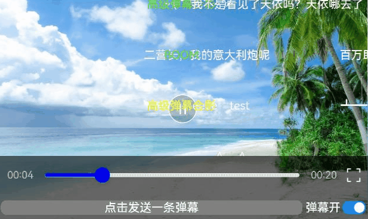

# 视频弹幕功能

### 介绍

本示例介绍如何使用[@ohos.danmakuflamemaster](https://ohpm.openharmony.cn/#/cn/detail/@ohos%2Fdanmakuflamemaster)和[@ohos.gsyvideoplayer](https://ohpm.openharmony.cn/#/cn/detail/@ohos%2Fgsyvideoplayer)开发支持视频弹幕的播放器。可以自定义弹幕样式、占据屏幕宽度，发送弹幕，开关弹幕视图。

### 效果图预览



**使用说明**

1. 点击播放按钮，进行视频播放，弹幕自动开启
2. 点击“弹幕关”按钮，关闭弹幕
3. 点击“发送弹幕”按钮，发送一条弹幕，弹幕内容为“这是一条弹幕”+当前时间戳

### 实现思路


1. 初始化播放器
```typescript
videoInit: (iVideoPlayer: IVideoPlayer, xid: string) => void = (iVideoPlayer: IVideoPlayer, xid: string) => {
  this.mIVideoPlayer = iVideoPlayer;
  this.xComponentId = xid;
  this.mIVideoPlayer.setUp(this.videoModel.getUrl(), this.videoModel.getCacheWithPlay());
}
```
2. 初始化弹幕
```typescript
danmuInit() {
  let maxLinesPair: Map<number, number> = new Map();
  maxLinesPair.set(BaseDanmaku.TYPE_SCROLL_RL, 5); // 滚动弹幕最大显示5行
  // 设置是否禁止重叠
  let overlappingEnablePair: Map<number, boolean> = new Map();
  ...
  this.mContext = DanmakuContext.create();
  //设置弹幕样式
  this.mContext.setDanmakuStyle(DANMAKU_STYLE_STROKEN, 3)
    .setDuplicateMergingEnabled(false)
  ...
  if (this.model != null) {
    this.mParser = this.createParser();
    this.model.setCallback(new Call(that));
    // 设置弹幕点击事件监听
    this.model.setOnDanmakuClickListener(new OnDanMu(that));
    ...
  }
}
```
3. 添加弹幕
```typescript
/*
 * 使用BaseDanmaku类初始化弹幕实例，并设定一系列弹幕的参数值，包括弹幕内容、样式等
 * 添加到提前实例化的弹幕模型model对象上
 */
private addDanmaku(isLive: Boolean) {
  if (this.mContext) {
    let danmaku: BaseDanmaku = this.mContext.mDanmakuFactory.createDanmaku(BaseDanmaku.TYPE_SCROLL_RL);
    danmaku.text = "这是一条弹幕" + SystemClock.uptimeMillis();
    danmaku.padding = 5;
    danmaku.priority = 0; // 可能会被各种过滤器过滤并隐藏显示
    danmaku.isLive = isLive.valueOf();// 是否为在线弹幕
    danmaku.setTime(this.model.getCurrentTime() + 1200);
    if (this.mParser) {
      danmaku.textSize = 25 * (this.mParser.getDisplayer().getDensity() * 0.8);
    }
    danmaku.textColor = 0xffff0000;
    danmaku.textShadowColor = 0xffffffff;
    danmaku.borderColor = 0xff00ff00;
    this.model.addDanmaku(danmaku);
  }
}
```
4. 解析弹幕

```typescript
/*
 * DanmakuParser类中包含了对弹幕数据的解析方法，解析每条弹幕的开始/结束时间、样式、内容等
 */
private createParser(): BaseDanmakuParser {
  let parser: BaseDanmakuParser = new DanmukuParser();
  let jsonSource = new JSONSource(sourceData);
  parser.load(jsonSource);
  return parser;
}
```
5. 本地自定义弹幕数据文件，格式如下
```json
{
  "DanmakuType":4,
  "alphaDuration":0,
  "beginAlpha":0,
  "beginX":0,
  "beginY":0,
  "duration":0,
  "endAlpha":0,
  "endX":0,
  "endY":0,
  "index":1,
  "isQuadraticEaseOut":false,
  "rotationY":0,
  "rotationZ":0,
  "text":"hhhhhhhhh",
  "textColor":-9946501,
  "textShadowColor":-16777216,
  "textSize":25,
  "time":219370,
  "timeOffset":0,
  "translationDuration":0,
  "translationStartDelay":0
}
```
6. 创建video的播放、初始化以及暂停事件的emitter，在对应事件开启监听
```typescript
let videoPlayEvent: emitter.InnerEvent = {
  eventId: 1
};
let videoInitEvent: emitter.InnerEvent = {
  eventId: 2
};
let videoPauseEvent: emitter.InnerEvent = {
  eventId: 3
};
```

### 高性能知识点

不涉及

### 工程结构&模块类型

```
danmakuplayer                          // har类型
|---/src/main/ets/model                        
|   |---DanmakuData.ets                // 数据模型层-列表数据模型 
|   |---DanmakuParser.ets              // 数据模型层-列表项数据模型
|---/src/main/ets/view                        
|   |---VideoView.ets                  // 视图层-场景列表页面
```

### 模块依赖

[@ohos/routermodule(动态路由)](../../feature/routermodule)

### 参考资料

1. 本实例依赖[danmakuflameplayer弹幕三方库](https://ohpm.openharmony.cn/#/cn/detail/@ohos%2Fdanmakuflamemaster)
2. 本实例依赖[GSYVideoPlayer视频播放器库](https://ohpm.openharmony.cn/#/cn/detail/@ohos%2Fgsyvideoplayer)
