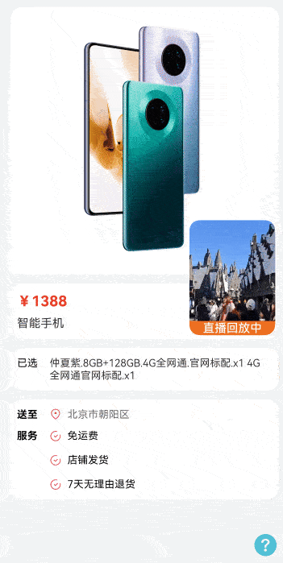

# 悬浮窗拖拽和吸附动画

### 介绍

本示例使用position绝对定位实现应用内悬浮窗，并且通过animateTo结合curves动画曲线实现悬浮窗拖拽跟手和松手吸附边缘的弹性动画效果。

### 效果图预览



**使用说明**

按住悬浮窗可以拖拽，松开后悬浮窗自动靠左或靠右，如果悬浮窗超出内容区上下边界，自动吸附在边界位置。 

### 实现思路

1. 悬浮窗组件使用Stack嵌套video布局，使用属性position绝对定位使组件悬浮。源码参考[FloatWindowMainPage.ets](./src/main/ets/pages/FloatWindowMainPage.ets)

```ts
Stack({ alignContent: Alignment.Bottom }) {
  Video({
    src: $rawfile('float_window_video.mp4'),
    controller: this.videoController
  })
    .controls(false)
    .autoPlay(true)
    .loop(true)
    .muted(true)
    .width($r('app.string.float_window_full_size'))
    .onClick(() => {
      this.videoController.requestFullscreen(true);
    })
    .borderRadius($r('app.integer.float_window_content_border_radius'))
  Text($r('app.string.float_window_live_text'))
    .width($r('app.string.float_window_full_size'))
    .fontSize($r('app.string.ohos_id_text_size_body1'))
    .fontColor($r('app.color.ohos_id_color_background'))
    .textAlign(TextAlign.Center)
    .backgroundColor($r('app.color.ohos_id_color_list_alert'))
    .borderRadius({
      bottomLeft: $r('app.integer.float_window_content_border_radius'),
      bottomRight: $r('app.integer.float_window_content_border_radius')
    })
}
.clip(true)
.border({
  width: $r('app.integer.float_window_border_width'),
  color: $r('app.color.ohos_id_color_background')
})
.borderRadius($r('app.string.ohos_id_corner_radius_default_l'))
.width(Constants.FLOAT_WINDOW_WIDTH)
.height(Constants.FLOAT_WINDOW_HEIGHT)
.backgroundColor($r('app.color.ohos_id_color_foreground'))
.position({ x: this.positionX, y: this.positionY })
.onTouch((event: TouchEvent) => {
  this.onTouchEvent(event);
})
```
2. 在悬浮窗组件的aboutToAppear中获取应用窗口尺寸，使用窗口宽度减去悬浮窗宽度和右边距让悬浮窗初始靠右。源码参考[FloatWindowMainPage.ets](./src/main/ets/pages/FloatWindowMainPage.ets)

```ts
  try {
    const properties = windowClass.getWindowProperties();
    // 获取应用窗口宽高
    this.windowRectWidth = px2vp(properties.windowRect.width);
    this.windowRectHeight = px2vp(properties.windowRect.height)
    // 窗口宽度减去悬浮窗宽度和右边距让悬浮窗初始靠右
    this.positionX = this.windowRectWidth - Constants.FLOAT_WINDOW_WIDTH - Constants.PAGE_PADDING;
  } catch (exception) {
    logger.error(TAG, 'Failed to obtain the window properties. Cause: ' + JSON.stringify(exception));
  }
```
3. 使用getWindowAvoidArea获取顶部状态栏高度和底部导航栏高度。源码参考[FloatWindowMainPage.ets](./src/main/ets/pages/FloatWindowMainPage.ets)

```ts                          
  try {
    const avoidArea = windowClass.getWindowAvoidArea(type);
    // 获取顶部状态栏高度
    this.topRectHeight = px2vp(avoidArea.topRect.height);
    // 获取底部导航栏高度
    this.bottomRectHeight = px2vp(avoidArea.bottomRect.height);
  } catch (exception) {
    logger.error(TAG, 'Failed to obtain the area. Cause:' + JSON.stringify(exception));
  }
```
4. 悬浮窗组件添加onTouchEvent回调，在手指按下时保存触摸点与悬浮窗左上角的偏移量offsetX和offsetY，用于移动时悬浮窗位置的计算。源码参考[FloatWindowMainPage.ets](./src/main/ets/pages/FloatWindowMainPage.ets)

```ts
  case TouchType.Down: {
    this.offsetX = event.touches[0].x;
    this.offsetY = event.touches[0].y;
    break;
  }
```
5. 手指移动时，获取触摸点相对于应用窗口左上角的X和Y坐标，通过计算设置悬浮窗的position坐标实现拖拽，使用默认参数的弹性跟手动画曲线curves.responsiveSpringMotion结合animateTo实现跟手动画效果。源码参考[FloatWindowMainPage.ets](./src/main/ets/pages/FloatWindowMainPage.ets)

```ts
  case TouchType.Move: {
    const windowX: number = event.touches[0].windowX;
    const windowY: number = event.touches[0].windowY;
    // TODO：知识点：跟手动画，推荐使用默认参数的弹性跟手动画曲线curves.responsiveSpringMotion。
    animateTo({ curve: curves.responsiveSpringMotion() }, () => {
      this.positionX = windowX - this.offsetX - Constants.PAGE_PADDING;
      this.positionY = windowY - this.offsetY - this.topRectHeight - Constants.PAGE_PADDING; // 减去手指位置到悬浮窗左上角的y轴偏移和设备顶部状态栏高度
    })
    break;
  }
```

6. 手指抬起时，通过判断悬浮窗中心在水平方向位于窗口中心的左侧或右侧设置悬浮窗靠左或靠右，如果悬浮窗超出内容区上下边界，则将悬浮窗设置在边界位置，使用curves.springMotion弹性动画曲线实现吸附边界时的弹性动画效果。源码参考[FloatWindowMainPage.ets](./src/main/ets/pages/FloatWindowMainPage.ets)

```ts
  case TouchType.Up: {
    // TODO：知识点：通过判断悬浮窗在窗口中的位置，设置悬浮窗贴边，使用curves.springMotion()弹性动画曲线，可以实现阻尼动画效果
    animateTo({ curve: curves.springMotion() }, () => {
      // 判断悬浮窗中心在水平方向是否超过窗口宽度的一半，根据结果设置靠左或靠右
      if (this.positionX > (this.windowRectWidth - Constants.FLOAT_WINDOW_WIDTH) / 2) {
        this.positionX = this.windowRectWidth - Constants.FLOAT_WINDOW_WIDTH - Constants.PAGE_PADDING; // 悬浮窗靠右
      } else {
        this.positionX = Constants.PAGE_PADDING; // 悬浮窗靠左
      }
      // 页面高度
      const pageHeight: number = this.windowRectHeight - this.topRectHeight - this.bottomRectHeight;
      // 判断悬浮窗是否超出内容区上下边界，根据结果将悬浮窗设置在边界位置
      if (this.positionY < Constants.PAGE_PADDING) {
        this.positionY = Constants.PAGE_PADDING;
      } else if (this.positionY > pageHeight - Constants.FLOAT_WINDOW_HEIGHT - Constants.PAGE_PADDING) {
        this.positionY = pageHeight - Constants.FLOAT_WINDOW_HEIGHT - Constants.PAGE_PADDING;
      }
    })
    break;
  }
```

### 高性能知识点

不涉及

### 工程结构&模块类型

   ```
   floatwindow                                  // har类型
   |---/src/main/ets/common                        
   |   |---Constants.ets                        // 常量
   |---/src/main/ets/pages                        
   |   |---FloatWindowMainPage.ets              // 视图层-悬浮窗首页
   ```

### 模块依赖

1. 本实例依赖common模块中的[日志工具类logger](../../common/utils/src/main/ets/log/Logger.ets)。
2. 本示例依赖[动态路由模块](../../feature/routermodule/src/main/ets/router/DynamicsRouter.ets)来实现页面的动态加载。

### 参考资料

[@ohos.window (窗口)](https://developer.huawei.com/consumer/cn/doc/harmonyos-references/js-apis-window-0000001820880785#ZH-CN_TOPIC_0000001820880785__getwindowavoidarea9)

[显式动画 (animateTo)](https://developer.huawei.com/consumer/cn/doc/harmonyos-references/ts-explicit-animation-0000001862687717)

[@ohos.curves (插值计算)](https://developer.huawei.com/consumer/cn/doc/harmonyos-references-V1/js-apis-curve-0000001580185566-V1#ZH-CN_TOPIC_0000001666707716__curvesspringmotion9)