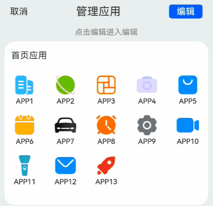

# 网格元素交换案例

### 介绍

直接进行交换和删除元素会给用户带来不好的体验效果，因此需要在此过程中注入一些特色的动画来提升体验效果，本案例通过Grid组件、attributeModifier、以
及animateTo函数实现了拖拽动画和删除动画。

### 效果图预览

 

**使用说明**：

1. 进入页面，点击编辑，长按网格元素，执行拖拽操作，拖拽过程中显示此网格元素，拖拽到一定的位置时，会进行网格元素的位置交换。
2. 编辑模式下，点击网格元素，此元素会被删除。

### 实现思路

本示例主要通过attributeModifier、supportAnimation、animateTo等实现了删除动画以及长按拖拽动画。attributeModifier绑定自定义属性对象，
控制每个网格元素的属性更新。执行删除操作时，通过animateTo去更新offset值以及opacity等属性。supportAnimation设置为true，支持GridItem
拖拽动画，在onItemDragStart开始拖拽网格元素时触发，onItemDragStart可以返回一个@Builder修饰的自定义组件，这样在拖拽的时候，
能够显示目标元素。onItemDrop在网格元素内停止拖拽时触发。此时执行元素位置的切换功能。

1. 声明一个数组，添加自定义属性对象，每个自定义属性对象对应一个网格元素，源码参考[AttributeModifier.ets](./src/main/ets/model/AttributeModifier.ets)和[GridItemDeletionCtrl.ets](./src/main/ets/model/GridItemDeletionCtrl.ets)。
```javascript
 constructor(data: T[]) {
   this.gridData = data;
   data.forEach(() => {
     this.modifier.push(new GridItemModifier());
   })
 }
 /**
 * 声明GridItem动态属性
 */
@Observed
export class GridItemModifier implements AttributeModifier<GridItemAttribute> {
  public offsetX: number = 0;
  public offsetY: number = 0;
  public opacity: number = 1;

  /**
   * 定义组件普通状态时的样式
   * @param instance
   */
  applyNormalAttribute(instance: GridItemAttribute): void {
    instance.translate({ x: this.offsetX, y: this.offsetY });
    instance.opacity(this.opacity);
  }
}
```
2. 绑定attributeModifier属性，attributeModifier属性的值为对应的自定义属性对象。源码参考[GridExchange.ets](./src/main/ets/view/GridExchange.ets)。
```javascript
 GridItem() {
   IconWithNameView({ app: item })
 }
 .onAreaChange((oldValue: Area, newValue: Area) => {
   this.itemAreaWidth = Number(newValue.width);
 })
 .onTouch((event: TouchEvent) => {
   if (event.type === TouchType.Down) {
     this.movedItem = this.appInfoList[index];
   }
 })
 // TODO:知识点:动态绑定属性信息
 .attributeModifier(this.GridItemDeletion.getModifier(item) ? this.GridItemDeletion.getModifier(item) : undefined)
```

3. 编辑模式下点击网格元素，执行删除操作，删除过程中使用animateTo来更新元素的偏移量并实现动画效果。源码参考[GridItemDeletionCtrl.ets](./src/main/ets/model/GridItemDeletionCtrl.ets)。

```javascript
 deleteGridItem(item: T, itemAreaWidth: number): void {
   const index: number = this.gridData.indexOf(item);
   // 最后一条数据不执行偏移
   if (index === this.gridData.length - 1) {
     this.gridData.splice(index, 1);
     this.modifier.splice(index, 1);
     return;
   }
   // TODO:知识点:实现删除动画。先让目标元素的opacity为0，不可视，直接删除目标元素会导致偏移的时候位置异常，接着遍历元素的属性对象，修改偏移量。
   this.modifier[index].opacity = 0;
   animateTo({
     curve: Curve.Friction, duration: ANIMATION_DURATION, onFinish: () => {
       // 初始化偏移位置
       this.modifier.forEach((item) => {
         item.offsetX = 0;
         item.offsetY = 0;
       })
       // 删除对应的数据
       this.gridData.splice(index, 1);
       this.modifier.splice(index, 1);
       this.status = DeletionStatus.FINISH;
     }
   }, () => {
     this.modifier.forEach((item: GridItemModifier, ind: number) => {
       if (ind > index && ind % COLUMN_COUNT !== 0) {
         item.offsetX = -itemAreaWidth;
       } else if (ind > index && ind % COLUMN_COUNT === 0) {
         item.offsetX = itemAreaWidth * 4; // 位置偏移到上一行的最后一列，因此偏移4个gridItem所占的宽度
         item.offsetY = -GRID_ITEM_HEIGHT;
       }
     })
     this.status = DeletionStatus.START;
   })
 }
```
4. 交换网格元素，onItemDragStart以及onItemDrop来完成元素的交换功能，supportAnimation设置为true，支持在拖拽时显示动画效果。onItemDragStart函数中
返回目标自定义组件，可以在拖拽过程中显示。onItemDrop函数执行最后网格元素的交换。 源码参考[GridExchange.ets](./src/main/ets/view/GridExchange.ets)。
```javascript
 .supportAnimation(true)
 .editMode(this.isEdit)
 .onItemDragStart((event: ItemDragInfo, itemIndex: number) => {
   // TODO:知识点:在onItemDragStart函数返回自定义组件，可在拖拽过程中显示此自定义组件。
   return this.pixelMapBuilder();
 })
 .onItemDrop((event: ItemDragInfo, itemIndex: number, insertIndex: number, isSuccess: boolean) => {
   // TODO:知识点:执行gridItem切换操作
   if (isSuccess && insertIndex < this.appInfoList.length) {
     this.changeIndex(itemIndex, insertIndex);
   }
 })
```
### 高性能知识点
* 动态加载数据场景可以使用[LazyForEach](https://developer.harmonyos.com/cn/docs/documentation/doc-guides-V3/arkts-rendering-control-lazyforeach-0000001524417213-V3)遍历数据。
* [onAreaChange](https://developer.huawei.com/consumer/cn/doc/harmonyos-references-V2/ts-universal-component-area-change-event-0000001478061665-V2)
在区域发生大小变化的时候会进行调用，由于删除操作或者网格元素的交互都能够触发区域函数的使用，操作频繁，
建议此处减少日志的打印、复用函数逻辑来降低性能的内耗。
* [onTouch](https://developer.huawei.com/consumer/cn/doc/harmonyos-references-V2/ts-universal-events-touch-0000001427902424-V2)
在进行手势操作的时候会进行多次调用，建议此处减少日志的打印、复用函数逻辑来降低性能的内耗。

### 工程结构&模块类型

```
gridexchange                                 // har类型
|---model
|   |---AppInfo.ets                          // App信息
|   |---AttributeModifier.ets                // 属性对象
|   |---GridItemDeletionCtrl.ets             // 列表项交换
|   |---MockData.ets                         // 模拟数据
|---view
|   |---GridExchange.ets                     // 视图层-应用主页面
```

### 模块依赖

本实例依赖[common模块](../../common/utils)来实现日志的打印、资源 的调用、依赖[动态路由模块](../../feature/routermodule/src/main/ets/router/DynamicsRouter.ets)来实现页面的动态加载。

### 参考资料

[Grid](https://developer.huawei.com/consumer/cn/doc/harmonyos-references-V2/ts-container-grid-0000001478341161-V2)

[animateTo](https://developer.huawei.com/consumer/cn/doc/harmonyos-references-V2/ts-explicit-animation-0000001478341181-V2)

[attributeModifier](https://docs.openharmony.cn/pages/v4.1/zh-cn/application-dev/reference/apis-arkui/arkui-ts/ts-universal-attributes-attribute-modifier.mdhttps://docs.openharmony.cn/pages/v4.1/zh-cn/application-dev/reference/apis-arkui/arkui-ts/ts-universal-attributes-attribute-modifier.md)