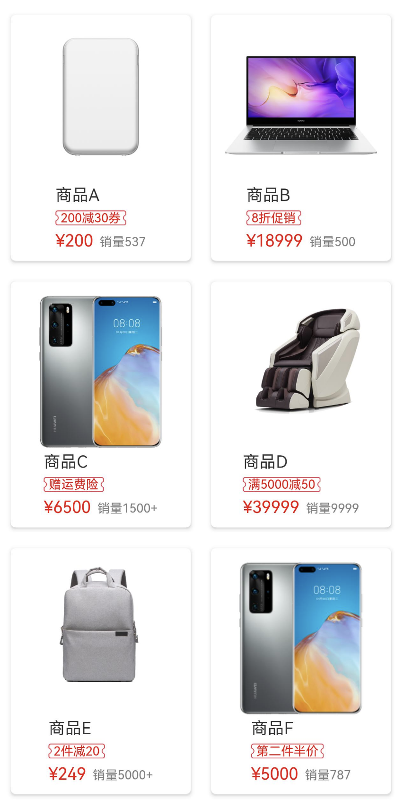

# 边框或背景图片拉伸案例

### 介绍

HarmonyOS上不支持.9资源文件进行安全拉伸。
作为替代方案，本案例中商城页面的促销标签边框使用同一张图片资源，通过设置图片的resizable属性，展示不同长度的促销标签效果。

### 效果图预览



**使用说明**

1. 打开案例即可直接查看效果。
2. 每一个商品的促销标签都使用同一张本地资源图片，不同长度的文案对应不同的图片拉伸比例。

### 实现思路

1. 通过设置图片组件的[resizable](https://developer.huawei.com/consumer/cn/doc/harmonyos-references-V5/ts-basic-components-image-0000001834691318-V5#ZH-CN_TOPIC_0000001834691318__resizable11)属性实现图片的安全拉伸。
```typescript
Image($r('app.media.ninepatchimage_border'))
  .width(this.discountTextWidth)
  .height(this.discountTextHeight)
    // TODO: 知识点：通过设置图片组件的resizable属性，设置顶部、右侧、底部、左侧的距离，使其边缘部分在图片拉伸时不会发生变化，仅图片中央区域被拉伸
  .resizable({
    slice: {
      top: $r('app.integer.ninepatchimage_product_discount_image_resizable_top'),
      right: $r('app.integer.ninepatchimage_product_discount_image_resizable_right'),
      bottom: $r('app.integer.ninepatchimage_product_discount_image_resizable_bottom'),
      left: $r('app.integer.ninepatchimage_product_discount_image_resizable_left')
    }
  })
```
源码请参考[ProductItemComp.ets](./src/main/ets/components/ProductItemComp.ets)

2. 依赖onAreaChange事件，观察促销标签文案所在Text组件的宽高变化，通过状态绑定的形式，动态修改促销标签边框底图的宽高。
```typescript
Text(discount)
  .fontSize($r('app.integer.ninepatchimage_product_discount_font_size'))
  .fontColor(Color.Red)
    // TODO: 知识点：通过监听文本组件的宽高，以及状态变量，动态设置背景图片的宽高
  .onAreaChange((oldValue: Area, newValue: Area) => {
    this.discountTextWidth = newValue.width;
    this.discountTextHeight = newValue.height;
  })
  .padding({
    left: $r('app.integer.ninepatchimage_product_discount_padding'),
    right: $r('app.integer.ninepatchimage_product_discount_padding')
  })
```
源码请参考[ProductItemComp.ets](./src/main/ets/components/ProductItemComp.ets)

### 高性能知识点

1. WaterFlow组件下使用LazyForEach、组件复用，从而提升瀑布流列表首次渲染和滚动时的性能。
```typescript
WaterFlow() {
  LazyForEach(this.productsDataSource, (item: Product) => {
    FlowItem() {
      // TODO:性能知识点：使用@Reusable修饰可复用的组件，并通过设置reuseId提供瀑布流滑动场景中的组件复用能力
      ProductItemComp({
        product: item
      })
        .reuseId(item.type)
    }
    .width('100%')
  })
}
```

```typescript
@Reusable
@Component
export struct ProductItemComp {
  ...
}
```

2. 通过onAreaChange事件监听文本组件宽高的变化，设置背景图片的宽高，然而onAreaChange为系统高频回调，每一帧都会执行，应避免在其中进行冗余和耗时的操作。
```typescript
Text(discount)
    .fontSize($r('app.integer.imageresizable_product_discount_font_size'))
    .fontColor(Color.Red)
    // TODO: 知识点：通过监听文本组件的宽高，以及状态变量，动态设置背景图片的宽高
    // TODO: 性能知识点：onAreaChange为系统高频回调，每一帧都会执行，应避免在其中进行冗余和耗时的操作
    .onAreaChange((oldValue: Area, newValue: Area) => {
      this.discountTextWidth = newValue.width;
      this.discountTextHeight = newValue.height;
    })
```

### 工程结构&模块类型

```
ninepatchimage                       // har类型
|---common
|   |---constants
|   |    |---CommonConstants.ets     // 通用常量
|---components
|   |---ProductItemComp.ets          // 自定义组件-商品简易信息
|---model
|   |---ProductModel.ets             // 模型层-商品数据模型
|---pages
|   |---ProductWaterFlowPage.ets     // 展示层-商品瀑布流页面
```

### 模块依赖

- [路由模块](../routermodule)

### 参考资料

- [Image组件resizable属性](https://developer.huawei.com/consumer/cn/doc/harmonyos-references-V5/ts-basic-components-image-0000001834691318-V5#ZH-CN_TOPIC_0000001834691318__resizable11)
- [高性能指导](https://gitee.com/circlezlo/cases/tree/master/docs/performance)