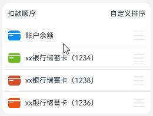

# 列表项交换案例

### 介绍

本案例通过List组件、组合手势GestureGroup、swipeAction属性以及attributeModifier属性等实现了列表项的交换和删除。

### 效果图预览

 

**使用说明**：

1. 进入页面，长按列表项，执行拖拽操作，当拖拽长度大于列表项所占高度一半的时候，列表项进行交换。
2. 列表项左滑，显示删除按钮，点击删除按钮，此列表项被删除。

### 实现思路

首先创建一个数组modifier来添加自定义属性对象，根据组合手势GestureGroup来控制自定义属性的值并通过attributeModifier绑定自定义属性对象来动态加载属性。
然后通过swipeAction属性绑定删除组件，左滑显示此删除组件，点击实现列表项的删除。
1. 声明一个数组，添加自定义属性对象，每个自定义属性对象对应一个列表项，源码参考[AttributeModifier.ets](./src/main/ets/model/AttributeModifier.ets)和[ListExchangeCtrl.ets](./src/main/ets/model/ListExchangeCtrl.ets)。
```
 constructor(deductionData: Array<T>) {
   this.deductionData = deductionData;
   this.modifier = new Array<ListItemModifier>();
   deductionData.forEach(() => {
     this.modifier.push(new ListItemModifier());
   })
 }
 /**
  * 通过实现AttributeModifier接口，自定义属性修改器
  * 将拖拽排序相关样式封装成属性修改器，可以方便移植
  */
 export class ListItemModifier implements AttributeModifier<ListItemAttribute> {
  public hasShadow: boolean = false;
  public isDeleted: boolean = false;
  public scale: number = 1;
  public offsetY: number = 0;
  public offsetX: number = 0;
  public opacity: number = 1;
  public static instance: ListItemModifier | null = null;

  public static getInstance(): ListItemModifier {
    if (!ListItemModifier.instance) {
      ListItemModifier.instance = new ListItemModifier();
    }
    return ListItemModifier.instance;
  }

  /**
   * 定义组件普通状态时的样式
   * @param instance
   */
  applyNormalAttribute(instance: ListItemAttribute): void {
    if (this.hasShadow) {
      instance.shadow({ radius: $r('app.integer.list_exchange_shadow_radius'), color: $r('app.color.box_shadow') });
      instance.zIndex(1);
      instance.opacity(0.5);
    } else {
      instance.opacity(this.opacity);
    }
    instance.translate({ x: this.offsetX, y: this.offsetY });
    instance.scale({ x: this.scale, y: this.scale });
  }
}
```
2. 绑定attributeModifier属性以及组合手势GestureGroup，attributeModifier属性的值为对应的自定义属性对象。源码参考[ListExchangeView.ets](./src/main/ets/view/ListExchangeView.ets)。
```typescript
// 列表区域
List() {
  ForEach(this.appInfoList, (item: ListInfo) => {
    ListItem() {
      DeductionView({ listItemInfo: item })
    }
    .zIndex(this.currentData === item ? 2 : 1) // 层级属性
    .swipeAction({ end: this.deleteBuilder(item) }) // 用于设置ListItem的划出组件
    .transition(TransitionEffect.OPACITY)
    .attributeModifier(this.listExchangeCtrl.getModifier(item)) //动态设置组件的属性方法， 参数为属性修改器
    .gesture(
      // 以下组合手势为顺序识别，当长按手势事件未正常触发时，则不会出发拖动手势事件
      GestureGroup(GestureMode.Sequence,
        // 长按
        LongPressGesture()
          .onAction((event: GestureEvent) => {
            this.currentData = item;
            this.isLongPress = true;
            this.listExchangeCtrl.onLongPress(item);
          }),
        // 拖动
        PanGesture()
          .onActionUpdate((event: GestureEvent) => {
            this.listExchangeCtrl.onMove(item, event.offsetY);
          })
          .onActionEnd((event: GestureEvent) => {
            this.listExchangeCtrl.onDrop(item);
          })
      ).onCancel(() => {
        if (!this.isLongPress) {
          return;
        }
        this.listExchangeCtrl.onDrop(item);
      })
    )
  }, (item: ListInfo) => JSON.stringify(item))
}
.divider({ strokeWidth: '1px', color: 0xeaf0ef })
.scrollBar(BarState.Off)
.border({
  radius: { 
    bottomLeft: $r('app.string.ohos_id_corner_radius_default_l'),
    bottomRight: $r('app.string.ohos_id_corner_radius_default_l')
  }
})
.backgroundColor(Color.White)
.width('100%')
 
```

3. 长按列表项，通过LongPressGesture识别长按手势，执行onLongPress函数方法更改此列表项的scale、shadow、zIndex和opacity等属性，并通过animateTo来实现动画效果，源码参考[ListExchangeCtrl.ets](./src/main/ets/model/ListExchangeCtrl.ets)。

```
 onLongPress(item: T) {
   const index: number = this.deductionData.indexOf(item);
   this.dragRefOffset = 0;
   // TODO:知识点:长按当前列表项透明度和放大动画
   animateTo({ curve: Curve.Friction, duration: ANIMATE_DURATION }, () => {
     this.state = OperationStatus.PRESSING;
     this.modifier[index].hasShadow = true;
     this.modifier[index].scale = 1.04; // 放大比例为1.04
   })
 }
```
4. 交换列表项，通过PanGesture手势的onActionUpdate方法监听拖动的纵轴移动长度，然后执行onMove方法，根据移动长度的大小来判断是否执行列表项交换方法changeItem，源码参考[ListExchangeCtrl.ets](./src/main/ets/model/ListExchangeCtrl.ets)。
```
 onMove(item: T, offsetY: number) {
   const index: number = this.deductionData.indexOf(item);
   this.offsetY = offsetY - this.dragRefOffset;
   this.modifier[index].offsetY = this.offsetY;
   const direction: number = this.offsetY > 0 ? 1 : -1;
   // 触发拖动时，被覆盖子组件缩小与恢复的动画
   const curveValue: ICurve = curves.initCurve(Curve.Sharp);
   const value: number = curveValue.interpolate(Math.abs(this.offsetY) / ITEM_HEIGHT);
   const shrinkScale: number = 1 - value / 10; // 计算缩放比例，value值缩小10倍
   if (index < this.modifier.length - 1) { // 当拖拽的时候，被交换的对象会缩放
     this.modifier[index + 1].scale = direction > 0 ? shrinkScale : 1;
   }
   if (index > 0) {
     this.modifier[index - 1].scale = direction > 0 ? 1 : shrinkScale;
   }
   // TODO:知识点:处理列表项的切换操作
   if (Math.abs(this.offsetY) > ITEM_HEIGHT / 2) {
     animateTo({ curve: Curve.Friction, duration: ANIMATE_DURATION }, () => {
       this.offsetY -= direction * ITEM_HEIGHT;
       this.dragRefOffset += direction * ITEM_HEIGHT;
       this.modifier[index].offsetY = this.offsetY;
       this.changeItem(index, index + direction);
     })
   }
 }

 changeItem(index: number, newIndex: number): void {
   const tmp: Array<T> = this.deductionData.splice(index, 1);
   this.deductionData.splice(newIndex, 0, tmp[0]);
   const tmp2: Array<ListItemModifier> = this.modifier.splice(index, 1);
   this.modifier.splice(newIndex, 0, tmp2[0]);
 }
```
5. 通过swipeAction属性绑定删除按钮组件，列表项左滑显示删除组件，点击删除按钮，列表项删除。源码参考[ListExchangeCtrl.ets](./src/main/ets/model/ListExchangeCtrl.ets)。
```
deleteItem(item: T): void {
  const index = this.deductionData.indexOf(item);
  this.dragRefOffset = 0;
  // TODO:知识点:左偏移以及透明度动画
  animateTo({
    curve: Curve.Friction, onFinish: () => {
      // TODO:知识点:列表项删除动画
      animateTo({
        curve: Curve.Friction, onFinish: () => {
          this.state = OperationStatus.IDLE;
        }
      }, () => {
        this.modifier.splice(index, 1);
        this.deductionData.splice(index, 1);
      })
    }
  }, () => {
    this.state = OperationStatus.DELETE;
    this.modifier[index].offsetX = 150; // 列表项左偏移150
    this.modifier[index].opacity = 0; // 列表项透明度为0
  })
}
```
### 高性能知识点

**不涉及。**

### 工程结构&模块类型

```
listexchange                                 // har类型
|---model
|   |---ListInfo.ets                         // 列表项信息
|   |---AttributeModifier.ets                // 属性对象
|   |---ListExchangeCtrl.ets                 // 列表项交换
|   |---MockData.ets                         // 模拟数据
|---view
|   |---ListExchangeView.ets                 // 视图层-应用主页面
```

### 模块依赖

本实例依赖[common模块](../../common/utils)来实现日志的打印、资源 的调用、依赖[动态路由模块](../../feature/routermodule/src/main/ets/router/DynamicsRouter.ets)来实现页面的动态加载。

### 参考资料

[List](https://developer.huawei.com/consumer/cn/doc/harmonyos-references-V2/ts-container-list-0000001477981213-V2)

[GestureGroup](https://developer.huawei.com/consumer/cn/doc/harmonyos-references-V2/ts-combined-gestures-0000001477981185-V2)
