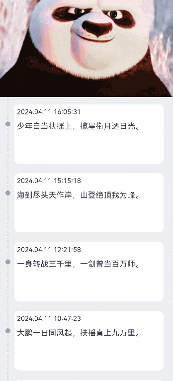

# 下拉展开图片和时间轴效果实现案例

### 介绍

下拉展开图片效果：初始时顶部图片只显示中间部分，其余部分，分别隐藏在屏幕上边缘和时间轴模块下方，随着下拉，图片会逐渐展开。
时间轴效果：位于左边，虚线贯穿整个List，每个内容模块前都有一个时间轴节点。

### 效果预览图



**使用说明**

1. 点击向下拖动，顶部背景，上方和下方会分别从屏幕上边缘以及时间轴模块下方，逐渐显示出来。

### 实现思路

1. 下拉刷新效果：通过 PullToRefresh 组件实现，通过onAreaChange接口计算图片下拉高度，使图片下拉高度为List下拉高度的1/2，下拉高度存在差值时，图片便会逐渐显示完整。
   源码参考[RefreshTimeLine.ets](./src/main/ets/view/RefreshTimeLine.ets)。

```ts
PullToRefresh({
  customList: () => {
    // 一个用@Builder修饰过的UI方法
    this.getListView();
  },
})
.onAreaChange((oldValue, newValue)=>{
  // TODO 知识点：PullToRefresh组件会铺满整改屏幕，通过onAreaChange获取到的区域高度就是屏幕高度
  // TODO 知识点：并且PullToRefresh组件不会随着上拉或下拉变化，该接口只会回调一次，此处不存在频繁回调造成的性能问题
  this.windowHeight = (newValue.height as number);
})

@Builder
private getListView() {
  List({ scroller: this.scroller })
    .onScroll((scrollOffset: number)=>{
      // 获取List上滑的高度，控制图片上滑的高度
      this.imgMarginTop -= scrollOffset;
    })
    .onAreaChange((oldValue, newValue)=>{
      // TODO 知识点: 通过onAreaChange获取到List的区域高度，与屏幕高度计算差值，得到下拉高度，除以高度基数，表明图片变化的高度是下拉高度的1/2
      this.refreshPullDownHeight =(this.windowHeight - (newValue.height as number))/this.pullDownHeightRadix;
    })
    .scrollBar(BarState.Off)
    .edgeEffect(EdgeEffect.None) // 必须设置列表为滑动到边缘无效果
}
```

2. 时间轴效果：时间轴部分：通过设置Column的bordier属性，只设置左边框实现。时间轴节点：样式通过设置borderRadius属性实现，位置通过设置margin的top实现偏移显示。
   源码参考[RefreshTimeLine.ets](./src/main/ets/view/RefreshTimeLine.ets)。

```ts
Row() {
  Column() {
    // 时间轴节点
    Column()
      .width($r('app.integer.width_and_height_ten'))
      .height($r('app.integer.width_and_height_ten'))
      .backgroundColor($r('app.color.time_node_color'))
      .borderRadius($r('app.integer.borderRadius_fifty'))
      .margin({top:$r('app.integer.margin_top_five')})

    // 时间轴
    Column()
      .width($r('app.integer.width_and_height_zero'))
      .height($r('app.integer.width_and_height_one_hundred'))
      .margin({top:$r('app.integer.margin_top_five')})
      .border({
        width: { left: $r('app.string.time_line_width')},
        color: { left: $r('app.color.time_line_color')},
        style: { left: BorderStyle.Dotted}
      })
  }
  .margin({left:$r('app.integer.margin_left_twenty')})

  // 内容区域
  Column() {
    Text(time)
      .fontSize($r('app.integer.font_size_fourteen'))
      .width($r('app.string.one_hundred_percent'))
      .height($r('app.integer.width_and_height_twenty'))
      .margin({
         left: $r('app.integer.margin_left_ten'),
         top: $r('app.integer.margin_top_five'),
         bottom: $r('app.integer.margin_bottom_five')
      })
      
    Text(text)
      .width($r('app.string.one_hundred_percent'))
      .margin({left:$r('app.integer.margin_left_ten'), top:$r('app.integer.margin_top_five')})
      .fontSize($r('app.integer.font_size_sixteen'))
  }
  .width($r('app.string.eighty_four_percent'))
  .height($r('app.integer.width_and_height_one_hundred_and_twenty'))
  .borderRadius($r('app.integer.borderRadius_ten'))
  .margin({
    left: $r('app.integer.margin_left_twelve'),
    top: $r('app.integer.margin_top_fifteen'),
    bottom: $r('app.integer.margin_bottom_five')
  })
  .backgroundColor(Color.White)
}
.width($r('app.string.one_hundred_percent'))
.backgroundColor($r('app.color.time_line_mode_back_color'))
```

### 高性能知识点

本示例使用了onScroll回调监听接口，此接口属于频繁回调接口，应该避免在内部进行冗余和耗时操作，例如避免打印日志。

onAreaChange回调监听接口: 组件位置变化时，每一帧都会触发回调，同样属于频繁回调接口，内部同样需要避免打印日志等耗时操作

### 工程结构&模块类型

   ```
   refreshtimeline                                       // har类型
   |---view
   |   |---RefreshTimeLine.ets                           // 视图层-下拉展开图片和时间轴效果实现案例
   ```

### 模块依赖

[**utils**](../../common/utils)

[@ohos/routermodule(动态路由)](../../feature/routermodule)

### 参考资料

[List 组件](https://developer.huawei.com/consumer/cn/doc/harmonyos-references/ts-container-list-0000001862607449)

[@ohos/PullToRefresh 组件](https://gitee.com/openharmony-sig/PullToRefresh)

[onAreaChange 事件](https://developer.huawei.com/consumer/cn/doc/harmonyos-references/ts-universal-component-area-change-event-0000001862687529)
