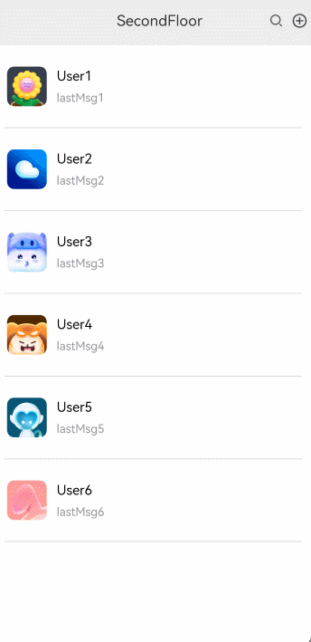

# 首页下拉进入二楼效果案例

### 介绍

本示例主要介绍了利用position和onTouch来实现首页下拉进入二楼、二楼上划进入首页的效果场景，利用translate和opacity实现动效的移动和缩放，并将界面沉浸式（全屏）显示。

### 效果图预览



**使用说明**

1. 向下滑动首页页面超过触发距离，页面进入二楼，未超过触发距离页面回弹。
2. 二楼页面向上滑动超过触发距离，页面进入首页，未超过触发距离页面回弹。
3. 效果图因要展示动效效果对展开速度进行了调整，可以通过[SecondFloor.ets](./src/main/ets/view/SecondFloor.ets)中expandSecondFloor的动效时长来调整二楼展开的速度，也可通过[FloorView.ets](./src/main/ets/view/FloorView.ets)中的OFFSET_STEP和EXPAND_FLOOR_INTERVAL_TIME来调整一楼展开的速度

### 实现思路

本例涉及的关键特性和实现方案如下：

1. 使用Column布局将一楼页面二楼页面包裹，使用position将一、二楼页面固定，floorHeight设置二楼高度（初始Y轴为负的二楼高度），使用clip按指定的形状对当前组件进行裁剪，源码参考[SecondFloor.ets](./src/main/ets/view/SecondFloor.ets)和[FloorView.ets](./src/main/ets/view/FloorView.ets)。

```typescript
Column() {
  // 二楼页面
  Column() {
    this.floorViewBuilder();
  }
  // 固定二楼刚开始位置
  .position({
    x: 0,
    // Y轴大小
    y: this.mainPageOffsetY
  })
  ...
  // 一楼页面
  Column() {
    this.mainPageBuilder();
  }
  .position({
    x: 0,
    // Y轴大小加上二楼高度
    y: this.offsetY + this.floorHeight
  })
}
.clip(true) // TODO：知识点：按指定的形状对当前组件进行裁剪，参数为boolean类型时，设置是否按照父容器边缘轮廓进行裁剪。
```

2. 通过对Column设置onTouch属性，记录手指按下和离开屏幕Y轴坐标，判断手势是上/下滑，当下滑距离达到触发距离进入二楼，未达到触发距离页面回弹（以一楼页面下滑为例），源码参考[SecondFloor.ets](./src/main/ets/view/SecondFloor.ets)。

```typescript
Column() {
  ...
  // 一楼页面
  Column() {
    this.mainPageBuilder();
  }
  ...
}
  .onTouch((event) => {
    switch (event.type) {
      case TouchType.Down:
        this.onTouchDown(event);
        break;
      case TouchType.Move:
        this.onTouchMove(event);
        break;
        ...
        break;
    }
    event.stopPropagation(); // 阻止冒泡
  })
        
/**
 * 按下事件、获取按下事件的位置
 * @param event 触屏事件
 */
private onTouchDown(event: TouchEvent) {
  // 获取触发按压事件Y轴的位置
  this.lastY = event.touches[0].windowY;
  ...
}

/**
 * 滑动事件
 * @param event 触屏事件
 */
private onTouchMove(event: TouchEvent) {
  ...
  let currentY = event.touches[0].windowY;
  // onTouch事件中本次Y轴大小减去上一次获取的Y轴大小，为负值则是向上滑动，为正值则是向下滑动
  let deltaY = currentY - this.lastY;
  ...
}
```

3. 使用Row布局将加载动画三个圆进行包裹，使用translate来实现圆的移动，使用scale来控制圆的加载，源码参考[SecondFloor.ets](./src/main/ets/view/SecondFloor.ets)。

```typescript
Row() {
  // this.floorHeight - Math.abs(this.offsetY)为下拉距离，下拉距离超过MINI_SHOW_DISTANCE（动效最小展示距离）且小于TRIGGER_HEIGHT（触发动画高度或者动效消失高度）展示动画
  if ((this.floorHeight - Math.abs(this.offsetY)) > MINI_SHOW_DISTANCE && (this.floorHeight - Math.abs(this.offsetY)) <= TRIGGER_HEIGHT) {
    Row() {
      // 向左偏移圆
      Blank()
        .width(this.roundSize)
        .height(this.roundSize)
        .borderRadius($r('app.integer.second_floor_circular_border_radius'))
        .scale(this.immediatelyScale)
        .backgroundColor($r('app.color.second_floor_circular_color'))
        .translate({ x: this.animationXLeft })
        .opacity(((this.mFloorHeight - Math.abs(this.offsetY)) / this.mFloorHeight)) // 使用下拉距离除以二楼高度获得圆的透明度
      // 中心加载点
      Blank()
      ...
      // 向右偏移圆
      Blank()
      ...
    }
  }
}
```

4. 操作translate来实现左右两圆实时的移动，使用scale来控制左右两圆的加载，源码参考[SecondFloor.ets](./src/main/ets/view/SecondFloor.ets)。

```typescript
/**
 * 滑动事件
 * @param event 触屏事件
 */
private onTouchMove(event: TouchEvent) {
...
  // TODO：知识点：确定是滑动状态后，进入动效界面，this.floorHeight减去this.offsetY的绝对值为滑动距离，在大于60(60指的是中心圆加载范围)和隐藏动效高度范围对左右圆的平移距离和和缩放进行设置
  if (((this.floorHeight - Math.abs(this.offsetY)) <= TRIGGER_HEIGHT) && (this.floorHeight - Math.abs(this.offsetY)) >= 60) {
    this.roundSize = 20;
    this.animationXLeft = 60;
    this.animationXRight = -60;
    // (this.floorHeight - Math.abs(this.offsetY))除以TRIGGER_HEIGHT 获取下拉百分比，使用百分比乘以60（60是根据圆最开始的位置获取）获得每次平移的距离，用来达到左右圆的X轴最后为0
    this.animationXLeft = this.animationXLeft - ((this.floorHeight - Math.abs(this.offsetY)) / TRIGGER_HEIGHT) * 60;
    this.animationXRight = this.animationXRight + ((this.floorHeight - Math.abs(this.offsetY)) / TRIGGER_HEIGHT) * 60;
    // 使用移动距离除以动效消失的高度，用来获取左右圆的缩放比例
    this.immediatelyScale = {
      x: ((this.floorHeight - Math.abs(this.offsetY)) / TRIGGER_HEIGHT),
      y: ((this.floorHeight - Math.abs(this.offsetY)) / TRIGGER_HEIGHT)
    };
  } else if (((this.floorHeight - Math.abs(this.offsetY)) < 60)) {
    // TODO：知识点：在中心圆加载的时候，左右圆是不显示的，因此将左右圆缩放比例大小调整为0，使用移动高度除以60（中心圆加载高度）再乘以20（圆的最终大小），以此来达到中心圆的加载效果
    this.roundSize = 0;
    this.roundSize = 20 * ((this.floorHeight - Math.abs(this.offsetY)) / 60);
    this.immediatelyScale = {
      x: 0,
      y: 0
    };
  } else {
    // 设置当二楼回收显示一楼时，三个圆属于加载成功状态
    this.roundSize = 20;
    this.immediatelyScale = { x: 1, y: 1 };
    this.animationXLeft = 0;
    this.animationXRight = 0;
  }
  ...
}
```

5. 在手指滑动结束离开屏幕后，通过判断此时二楼高度与Y轴高度差是否大于触发距离，若大于触发距离页面进入二楼，若小于页面进行回弹（以一楼下滑为例），源码参考[SecondFloor.ets](./src/main/ets/view/SecondFloor.ets)。

```typescript
/**
 * 触摸抬起或取消触摸事件
 */
private onTouchUp() {
  if (this.dragging) {
    // 二楼自身的高度减去向下Y轴的位移的绝对值大于触发值进入二楼，否则回弹
    if ((this.floorHeight - Math.abs(this.offsetY)) > this.expandFloorTriggerDistance) {
      // 进入二楼
      this.expandSecondFloor();
    } else {
      // 未达到触发距离回弹
      this.scrollByTop();
    }
  }
}
```

### 高性能知识点

本例使用了onTouch事件实时监听获取相关数据，避免在函数中进行冗余或耗时操作，例如应该减少或避免在函数打印日志，会有较大的性能损耗。

本示例使用了setInterval进行页面移动控制，在页面移动到相应的位置后使用clearInterval销毁以降低内存占用。

### 工程结构&模块类型

   ```
secondfloorloadanimation                     // har类型
|---model 
|   |---AppInfo.ets                          // App信息
|   |---UserInformation.ets                  // 用户信息    
|---view
|   |---SecondFloorLoadAnimation.ets         // 视图层-应用主页面
|   |---SecondFloor.ets                      // 视图层-应用一楼页面
|   |---FloorView.ets                        // 视图层-应用二楼页面
   ```

### 模块依赖

- 本实例依赖[common模块](../../common/utils)来实现日志的打印、资源 的调用、依赖[动态路由模块](../../feature/routermodule/src/main/ets/router/DynamicsRouter.ets)来实现页面的动态加载。

### 参考资料

- [@ohos.window](https://developer.huawei.com/consumer/cn/doc/harmonyos-references/js-apis-window-0000001820880785)
- [触摸事件](https://developer.huawei.com/consumer/cn/doc/harmonyos-references-V1/ts-universal-events-touch-0000001630425621-V1)