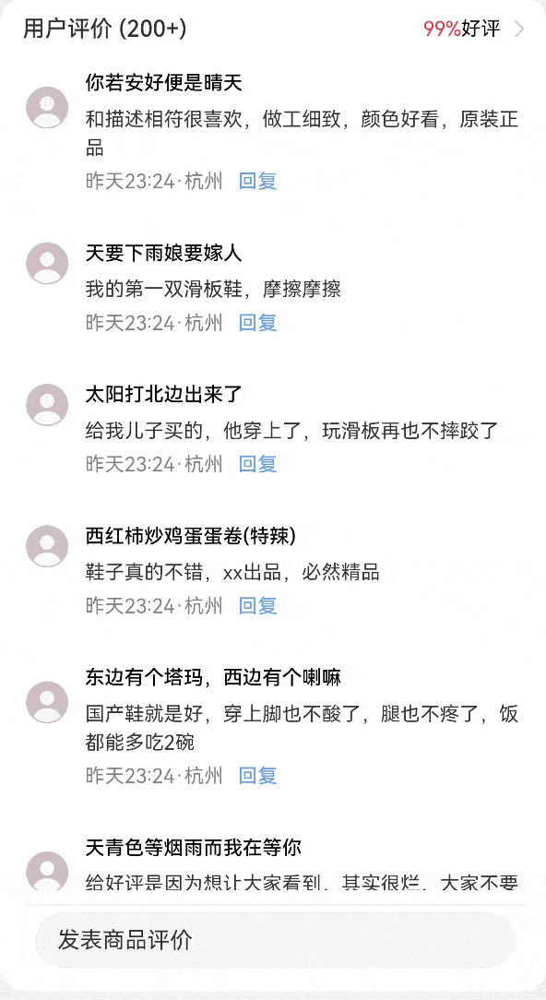
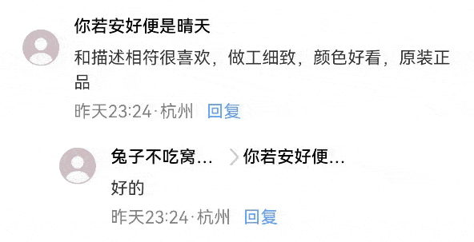

# textOverflow长文本省略

### 介绍

本示例实现了回复评论时，当回复人的昵称与被回复人的昵称长度都过长时，使用textOverflow和maxLines()实现昵称的长文本省略展示的功能。

### 效果图预览



### 使用说明

1. 点击评论中的"回复"，在输入框中输入回复内容，点击发送，即可在下方增加一条子评论。
2. 子回复列表的展示样式xxxxxx...>xxxxx...，此时回复人的昵称与被回复人的昵称长度都过长，将两方的名字都省略展示的样式，效果如下。



### 实现思路
#### 场景：通过textOverflow.Ellipsis与maxLines()实现长文本省略

- 通过textOverflow属性控制文本超长处理，textOverflow需配合maxLines一起使用（默认情况下文本自动折行）。  
当设置overflow: TextOverflow.Ellipsis时，此时超长文本中超出的部分显示省略号。

- 本案例中长文本省略的展示样式为xxxxxx...>xxxxx...，当同时设定回复人和被回复人昵称的文本属性.maxLines(1).textOverflow({ overflow: TextOverflow.Ellipsis })时, 如果回复人和被回复人的昵称超出设定的长度则会以省略号展示。从而实现长文本超长部分省略效果。
   源码参考[CommentPage.ets](./src/main/ets/components/mainpage/CommentPage.ets)。
```typescript
Text(reply.user) // 回复人昵称
  .maxLines(1)
  // TODO：知识点：通过设定maxLines为1与textOverflow为Ellipsis表明最大行数为1行，超出宽度30%的部分为省略号
  .textOverflow({ overflow: TextOverflow.Ellipsis })
  .width("30%")
Image($r('app.media.right'))
  .objectFit(ImageFit.Contain)
  .width($r('app.integer.text_flow_font_size'))
  .height($r('app.integer.text_flow_font_size'))
Text(reply.replyUser) // 被回复人昵称
  .maxLines(1)
  .textOverflow({ overflow: TextOverflow.Ellipsis })
  .width("30%")
```
### 工程结构&模块类型

```
   textoverflow                                     // har包
   |---model
   |   |---TextFlowMode.ets                         // 模型层-评论数据类 
   |---mainpage
   |   |---CommentInputDialog.ets                   // 视图层-自定义弹窗
   |   |---CommentPage.ets                          // 视图层-评论组件
   |   |---TextOverflowPage.ets                     // 视图层-主页
   |---mock
   |   |---DetailData.ets                           // 模拟数据模块
```

### 模块依赖

[routermodule](../routermodule)

[utils](../../common/utils)

### 高性能知识点

* 动态加载数据场景可以使用[LazyForEach](https://developer.harmonyos.com/cn/docs/documentation/doc-guides-V3/arkts-rendering-control-lazyforeach-0000001524417213-V3)遍历数据。

* 本例使用扁平化布局优化嵌套层级，建议采用相对布局RelativeContainer进行扁平化布局，有效减少容器的嵌套层级，减少组件的创建时间。

### 参考资料

[RelativeContainer](https://developer.huawei.com/consumer/cn/doc/harmonyos-references-V4/ts-container-relativecontainer-0000001862687657-V4)

[textOverflow](https://developer.huawei.com/consumer/cn/doc/harmonyos-guides-V2/arkts-common-components-text-display-0000001504880745-V2)


