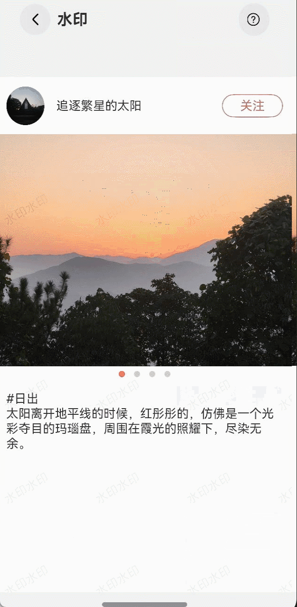

# 水印案例

### 介绍

在很多的场景中，如保存图片以及容器封面都能够见到水印，本案例通过Canvas组件以及OffscreenCanvas实现了页面添加水印以及保存图片时添加水印的功能。

### 效果图预览



**使用说明**：

1. 进入页面，页面背景显示水印效果。
2. 长按轮播图片，弹出半模态弹窗，点击保存按钮，图片保存在图库中，查看图片，图片显示水印。

### 实现思路

本示例使用两种方法添加水印
方法一：Canvas组件绘制水印，然后将水印组件通过overlay属性将水印作为浮层放置在页面中
方法二：获取初始图片的pixelMap对象， 通过OffscreenCanvas绘制水印，并生成一个新的pixelMap对象进行保存。

**Canvas组件绘制水印**
1. 自定义一个WaterMarkView组件，在Canvas组件的onReady函数中执行内容的填入逻辑。context.fillStyle、context.font、context.textAlign以及textBaseline
   来实现绘制的填充色、文本绘制中的字体大小、文本绘制中的文本对齐方式以及文本绘制中的水平对齐方式。
   源码参考[WaterMarkView.ets](./src/main/ets/view/WaterMarkView.ets)。
```typescript
 Canvas(this.context)
   .width('100%')
   .height('100%')
   .hitTestBehavior(HitTestMode.Transparent)
   .onReady(() => {
     // TODO:知识点:通过canvas绘制水印
     this.context.fillStyle = '#10000000';
     this.context.font = '16vp';
     this.context.textAlign = 'center';
     this.context.textBaseline = 'middle';
     ...
   })
```
2.通过context.fillText来进行内容的绘制，而for循环根据context.width和context.height来实现内容铺满整个画布。源码参考[WaterMarkView.ets](./src/main/ets/view/WaterMarkView.ets)。
```typescript
 for (let i = 0; i < this.context.width / 120; i++) {
   this.context.translate(120, 0);
   let j = 0;
   for (; j < this.context.height / 120; j++) {
      this.context.rotate(-Math.PI / 180 * 30);
      this.context.fillText('水印水印', -60, -60);
      this.context.rotate(Math.PI / 180 * 30);
      this.context.translate(0, 120);
   }
   this.context.translate(0, -120 * j);
}
```
3.最后通过overlay属性将水印作为浮层放置在页面中。源码参考[MainView.ets](./src/main/ets/view/MainView.ets)
```typescript
@Builder
  contentView() {
    Stack() {
      Column() {
      }
      .height('100%')
      .overlay(createWaterMarkView())
    }
  }
```
**OffscreenCanvas绘制水印**
1. 首先根据imageSource.createPixelMap创建一个选定图片的图像像素类pixelMap。源码参考[MainView.ets](./src/main/ets/view/MainView.ets)
```typescript
addWaterMark() {
  CONTEXT.resourceManager.getMediaContent(this.imageSource.id, (error, value) => {
    if (error) {
      return;
    }
    let imageSource: image.ImageSource = image.createImageSource(value.buffer);
    imageSource.getImageInfo((err, data) => {
      if (err) {
        return;
      }
      let opts: image.DecodingOptions = {
        editable: true,
        desiredSize: {
          height: data.size.height,
          width: data.size.width
        }
      }
      imageSource.createPixelMap(opts, async (err, pixelMap) => {
       ...
      })
    })
  })
}
```
2.新增一个OffscreenCanvas对象并根据offScreenCanvas.getContext('2d')获取offscreen canvas绘图上下文信息offScreenContext，
  根据此上下文信息可以使用drawImage进行图像绘制，offScreenContext.fillText绘制内容。源码参考[MainView.ets](./src/main/ets/view/MainView.ets)
```typescript
 if (err) {
   return;
}
// TODO:知识点:通过OffscreenCanvasRenderingContext2D绘制水印
const offScreenCanvas = new OffscreenCanvas(data.size.width, data.size.height);
const offScreenContext: OffscreenCanvasRenderingContext2D = offScreenCanvas.getContext('2d');
this.imageScale = offScreenCanvas.width / display.getDefaultDisplaySync().width;
offScreenContext.drawImage(pixelMap, 0, 0, offScreenCanvas.width, offScreenCanvas.height);
offScreenContext.textAlign = 'right';
offScreenContext.textBaseline = 'bottom';
offScreenContext.fillStyle = '#fffa0606';
// 设置字体大小
offScreenContext.font = 32 * this.imageScale + 'vp';
// 添加文字阴影
offScreenContext.shadowBlur = 20;
offScreenContext.shadowColor = '#F3F3F3';
// 绘制文本
offScreenContext.fillText('追逐繁星的太阳', offScreenCanvas.width - 20 * this.imageScale, offScreenCanvas.height - 20 * this.imageScale);

```
3.通过offScreenContext.getPixelMap获取新的图像像素类pixelMap。源码参考[MainView.ets](./src/main/ets/view/MainView.ets)
```typescript
this.pixelMap = offScreenContext.getPixelMap(0, 0, offScreenCanvas.width, offScreenCanvas.height);
```
4.phAccessHelper.createAsset方法生成一个图片存储地址，然后通过imagePacker.packing将新的pixelMap图像像素类生成一个buffer数据，
  最后通过fs.writeSync方法进行图片的保存。源码参考[MainView.ets](./src/main/ets/view/MainView.ets)
```typescript
const phAccessHelper = photoAccessHelper.getPhotoAccessHelper(CONTEXT);
const uri = await phAccessHelper.createAsset(photoAccessHelper.PhotoType.IMAGE, 'png');
if (this.pixelMap !== undefined) {
   // 保存图片到本地
   const imagePacker = image.createImagePacker();
   const imageBuffer = await imagePacker.packing(this.pixelMap, { format: 'image/png', quality: 100 });
   try {
      // 通过uri打开媒体库文件
      let file = fs.openSync(uri, fs.OpenMode.READ_WRITE | fs.OpenMode.CREATE);
      logger.info(`openFile success, fd: ${file.fd}`);
      // 写到媒体库文件中
      fs.writeSync(file.fd, imageBuffer);
      fs.closeSync(file.fd);
   } catch (err) {
      logger.info(`fs failed ${err.code},errMessage:message`);
   }
}
```
### 高性能知识点

**不涉及。**

### 工程结构&模块类型

```
videocache                                         // har类型
|---model
|   |---DataType.ets                               // 模型层-数据类型
|   |---MockData.ets                               // 模型层-模拟数据
|---view
|   |---MainView.ets                               // 视图层-主页面
|   |---WaterMarkView.ets                          // 视图层-水印
```

### 模块依赖

本实例依赖common模块来实现[日志](../../common/utils/src/main/ets/log/Logger.ets)的打印、[资源](../../common/utils/src/main/resources/base/element)
的调用、[动态路由模块](../../feature/routermodule/src/main/ets/router/DynamicsRouter.ets)来实现页面的动态加载。

### 参考资料

[Canvas组件](https://developer.huawei.com/consumer/cn/doc/harmonyos-references-V2/ts-components-canvas-canvas-0000001427744852-V2)

[OffscreenCanvas对象](https://developer.huawei.com/consumer/cn/doc/harmonyos-references-V2/js-components-canvas-offscreencanvas-0000001477981277-V2)
