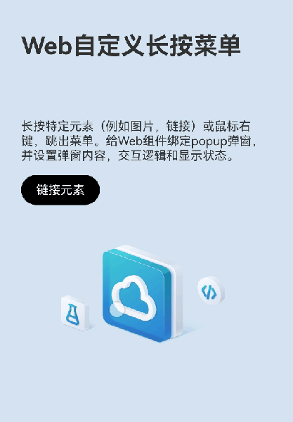

# Web自定义长按菜单案例

### 介绍

本示例介绍了给Webview页面中可点击元素（超链接/图片）绑定长按/鼠标右击时的自定义菜单的方案。

### 效果预览图


**使用说明**

长按Web页面中的图片或者链接元素，弹出自定义的Menu菜单，创建自定义的操作，如复制图片、使用浏览器打开链接、复制链接等。

### 实现思路

1. 创建Web组件，导入示例HTML文件，绑定弹出菜单组件。

```typescript
Web({ src: $rawfile("index.html"), controller: this.controller })
  .bindPopup(this.showMenu,
    {
      builder: this.MenuBuilder(),
      enableArrow: false,
      placement: Placement.LeftTop,
      mask: false,
      onStateChange: (e) => {
        if (!e.isVisible) {
          this.showMenu = false;
          this.result!.closeContextMenu();
        }
      }
    })
```

2. 调用Web组件的onContextMenuShow函数，获取当前页面元素弹窗菜单的信息，如位置信息、当前链接、以及是否存在图片等媒体元素、获取事件来源等。同时也获取弹出菜单的响应事件，用于处理前面获取到的菜单信息，如复制图片、全选、剪切、关闭菜单等。

```typescript
// TODO: 知识点: 长按或者鼠标右键触发该事件，当前只对图片、链接有效。
.onContextMenuShow((event) => {
  if (event) {
    this.result = event.result;
    this.param = event.param;
    logger.info(TAG, "x coord = " + event.param.x());
    logger.info(TAG, "y coord = " + event.param.y());
    logger.info(TAG, "link url = " + event.param.getLinkUrl())
    this.linkUrl = event.param.getLinkUrl();
    this.inputType = this.param.getInputFieldType();
  }
  logger.info(TAG, TAG, `x: ${this.offsetX}, y: ${this.offsetY}`);
  this.showMenu = true;
  return true;
})
```

3. 创建自定义菜单。在onContextMenuShow事件中能够获取触发菜单元素的信息和事件，根据这些内容动态创建自定义的弹出菜单。

```typescript
Menu() {
  // 如果元素存在图片
  if (this.param?.existsImageContents()) {
    MenuItem({
      content: $r('app.string.copy_image'),
    })
      .onClick(() => {
        this.result?.copyImage();
        this.showMenu = false;
      })
  }
  // 如果元素可剪切
  if (this.param?.getEditStateFlags() === ContextMenuEditStateFlags.CAN_CUT) {
    MenuItem({
      content: $r('app.string.cut'),
    })
      .onClick(() => {
        this.result?.cut();
        this.showMenu = false;
      })
  }
  // 如果元素可拷贝
  if (this.param?.getEditStateFlags() === ContextMenuEditStateFlags.CAN_PASTE) {
    MenuItem({
      content: $r('app.string.copy'),
    })
      .onClick(() => {
        this.result?.copy();
        this.showMenu = false;
      })
  }
  // 如果元素可粘贴
  if (this.param?.getEditStateFlags() === ContextMenuEditStateFlags.CAN_PASTE) {
    MenuItem({
      content: $r('app.string.paste'),
    })
      .onClick(() => {
        this.result?.paste();
        this.showMenu = false;
      })
  }
  // 如果元素可全选
  if (this.param?.getEditStateFlags() === ContextMenuEditStateFlags.CAN_PASTE) {
    MenuItem({
      content: $r('app.string.select_all'),
    })
      .onClick(() => {
        this.result?.selectAll();
        this.showMenu = false;
      })
  }
  // 如果元素为链接
  if (this.linkUrl) {
    // 浏览器打开链接
    MenuItem({
      content: $r('app.string.open_link'),
    })
      .onClick(() => {
        let wantInfo: Want = {
          action: 'ohos.want.action.viewData',
          entities: ['entity.system.browsable'],
          uri: this.linkUrl
        };
        this.context.startAbility(wantInfo).then(() => {
          logger.info(TAG, 'startAbility succeed');
        }).catch((err: BusinessError) => {
          logger.error(TAG, `startAbility failed, code is ${err.code}, message is ${err.message}`);
          return;
        });
        this.showMenu = false;
      })
    // 复制链接
    MenuItem({
      content: $r('app.string.copy_link'),
    })
      .onClick(() => {
        let pasteData = pasteboard.createData('text/plain', this.linkUrl);
        pasteboard.getSystemPasteboard().setData(pasteData, (error) => {
          if (error) {
            logger.error(TAG, 'Failed to set PasteData. Cause: ' + error.message);
            return;
          }
          logger.info(TAG, 'Succeeded in setting PasteData.');
        });
        this.showMenu = false;
      })
  }
  // 判断是否输入框
  if (this.inputType != ContextMenuInputFieldType.None) {
    MenuItem({
      content: $r('app.string.input_field'),
    })
      .onClick(() => {
        this.showMenu = false;
      })
  }
}
```
因为不同元素触发的弹窗宽高尺寸不一样，还需要根据手指按压位置和弹窗尺寸选择弹窗显示的位置。
```typescript
let offset: Position = { x: 0, y: 0};
if (this.pressPosX <= this.webWidth / 2) {
  offset.x = -(this.webWidth / 2 - this.pressPosX) + popupWidth / 2 + FINGER_OFFSET_X;
} else {
  offset.x = -(this.webWidth / 2 - this.pressPosX) - popupWidth / 2 - FINGER_OFFSET_X;
}
if (this.pressPosY <= this.webHeight / 2) {
  offset.y = -(this.webHeight / 2 - this.pressPosY) + popupHeight / 2 + FINGER_OFFSET_Y;
} else {
  offset.y = (this.pressPosY - this.webHeight / 2) - popupHeight / 2 - FINGER_OFFSET_Y;
}
logger.debug(TAG, `popup offset: ${offset.x}, ${offset.y}`);
return offset;
}
```

### 高性能知识点

- 本案例使用了Webview控制器的[initializeWebEngine](https://developer.huawei.com/consumer/cn/doc/harmonyos-references-V1/js-apis-webview-0000001630265617-V1#ZH-CN_TOPIC_0000001666708076__initializewebengine)接口提前加载Web引擎的动态库文件，从而提前进行Web组件动态库的加载和Web内核主进程的初始化，最终以提高启动性能，减少白屏时间。
- 本案例使用了系统高频回调事件[onAreaChange](https://developer.huawei.com/consumer/cn/doc/harmonyos-references/ts-universal-component-area-change-event-0000001862687529#ZH-CN_TOPIC_0000001862687529__onareachange)，应避免在该回调中调用冗余和耗时操作。

### 工程结构&模块类型

```
webcustompressmenu      // HAR类型
  ├─mainpage
  │ └─MainPage.ets      // ArkTS页面
  ├─rawfile
  │ └─index.html        // HTML页面
```

### 模块依赖

- [**utils**](../../common/utils)
- [**routermodule**](../routermodule)

### 参考资料

- [Web组件](https://developer.huawei.com/consumer/cn/doc/harmonyos-references-V4/ts-basic-components-web-0000001860247877-V4#ZH-CN_TOPIC_0000001860247877__oncontextmenushow9)
- [Popup控制](https://developer.huawei.com/consumer/cn/doc/harmonyos-references-V4/ts-universal-attributes-popup-0000001862607349-V4)