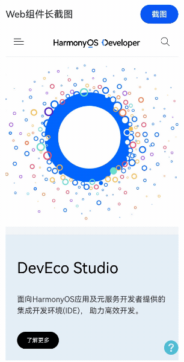

# Web页面长截图

### 介绍

本案例实现了Web组件中网页长截图的方案。支持截图后展示大小浮窗预览、保存图片到相册、手势左滑关闭等功能。

### 效果图预览



### 实现思路

本解决方案通过循环滚动Web组件，每次滚动截取当前状态后拼接到离屏画布，最后一次性转为PixelMap图片并显示在全屏模态窗口中。再通过安全控件SaveButton以免权限申请的方式保存到用户的相册中。

1. 创建Web组件加载指定的网页，获取Web组件和网页的实际尺寸，并给Web组件绑定自定义的id。

由于Web组件为自适应填充剩余空间，所以通过onAreaChange接口来获取Web组件的实际尺寸。
Web网页加载完成后在onPageEnd回调中通过WebviewController的接口runJavaScriptExt执行javascript代码以获取网页的实际大小。

```typescript
Web({
  src: this.webPageUrl,
  controller: this.webviewController
})
  .id(Constants.WEB_ID)
  .onAreaChange((oldValue, newValue) => {
    this.webWidth = newValue.width as number;
    this.webHeight = newValue.height as number;
    logger.info(TAG, `Web component width: ${this.webWidth}, height: ${this.webHeight}`);
  })
  .onPageEnd(() => {
    const script = '[document.documentElement.scrollWidth, document.documentElement.scrollHeight]';
    this.webviewController.runJavaScriptExt(script).then((result) => {
      switch (result.getType()) {
        case webview.JsMessageType.ARRAY:
          this.h5Width = (result.getArray() as number[])[0]; // 这里的单位是vp
          this.h5Height = (result.getArray() as number[])[1];
          logger.info(TAG, `h5Width = ${this.h5Width}, h5Height = ${this.h5Height}`);
          break;
        default:
          logger.error(TAG, `Get web page size tyep error.`);
          break;
      }
    });
  })
```

2. 创建截图函数，执行滚动截图并拼接。

截图的次数为网页高度/Web组件高度向上取整的结果。
最后一次截图的图片需要特殊处理，去除重复的部分，重复的部分高度即网页高度/Web组件高度取余。通过PixelMap对象的接口crop进行裁剪。

```typescript
const snipTimes = Math.ceil(this.h5Height / this.webHeight);
for (let i = 0; i < snipTimes; i++) {
  let curSnip = await componentSnapshot.get(Constants.WEB_ID);
  // 最后一次截图需要特殊处理，去除重复部分
  if (i === snipTimes - 1) {
    let h = this.h5Height % this.webHeight;
    // 裁剪
    await curSnip.crop({ x: 0, y: vp2px(this.webHeight - h),
      size: {
        height: vp2px(h),
        width: vp2px(this.webWidth)
      }
    });
    offCanvasCtx.drawImage(curSnip, 0, this.webHeight * i, this.webWidth, h);
  } else {
    offCanvasCtx.drawImage(curSnip, 0, this.webHeight * i, this.webWidth, this.webHeight);
  }
}
```

这里图片拼接的方案选择的是离屏画布渲染对象OffscreenCanvasRenderingContext2D，离屏绘制会将需要绘制的内容先绘制在缓存区，加快绘制速度。
> 为什么不使用PixelMap首尾拼接？  
> 虽然componentSnapshot.get接口能够直接获取PixelMap对象，但是如果选择直接处理PixelMap需要手动将其转换为ArrayBuffer格式，再转为Uint8Array通过set接口拼接。
> 整个过程非常繁琐，且消耗资源，并且目前PixelMap接口还有格式限制，影响图片输出。

而使用画布组件，只需要

```typescript
// 截图时拼接图片
offCanvasCtx.drawImage(curSnip, 0, this.webHeight * i, this.webWidth, this.webHeight);
...
// 截图完即可输出完整的长截图        
this.mergedImage = offCanvasCtx.getPixelMap(0, 0, this.h5Width, this.h5Height);
```

3. 截图后弹出预览窗口，可以滚动查看完整的截图，并保存图片到用户相册中。

本案例使用全屏模态窗口，开始截图后即弹出。截图未完成时，提示用户正在截图，截图完成后转为图片预览窗口，并且支持切换大小窗口。

窗口位置通过position属性设置，结合属性动画可以形成切换时的动画效果。
```typescript
  /**
   * 设置弹窗居中。
   */
  setPopupCenter() {
    this.snapPopupPosition = {
      x: (this.displayWidth - this.snapPopupWidth) / 2,
      y: (this.displayHeight - this.snapPopupHeight) / 2
    }
  }

  /**
   * 设置弹窗位置为左下。
   */
  setPopupBottomLeft() {
    this.snapPopupPosition = {
      x: Constants.POPUP_MARGIN_LEFT,
      y: this.displayHeight - this.snapPopupHeight - Constants.POPUP_MARGIN_BOTTOM
    }
  }
```

保存图片相册使用SaveButton安全控件，该接口可以免申请读写相册权限，临时获取存储权限。
```typescript
// 安全控件的UI有严格的限制，智能使用系统提供的属性
SaveButton({
  icon: SaveIconStyle.FULL_FILLED,
  text: SaveDescription.SAVE_IMAGE,
  buttonType: ButtonType.Capsule
})
  .onClick(async (event, result) => {
    this.saveSnapshot(result);
  })

/**
 * 保存图片到相册。
 */
async saveSnapshot(result: SaveButtonOnClickResult) {
  // TODO: 知识点：使用SaveButton组件可以免申请权限，用户点击后，临时将文件存入系统目录
  if (result == SaveButtonOnClickResult.SUCCESS) {
    let helper = photoAccessHelper.getPhotoAccessHelper(this.context);
    // 使用保存控件
    try {
      // onClick触发后10秒内通过createAsset接口创建图片文件，10秒后createAsset权限收回。
      let uri = await helper.createAsset(photoAccessHelper.PhotoType.IMAGE, 'png');
      // 使用uri打开文件，可以持续写入内容，写入过程不受时间限制
      let file = await fs.open(uri, fs.OpenMode.READ_WRITE | fs.OpenMode.CREATE);
      const imagePackerApi: image.ImagePacker = image.createImagePacker();
      let packOpts: image.PackingOption = {
        format: Constants.SAVE_IMAGE_FORMAT,
        quality: Constants.SAVE_IMAGE_QUALITY,
      };
      imagePackerApi.packToFile(this.mergedImage, file.fd, packOpts).then(() => {
        logger.info(TAG, `Succeeded in packToFile`);
        promptAction.showToast({
          message: $r('app.string.saved_to_album'),
          duration: Constants.SAVED_TO_ALBUM_PROMPT_DURATION
        })
      }).catch((error: BusinessError) => {
        logger.error(TAG, `Failed to packToFile. Error code is ${error.code}, message is ${error.message}`);
      })
    } catch (error) {
      const err: BusinessError = error as BusinessError;
      logger.error(TAG, `Failed to save photo. Error code is ${err.code}, message is ${err.message}`);
    }
  }
  this.closeSnapPopup();
}
```

本案例还支持左滑关闭预览小窗口的手势特性。窗口组件使用gesture通用属性绑定滑动手势，结合属性动画实现滑动窗口效果。

```typescript
.gesture(
  PanGesture(this.panOption)
    .onActionStart(() => {
      // 保存滑动前的位置，以便用于恢复状态
      this.xPositionBefore = this.snapPopupPosition.x as number;
    })
    .onActionUpdate((event) => {
      // 左滑弹窗关闭，但允许向右滑动一小部分，形成弹性效果，提升操作手感
      if (event.offsetX < Constants.POPUP_RIGHT_PAN_GESTURE) {
        this.snapPopupPosition.x = this.xPositionBefore + event.offsetX;
      }
    })
    .onActionEnd((event) => {
      // 左滑超过一定阈值才会触发关闭弹窗，提升用户体验
      if (event.offsetX < Constants.POPUP_LEFT_PAN_GESTURE && !this.showPreview) {
        // 避免瞬间消失，而是平移动画后消失
        this.snapPopupPosition.x = Constants.POPUP_LEFT_SCREEN;
        sleep(Constants.ANIMATE_DURATION).then(() => {
          this.isShowSnapPopup = false;
        })
      } else if (!this.showPreview) {
        // 小窗预览时，右滑或者左滑没有达到阈值时恢复弹窗位置，结合动画属性形成弹性效果
        this.setPopupBottomLeft();
      }
    })
)
```

其他窗口UI及效果详见代码。

### 高性能知识点

1. 本案例使用了Web预加载接口[initializeWebEngine](https://developer.huawei.com/consumer/cn/doc/harmonyos-references-V1/js-apis-webview-0000001630265617-V1#ZH-CN_TOPIC_0000001666708076__initializewebengine)提前加载webview内核，并且使用[prepareForPageLoad](https://developer.huawei.com/consumer/cn/doc/harmonyos-references-V1/js-apis-webview-0000001630265617-V1#ZH-CN_TOPIC_0000001666708076__prepareforpageload10)对目标网页进行预连接，提升打开网页的速度。
2. 本案例使用了[离屏渲染对象](https://developer.huawei.com/consumer/cn/doc/harmonyos-references-V1/ts-offscreencanvasrenderingcontext2d-0000001743039380-V1)来拼接截图，将需要绘制的内容先绘制在缓存区，然后将其转换成图片，加快了绘制速度。
3. 本案例使用了[onAreaChange](https://developer.huawei.com/consumer/cn/doc/harmonyos-references/ts-universal-component-area-change-event-0000001862687529#ZH-CN_TOPIC_0000001862687529__onareachange)接口动态获取Web组件的尺寸，该接口属于高频回调接口，避免在该回调中调用冗余和耗时操作。还应尽可能的减少对状态变量的修改以避免触发大量UI重绘和动效耗时。

### 工程结构&模块类型

```
webpagesnapshot                // har类型
├───mainpage
│   ├───MainPage.ets           // ArkTS页面
├───common
│   ├───Constants.ets          // 常量
│   └───Utils.ets              // 通用工具
│
```

### 模块依赖

- [**路由模块**](../routermodule)
- [**utils**](../../common/utils)

### 参考资料

- [**全屏模态转场**](https://developer.huawei.com/consumer/cn/doc/harmonyos-references/ts-universal-attributes-modal-transition-0000001815927540)
- [**OffscreenCanvasRenderingContext2D**](https://developer.huawei.com/consumer/cn/doc/harmonyos-references/ts-offscreencanvasrenderingcontext2d-0000001862607485)
- [**PixelMap**](https://developer.huawei.com/consumer/cn/doc/harmonyos-references/js-apis-image-0000001821001457#ZH-CN_TOPIC_0000001811318782__pixelmap7)
- [**WebviewController**](https://developer.huawei.com/consumer/cn/doc/harmonyos-references/js-apis-webview-0000001813416660#ZH-CN_TOPIC_0000001813416660__webviewcontroller)
- [**@ohos.arkui.componentSnapshot (组件截图)**](https://developer.huawei.com/consumer/cn/doc/harmonyos-references/js-apis-arkui-componentsnapshot-0000001774121118)
- [**SaveButton**](https://developer.huawei.com/consumer/cn/doc/harmonyos-references/ts-security-components-savebutton-0000001815767892)
- [**PanGesture**](https://developer.huawei.com/consumer/cn/doc/harmonyos-references/ts-basic-gestures-pangesture-0000001815767760)