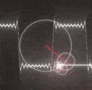

# XComponent + Vsync 实现自定义动画

### 介绍
XComponent 提供了应用在 native 侧调用 OpenGLES 图形接口的能力，本文主要介绍如何配合 Vsync 事件，完成自定义动画。在这种实现方式下，自定义动画的绘制不在 UI 主线程中完成，即使主线程卡顿，动画效果也不会受影响。

### 效果演示



### 实现思路
1. CMakelists 增加 lib 依赖

```cpp
find_library( # Sets the name of the path variable.
               libvsync-lib
               # Specifies the name of the NDK library that
               # you want CMake to locate.
               native_vsync )
```

2. 创建 vsync 实例

```cpp
#include <native_vsync/native_vsync.h>

SyncParam *param = new SyncParam();
param->eglCore = this;
param->window = window;
mVsync = OH_NativeVSync_Create(GAME_SYNC_NAME, 3);
if (!mVsync) {
    LOGE("EGLCore:: Create mVsync failed");
    return;
}
```
3. 创建 OH_NativeVSync_RequestFrame 回调，并在回调中使用 egl 接口进行绘制

```cpp
OH_NativeVSync_RequestFrame(
    mVsync,
    [](long long timestamp, void *data) {
        LOGI("EGLCore::OH_NativeVSync_RequestFrame timestamp = %{public}lld", timestamp);
        SyncParam *syncParam = (SyncParam *)data;
        if (syncParam == nullptr) {
            return;
        }
        EGLCore *eglCore = syncParam->eglCore;
        void *window = syncParam->window;
        if (eglCore == nullptr || window == nullptr) {
            return;
        }
        eglCore->mEglWindow = static_cast<EGLNativeWindowType>(window);
        ...
        eglCore->DrawSquare();
        eglCore->switchSpecular();
        eglCore->switchAmbient();
        },
    param
);
```
此处需要注意，frame callback 回调的执行线程不是当前申请 OH_NativeVSync_RequestFrame 的线程，而是 vsync 实例中申请的 eventlooper 线程。所以，egl Window 的初始化也需要放到 callback 中创建。

### 高性能知识点

- 一个 Vsync 实例对应一个 [EventRunner](https://gitee.com/openharmony/notification_eventhandler) 创建的新线程，在这个线程中执行渲染处理，理论上这个线程的运算耗时，只会影响动画帧率，不会影响应用主线程的帧率。
- 其余 OpenGLES 的绘制方法，与社区的 OpenGLES 的用法一致
### 工程结构&模块类型

   ```
   XcomponentVsync                                        // har类型
   |---cpp                                                // native xcomponent配合vsync实现自定义动画
   |---pages
   |   |---XcomponentVsync.ets                            // Xcomponent 组件加载自定义动画 
   ```

### 模块依赖

[**utils**](../../common/utils)

[@ohos/routermodule(动态路由)](../../feature/routermodule)


### 参考资料

[XComponent](https://developer.huawei.com/consumer/cn/doc/harmonyos-guides-V5/napi-xcomponent-guidelines-0000001775857186-V5)

[Vsync](https://developer.huawei.com/consumer/cn/doc/harmonyos-references-V5/_native_vsync-0000001774280714-V5#ZH-CN_TOPIC_0000001860624701__oh_nativevsync_requestframe)

[EventRunner](https://gitee.com/openharmony/notification_eventhandler)