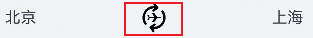

# 地址交换动画
```ts
import curves from '@ohos.curves';
import { AppRouter } from '@ohos/dynamicsrouter/Index';
import { promptAction } from '@kit.ArkUI';
```
* import curves from '@ohos.curves'; 引入了动画曲线，可以用于创建平滑的动画效果。
* import { AppRouter } from '@ohos.dynamicsrouter/Index'; 引入了应用程序路由管理器，用于页面之间的导航。
* import { promptAction } from '@kit.ArkUI'; 引入了用户交互操作的预定义方法，如提示框等。

如果我们查看路径的话可以发现，[curves](https://developer.huawei.com/consumer/cn/doc/harmonyos-references/js-apis-curve-0000001774121126#ZH-CN_TOPIC_0000001857917121__curve)和 [promptAction](https://developer.huawei.com/consumer/cn/doc/harmonyos-references/js-apis-promptaction-0000001821000749)是由鸿蒙自带的SDK给出,感兴趣的可以自己查看官方文档。这里的AppRouter由自己定义，下面是自定义函数代码:
```ts
// 自定义装饰器
export function AppRouter(param: AppRouterParam) {
  return Object;
}

// 装饰器参数
export interface AppRouterParam {
  // 跳转的路由名
  name: string;
  // 是否需要传递参数，需要的话设置为true，否则可不需要设置。
  hasParam?: boolean;
}
```
为了找到自定义的AppRouter文件目录，我们在其对应的oh-package.json5文件下进行了如下的定义：
```ts
"@ohos/dynamicsrouter": "file:../../feature/routermodule"
"main": "Index.ets"
```
如此一来在配置动态路由模块的时候的路径@ohos/dynamicsrouter便会去替换为上上级目录下的feature文件夹下的routermodule中index.ets中去寻找自定义函数的路径。以下是index.est中的内容：
```ts

export { DynamicsRouter } from './src/main/ets/router/DynamicsRouter';

export { Interceptor, InterceptorExecute } from './src/main/ets/interceptor/Interceptor';

export { AppRouterInfo } from './src/main/ets/model/AppRouterInfo';

export { AppRouter } from './src/main/ets/annotation/AppRouter';
```
我们在当前的文件路径中去寻找对应的自建函数即可。对于AppRouter来说，所对应的路径便是'./src/main/ets/annotation/AppRouter'。由此，我们将AppRouter的内容成功地导入到了本文件中。
<br/>

接下来便是组件的主体内容,我们将其分为两个部分：组内变量申明和build函数的构建。我们从组内变量的申明开始:
```ts
// 旋转角度
@State rotateAngle: number = 0;
// 偏移量
@State translateX: number = 0;
// 是否已交换
@State swap: boolean = false;
// 整体内容区宽度
private rowWidth: number = 300;
// 单次偏移距离
private distance: number = this.rowWidth * 0.6;
// 内容相隔距离
private columnSpace: number = 16;
// 初始化偏移距离
private zeroTranslate: number = 0;
// 单次旋转180°
private rotateAddAngle: number = 180;
// toast弹窗时长
private toastDuration: number = 2000;
```
需要注意的是，我们这里统一采用了驼峰的命名方式，对于变量的类型我们这里也分为State和private两种。关于何时选择state或者private，以下是总结的一些标准：
* 设置为@State
* * 需要触发UI更新的变量。
* * 随着用户交互或其他动态事件而改变的变量。
* * 需要在模板中直接绑定和使用的变量。
* 设置为private
* * 不需要触发UI更新的变量。
* * 用于组件内部逻辑处理、配置参数或计算结果的变量。
* * 不需要在模板中直接绑定和使用的变量。
<br/>

接下来是组件的build部分。
```ts
build() {
    // 地址交换
    Column({ space: this.columnSpace }) {
      Row() {
        Text($r('app.string.address_exchange_address_left'))
          .translate({ x: this.translateX })
          .width($r('app.string.address_exchange_address_width'))
          .textAlign(this.swap ? TextAlign.End : TextAlign.Start)
          .onClick(() => {
            promptAction.showToast({
              message: $r('app.string.address_exchange_other_function'),
              duration: this.toastDuration
            });
          })

        Stack() {
          Image($r('app.media.address_exchange_airplane'))
            .size({
              height: $r('app.integer.address_exchange_airplane_size'),
              width: $r('app.integer.address_exchange_airplane_size')
            })
          Image($r('app.media.address_exchange_recycle'))
            .size({
              height: $r('app.integer.address_exchange_recycle_size'),
              width: $r('app.integer.address_exchange_recycle_size')
            })
            .rotate({ angle: this.rotateAngle })
            .animation({
              curve: Curve.EaseOut,
              playMode: PlayMode.Normal,
            })
        }
        .width($r('app.string.address_exchange_image_width'))
        .onClick(() => {
          this.swap = !this.swap
          // TODO 知识点：动画效果，修改偏移量，修改旋转角度，实现效果
          animateTo({ curve: curves.springMotion() }, () => {
            if (this.swap) {
              this.translateX = this.distance;
            } else {
              this.translateX = this.zeroTranslate;
            }
          })
          this.rotateAngle += this.rotateAddAngle;
        })

        Text($r('app.string.address_exchange_address_right'))
          .translate({ x: -this.translateX })
          .width($r('app.string.address_exchange_address_width'))
          .textAlign(this.swap ? TextAlign.Start : TextAlign.End)
          .onClick(() => {
            promptAction.showToast({
              message: $r('app.string.address_exchange_other_function'),
              duration: this.toastDuration
            });
          })
      }
      .width(this.rowWidth)
      .height($r('app.integer.address_exchange_content_height'))

      Row({ space: this.columnSpace }) {
        Text($r('app.string.address_exchange_date'))
          .fontSize($r('app.string.ohos_id_text_size_headline'))
          .fontWeight(FontWeight.Medium)
          .height($r('app.integer.address_exchange_date_height'))
        Text($r('app.string.address_exchange_week'))
          .height($r('app.integer.address_exchange_date_height'))
      }
      .width(this.rowWidth)
      .onClick(() => {
        promptAction.showToast({
          message: $r('app.string.address_exchange_other_function'),
          duration: this.toastDuration
        });
      })

      Button($r('app.string.address_exchange_search_ticket'))
        .fontColor(Color.White)
        .height($r('app.integer.address_exchange_button_height'))
        .width(this.rowWidth)
        .onClick(() => {
          promptAction.showToast({
            message: $r('app.string.address_exchange_other_function'),
            duration: this.toastDuration
          });
        })
    }
    .backgroundColor($r('app.color.ohos_id_color_sub_background'))
    .borderRadius($r('app.string.ohos_id_corner_radius_default_m'))
    .width($r('app.string.address_exchange_content_size'))
    .height($r('app.integer.address_exchange_total_height'))
    .margin($r('app.string.ohos_id_card_margin_start'))
  }
```
从应用的整体设计上来看其总共为一列，两行。第一行为交换动画的主体部分，第二部分为日期，第三部分为查询按钮，我们一步步分开讨论。我们首先从第一行开始讨论。在进行讨论之前，我们补充一点关于其中具体文本显示的问题。在组件中的文本我们统一将其放置在当前resources目录下的base/element中的string.json中。整数信息我们则统一放置在base/element中的integer.json中。对于图片文件，我们则将其放置在base/media中。所有这些源文件的内容，我们通过Text $r来进行发送。
```ts
Row() {
        Text($r('app.string.address_exchange_address_left'))
          .translate({ x: this.translateX })
          .width($r('app.string.address_exchange_address_width'))
          .textAlign(this.swap ? TextAlign.End : TextAlign.Start)
          .onClick(() => {
            promptAction.showToast({
              message: $r('app.string.address_exchange_other_function'),
              duration: this.toastDuration
            });
          })

        Stack() {
          Image($r('app.media.address_exchange_airplane'))
            .size({
              height: $r('app.integer.address_exchange_airplane_size'),
              width: $r('app.integer.address_exchange_airplane_size')
            })
          Image($r('app.media.address_exchange_recycle'))
            .size({
              height: $r('app.integer.address_exchange_recycle_size'),
              width: $r('app.integer.address_exchange_recycle_size')
            })
            .rotate({ angle: this.rotateAngle })
            .animation({
              curve: Curve.EaseOut,
              playMode: PlayMode.Normal,
            })
        }
        .width($r('app.string.address_exchange_image_width'))
        .onClick(() => {
          this.swap = !this.swap
          // TODO 知识点：动画效果，修改偏移量，修改旋转角度，实现效果
          animateTo({ curve: curves.springMotion() }, () => {
            if (this.swap) {
              this.translateX = this.distance;
            } else {
              this.translateX = this.zeroTranslate;
            }
          })
          this.rotateAngle += this.rotateAddAngle;
        })

        Text($r('app.string.address_exchange_address_right'))
          .translate({ x: -this.translateX })
          .width($r('app.string.address_exchange_address_width'))
          .textAlign(this.swap ? TextAlign.Start : TextAlign.End)
          .onClick(() => {
            promptAction.showToast({
              message: $r('app.string.address_exchange_other_function'),
              duration: this.toastDuration
            });
          })
      }
```
代码的整体部分分为三个部分，第一部分为显示出发地，通过translate为Text组件设置水平位移，this.translateX 是一个状态变量，表示水平偏移量。通过width设置Text组件的宽度，使用资源文件中的值 app.string.address_exchange_address_width。这里 $r 函数从资源文件中获取宽度值。通过textAlign设置Text组件的文本对齐方式。根据状态变量 this.swap 的值来决定是右对齐 (TextAlign.End) 还是左对齐 (TextAlign.Start)。然后我们通过onClick为组件设置点击事件处理，当用户点击Text组件时，执行onClick的内部代码。通过使用[promptAction](https://developer.huawei.com/consumer/cn/doc/harmonyos-references/js-apis-promptaction-0000001821000749#ZH-CN_TOPIC_0000001857916061__promptactionshowtoast)的内置方法，我们创建并显示文本提示框。
<br/>

在第二部分中，我们通过使用[stack](https://developer.huawei.com/consumer/cn/doc/harmonyos-references/ts-container-stack-0000001815767840)创建一个堆栈布局，允许子组件堆叠在一起。子组件按顺序从底层到顶层进行绘制。

上面的图像中我们可以观察到动图由两部分组成，旋转箭头和飞机图标。为此，我们使用两次[image](https://developer.huawei.com/consumer/cn/doc/harmonyos-references/ts-basic-components-image-0000001815927572),对于旋转箭头图标，由于我们会在用户点击的时候实现一定的动画效果，我们使用属性动画[animation](https://developer.huawei.com/consumer/cn/doc/harmonyos-references/ts-animatorproperty-0000001815927688)，其中的Curve.EaseOut 曲线，使动画在结束时逐渐减速。对于整体的动图，我们在stack外设置onClick，其中包含了触发动画效果、修改偏移量和旋转角度的逻辑。我们首先面对的是一个swap布尔值，每次点击后，swap 状态在 true 和 false 之间切换。与上面不同的是，我们这里使用[animateTo](https://developer.huawei.com/consumer/cn/doc/harmonyos-references/ts-explicit-animation-0000001862687717)。其中两者的区别在于animation为 Image 组件绑定动画属性，使其在旋转时具有 EaseOut 曲线和正常播放模式，而animateTo在 onClick 回调中使用 animateTo 方法，使组件在点击时通过弹簧效果动画平滑地修改偏移量。我们使用使用 curves.springMotion() 作为动画曲线，用于实现弹簧效果。通过 animateTo 方法，可以在 swap 状态切换时实现平滑的动画效果。在动画过程中，translateX 会根据 swap 的值进行调整，图像的位置会随之变化。同时，rotateAngle 的增加将使图像每次点击后旋转预定义的角度。
<br/>

第三部分和第一部分为对称关系，这里也就不再赘述。
<br/>

接下来我们这里要介绍的是app的第二个日期部分。
```ts
Row({ space: this.columnSpace }) {
        Text($r('app.string.address_exchange_date'))
          .fontSize($r('app.string.ohos_id_text_size_headline'))
          .fontWeight(FontWeight.Medium)
          .height($r('app.integer.address_exchange_date_height'))
        Text($r('app.string.address_exchange_week'))
          .height($r('app.integer.address_exchange_date_height'))
      }
      .width(this.rowWidth)
      .onClick(() => {
        promptAction.showToast({
          message: $r('app.string.address_exchange_other_function'),
          duration: this.toastDuration
        });
      })
```
首先创建一个创建一个水平排列的 Row 布局，并设置其子组件之间的间隔为 this.columnSpace。创建两行文字用于显示具体日期和星期数。在Row之外，我们设置onClick为 Row 布局设置点击事件处理函数。这里同样使用到了[promptAction](https://developer.huawei.com/consumer/cn/doc/harmonyos-references/js-apis-promptaction-0000001821000749#ZH-CN_TOPIC_0000001857916061__promptactionshowtoast)的内置方法显示一个 toast 弹窗，用于在用户点击的时候显示提示内容。
<br/>

最后一部分是设置查询按钮,并在点击按钮时显示一个 toast 弹窗。
```ts
Button($r('app.string.address_exchange_search_ticket'))
        .fontColor(Color.White)
        .height($r('app.integer.address_exchange_button_height'))
        .width(this.rowWidth)
        .onClick(() => {
          promptAction.showToast({
            message: $r('app.string.address_exchange_other_function'),
            duration: this.toastDuration
          });
        })
```
我们通过使用[Button](https://developer.huawei.com/consumer/cn/doc/harmonyos-references/ts-basic-components-button-0000001862607389)创建一个按钮，显示资源文件中的字符串, 并为其设置了一系列属性。其余的部分的功能在上面已经讨论过，这里也不再赘述。


