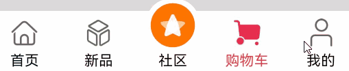

# 自定义TabBar页签案例

```ts
import { TABINFO } from '../model/TabBarData';
import { TabBarDataType } from '../model/DataType';
import { AppRouter } from '@ohos/dynamicsrouter/Index';
```
相比于前一章的文件导入，这里涉及到了本地自定义文件的导入。在这里我们首先通过自定义TabBarDataType类型，通过下面的import命令将新定义的数据类型导入到当前文件中。我们通过TabBarData将DataType中新定义的数据类型再次重新定义为一个4为数组。
<br/>

```ts
const HOME_TAB_BAR_INDEX: number = 0; // 初始化社区的tab下标
const COMMUNITY_TAB_BAR_INDEX: number = 2; // 初始化社区的tab下标
const ARC_MARGIN_TOP: number = -15; // 圆弧的上外间距为-15
```
接下来我们申请了一系列常数变量，具体的功能可见注释。在这一节中，我们使用到了3个子组件，他们呈现子，父，父父的关系。我们首先来查看位于父父层的 TabItem 组件。TabItem 组件是 HarmonyOS 中用于自定义 TabBar 项的组件。该组件通过接收 @Prop 和 @Link 装饰器传入的属性来实现自定义的 Tab 项，并包含了一些视觉和交互效果。
```ts
@Prop iconOffset: number; // 初始化tabBar图片的偏移量
@Prop tabBarIndex: number; // tabBar下标
@Link selectedIndex: number; // 初始化被选定的tabBar下标
```
[@Prop](https://developer.huawei.com/consumer/cn/doc/harmonyos-guides-V2/arkts-prop-0000001473537702-V2#section614118685518) 装饰器用于定义一个组件的属性，使得父组件可以向子组件传递数据。在 ArkTS 中，使用 @Prop 可以让组件更加灵活和可复用。与Prop所形成的单向数据绑定不同，[@Link](https://developer.huawei.com/consumer/cn/doc/harmonyos-guides-V2/arkts-link-0000001524297305-V2#section614118685518) 装饰器用于声明组件之间的数据绑定，类似于双向数据绑定。这意味着，当父组件中的数据变化时，子组件会自动更新，反之亦然。这种机制在实现组件之间的同步和数据共享时非常有用。
<br/>

在这届中，我们将尝试使用一个全新的写作布局，这种布局与Arkts的布局类似。这种布局方式由于arkts组件化的特性而变得可行，因更好的一一对应效果而被选择。我们现在从TabItem的build函数开始说起。
```ts
build() {
    Column() {
      Stack() {
        // 判断tab的下标是否为2
        if (this.tabBarIndex === COMMUNITY_TAB_BAR_INDEX) {
          Column() {
            Image(this.selectedIndex === this.tabBarIndex ? TABINFO[this.tabBarIndex].selectedIcon :
                  TABINFO[this.tabBarIndex].defaultIcon)
              .size({
                width: $r('app.integer.custom_tab_community_image_size'),
                height: $r('app.integer.custom_tab_community_image_size')
              })
              .interpolation(ImageInterpolation.High) // TODO：知识点：使用interpolation属性对图片进行插值，使图片显示得更清晰
          }
          .width($r('app.integer.custom_tab_community_image_container_size'))
          .height($r('app.integer.custom_tab_community_image_container_size'))
          // TODO：知识点：通过设置borderRadius以及margin的top值实现圆弧外轮廓效果。
          .borderRadius($r('app.integer.custom_tab_community_image_container_border_radius_size'))
          .margin({ top: ARC_MARGIN_TOP })
          .backgroundColor(Color.White)
          .justifyContent(FlexAlign.Center)
        } else {
          Column() {
            // 通过被选中的tabBar下标值和tabBar的默认下标值来改变图片显示
            Image(this.selectedIndex === this.tabBarIndex ? TABINFO[this.tabBarIndex].selectedIcon :
                  TABINFO[this.tabBarIndex].defaultIcon)
              // TODO：知识点：使用interpolation属性对图片进行插值，使图片显示得更清晰
              .interpolation(ImageInterpolation.High)
              .size(this.selectedIndex === HOME_TAB_BAR_INDEX && this.selectedIndex === this.tabBarIndex ?
                { width: $r('app.integer.custom_tab_community_image_size'), height: $r('app.integer.custom_tab_community_image_size') } :
                {
                  width: $r('app.integer.custom_tab_image_size'),
                  height: $r('app.integer.custom_tab_image_size')
                })
              // TODO：知识点：通过offset控制图片的纵向偏移。
              .offset({
                y: (this.selectedIndex === this.tabBarIndex && this.selectedIndex !== COMMUNITY_TAB_BAR_INDEX) ?
                this.iconOffset : $r('app.integer.custom_tab_common_size_0')
              })
              // TODO：知识点：组件的某些通用属性变化时，可以通过属性动画animation实现过渡效果。本示例的动画效果是tabBar的图片向上偏移一小段距离
              .animation({
                duration: 400,
                curve: Curve.Ease,
                iterations: 1,
                playMode: PlayMode.Normal
              })
          }
          .width(this.selectedIndex === HOME_TAB_BAR_INDEX && this.selectedIndex === this.tabBarIndex ?
          $r('app.integer.custom_tab_community_image_size') : $r('app.integer.custom_tab_image_container_size'))
          .height(this.selectedIndex === HOME_TAB_BAR_INDEX && this.selectedIndex === this.tabBarIndex ?
          $r('app.integer.custom_tab_community_image_size') : $r('app.integer.custom_tab_image_container_size'))
          .justifyContent(FlexAlign.Center)
        }
      }

      Text(TABINFO[this.tabBarIndex].title)
        .fontSize($r('app.integer.custom_tab_text_font_size'))
        .fontColor(this.selectedIndex === this.tabBarIndex ? $r('app.color.custom_tab_selected_text_color') : Color.Black)
        .visibility(this.selectedIndex === HOME_TAB_BAR_INDEX && this.selectedIndex === this.tabBarIndex ? Visibility.None : Visibility.Visible)
    }
    .width($r('app.integer.custom_tab_height_size'))
    .onClick(() => {
      // 更新被选中的tabBar下标
      this.selectedIndex = this.tabBarIndex;
      // 此处控制tabBar的Image图片向上偏移
      this.iconOffset = -3;
    })
  }
```

* __Column__：最外部的 Column， 将 Stack 和 Text 组件垂直排列。
    * __Stack 组件__：包含了 Tab 的图标和外轮廓。<br/>
    __社区 Tab 的特殊处理__：通过判断 tabBarIndex 是否为 COMMUNITY_TAB_BAR_INDEX 来处理社区 Tab 的特殊样式
        * __Column 容器__：包含一个 Image 组件，用于显示社区 Tab 的图标。
            * __Image 组件__：根据 selectedIndex 来决定显示选中或未选中的图标,图标使用何种尺寸。通过 interpolation 属性提高图像清晰度。
            * __圆弧外轮廓__：通过设置 borderRadius 和 margin 来实现圆弧外轮廓效果。
        * __Column 容器__: 其他 Tab 的处理：对其他 Tab 进行类似的处理，但没有社区 Tab 的圆弧外轮廓。
            * __Image 组件__：根据 selectedIndex 和 tabBarIndex 来决定图标的大小和偏移量。
            * __动画效果__：通过 animation 属性实现图标的动画效果。
        * __Text 组件__：显示 Tab 的标题，根据 selectedIndex 来设置字体颜色和可见性。
    * __onClick 事件__：点击 TabItem 时，更新 selectedIndex 和 iconOffset，以实现选中效果和图标的偏移动画。
<br/>

接下来是位于父层也就是相对于TabItem的子的CustomTabBar。我们首先看到的是该组件声明的变量:
```ts
@Link selectedIndex: number; // 初始化被选定的tabBar下标
@State iconOffset: number = 0; // 初始化tabBar图片的偏移量
```
需要注意的是，由于Prop和Link的存在，这里申明的变量并不代表该组件会用到的全部变量。
<br/>

```ts
build() {
    Flex({ direction: FlexDirection.Row, justifyContent: FlexAlign.SpaceAround, alignItems: ItemAlign.Center }) {
      // 数据量比较少的情况下推荐使用ForEach，遇到数据量比较多的场景，如列表场景、瀑布流场景等，推荐使用LazyForEach(https://docs.openharmony.cn/pages/v4.0/zh-cn/application-dev/quick-start/arkts-rendering-control-lazyforeach.md/)
      ForEach(TABINFO, (item: TabBarDataType, tabIndex: number) => {
        // 单独一个TabBar组件
        TabItem({
          iconOffset: this.iconOffset,
          tabBarIndex: tabIndex,
          selectedIndex: $selectedIndex,
        })

      })
    }
    .height($r('app.integer.custom_tab_height_size'))
  }
```
* [Flex](https://developer.huawei.com/consumer/cn/doc/harmonyos-references-V2/ts-container-flex-0000001427902472-V2): 使用 Flex 布局来排列子组件
    1. direction: FlexDirection.Row：设置主轴方向为行方向，子组件将按行排列。
    2. justifyContent: FlexAlign.SpaceAround：子组件在主轴方向（行）上均匀分布。
    3. alignItems: ItemAlign.Center：子组件在交叉轴（垂直方向）上居中对齐。
    * [ForEach](https://developer.huawei.com/consumer/cn/doc/harmonyos-guides-V2/arkts-rendering-control-foreach-0000001524537153-V2)：用于遍历数组 TABINFO，为每个元素创建一个 TabItem 组件。
        * TabItem：单个 Tab 项，接收 iconOffset、tabBarIndex 和 selectedIndex 作为属性。
    * 设置 Flex 布局的高度。
<br/>

最后我们将介绍的是位于最子层的TabView 组件。TabView 组件是 HarmonyOS 中用于实现自定义 TabBar 视图的组件。它包含多个子模块（如首页、新品、社区、购物车、我的）。
* 组件装饰器
    * @AppRouter({ name: "customtabbar/TabView" })：将该组件注册为一个路由视图，名称为 "customtabbar/TabView"。
    * [@Preview](https://developer.huawei.com/consumer/cn/doc/harmonyos-guides-V2/previewer-0000001054328973-V2)：启用预览功能。
    * @Component：声明这是一个组件。
* 属性定义
    * [@Provide](https://developer.huawei.com/consumer/cn/doc/harmonyos-guides-V2/arkts-provide-and-consume-0000001473857338-V2) selectedIndex: number = 0：提供一个初始值为 0 的被选定的 TabBar 下标。
    * private controller: TabsController = new TabsController()：初始化 Tab 控制器。
补充: @Provide 装饰器用于将组件的状态或属性注入到其子组件中，使得子组件可以直接访问和使用这些状态或属性。它类似于依赖注入机制，可以方便地实现父子组件之间的数据共享和状态管理。这种机制不仅适用于直接子组件，还适用于跨层次的子组件。
<br/>

```ts
build() {
    Column() {
      Tabs({ index: this.selectedIndex, barPosition: BarPosition.End, controller: this.controller }) {
        // 首页模块
        TabContent() {
          Text($r('app.string.custom_tab_home'))
            .fontSize($r('app.integer.custom_tab_title_font_size'))
            .padding(20)
        }

        // 新品模块
        TabContent() {
          Text($r('app.string.custom_tab_news'))
            .fontSize($r('app.integer.custom_tab_title_font_size'))
        }

        // 社区模块
        TabContent() {
          Text($r('app.string.custom_tab_community'))
            .fontSize($r('app.integer.custom_tab_title_font_size'))
        }

        // 购物车模块
        TabContent() {
          Text($r('app.string.custom_tab_shopping_cart'))
            .fontSize($r('app.integer.custom_tab_title_font_size'))
        }

        // 我的模块
        TabContent() {
          Text($r('app.string.custom_tab_mine'))
            .fontSize($r('app.integer.custom_tab_title_font_size'))
        }
      }
      .vertical(false)
      .scrollable(false)
      .layoutWeight(1)
      .backgroundColor('#ffdbd9d9')
      .barHeight($r('app.integer.custom_tab_common_size_0'))
      .onChange((index: number) => {
        this.selectedIndex = index;
      })

      // 自定义TabBar组件
      CustomTabBar({ selectedIndex: $selectedIndex })
    }.width($r('app.string.custom_tab_full_size'))
    .height($r('app.string.custom_tab_full_size'))
  }
```
* Column 容器：使用 Column 布局将 Tabs 和 CustomTabBar 组件垂直排列。
    * [Tabs](https://developer.huawei.com/consumer/cn/doc/harmonyos-references-V2/ts-container-tabs-0000001478181433-V2) 组件：用于实现多个 Tab 的切换功能。
        1. index: this.selectedIndex：设置当前选中的 Tab 下标。
        2. barPosition: BarPosition.End：设置 TabBar 的位置。
        3. controller: this.controller：绑定控制器。
            * TabContent 子组件：每个 TabContent 对应一个标签页，包含一个文本组件。
                * Text：显示标签页的标题，并设置字体大小和内边距。
    * Tabs 属性：
        1. vertical(false)：设置 TabBar 水平方向排列。
        2. scrollable(false)：禁用滚动。
        3. layoutWeight(1)：设置布局权重。
        4. backgroundColor('#ffdbd9d9')：设置背景颜色。
        5. barHeight($r('app.integer.custom_tab_common_size_0'))：设置 TabBar 的高度。
        6. onChange((index: number) => { this.selectedIndex = index; })：监听 Tab 切换事件，更新 selectedIndex。          
    * CustomTabBar
        * 设置组件的宽度。
        * 设置组件的高度。


