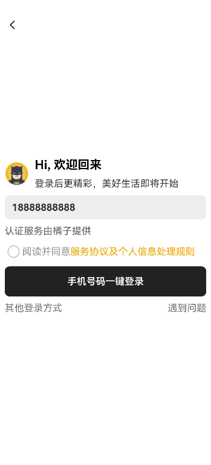

# 全屏登录页面

```ts
import { AppRouter } from '@ohos/dynamicsrouter/Index';

import { DefaultLogin } from './model/DefaultLogin';
```
关于AppRouter的import使用，可以查看第一篇中的介绍。第二个import则是本地相对路径搜索。
<br/>

由于组件装饰器和属性定义没有什么新颖的地方，这里就不多讨论。我们这里讨论的顺序按照登录界面的引导顺序来。我们首先讨论的是button按键的引导页面。
```ts
build() {
    Column() {
      // TODO：需求：增加其他登录方式，如半模态窗口
      Button($r('app.string.modalwindow_full_screen_modal_login_description'))
        .fontColor(Color.White)
        .borderRadius($r('app.integer.modalwindow_border_radius'))
         /**
         * ButtonType为Normal时，按钮圆角通过通用属性borderRadius设置。不同ButtonType下borderRadius属性是否生效，详见：
         * https://developer.huawei.com/consumer/cn/doc/harmonyos-references-V5/ts-basic-components-button-0000001815086854-V5#ZH-CN_TOPIC_0000001815086854__buttontype枚举说明
         */
        .type(ButtonType.Normal)
        .backgroundColor($r('app.color.modalwindow_grey_2'))
        .width($r('app.string.modalwindow_size_full'))
         /**
         * TODO: 知识点: 通过bindContentCover属性为组件绑定全屏模态页面
         * isPresent：是否显示全屏模态页面
         * loginBuilder：配置全屏模态页面内容
         */
        .bindContentCover($$this.isPresent, this.loginBuilder)
        .onClick(() => {
          this.isPresent = true; // 当isPresent为true时显示模态页面，反之不显示
        })
    }
    .size({ width: $r('app.string.modalwindow_size_full'), height: $r('app.string.modalwindow_size_full') })
    .padding($r('app.integer.modalwindow_padding_default'))
    .justifyContent(FlexAlign.Center)
  }
```
* Column：使用 Column 布局将 Button 组件垂直排列。
    * Button：创建一个按钮，点击后显示全屏模态窗口。
        * fontColor(Color.White)：设置按钮文本颜色为白色。
        * borderRadius($r('app.integer.modalwindow_border_radius'))：设置按钮的圆角。
        * type(ButtonType.Normal)：设置按钮类型为 Normal。
        * backgroundColor($r('app.color.modalwindow_grey_2'))：设置按钮背景颜色。
        * width($r('app.string.modalwindow_size_full'))：设置按钮宽度。
        * bindContentCover($$this.isPresent, this.loginBuilder)：绑定全屏模态页面。
            * $$this.isPresent：表示是否显示模态页面的状态。
            * this.loginBuilder：配置全屏模态页面内容。
        * onClick(() => { this.isPresent = true; })：点击按钮时，将 isPresent 设置为 true，显示模态页面。
    * .size({ width: $r('app.string.modalwindow_size_full'), height: $r('app.string.modalwindow_size_full') })：设置 Column 布局的宽高。
    * .padding($r('app.integer.modalwindow_padding_default'))：设置内边距。
    * .justifyContent(FlexAlign.Center)：设置子组件在主轴方向上的对齐方式为居中。
<br/>

接下来就是如果用户点击了按钮进入了全屏模态页面。对于这个组件，我们首先在设置登录按钮的组件中进行了封装。
```ts
@Builder
  loginBuilder() {
    Column() {
      DefaultLogin({ isPresentInLoginView: this.isPresent }) // 通过@State和@Link使isPresentInLoginView和isPresent产生关联
    }
  }
```
<br/>

下面便是关于如何定义DefaultLogin的具体讲解：
```ts
@Link isPresentInLoginView: boolean;
// 是否是默认一键登录方式
@State isDefaultLogin: boolean = true;
// 用户名
userName: string = '18888888888';
// 判断是否同意协议
isConfirmed: boolean = false;
private effect: TransitionEffect = TransitionEffect.OPACITY
    .animation({ duration: EFFECT_DURATION })
    .combine(TransitionEffect.opacity(EFFECT_OPACITY))
```
* @Link isPresentInLoginView: boolean：控制登录页面是否显示，通过 @Link 装饰器与父组件的 @State 装饰器的数据源建立双向数据绑定。
* @State isDefaultLogin: boolean = true：定义一个状态变量 isDefaultLogin，用于控制登录方式的切换。
* userName: string = '18888888888'：用户名称。
* isConfirmed: boolean = false：判断是否同意协议。
* TransitionEffect.OPACITY 是一个预定义的效果类型，用于表示透明度变化。它是 TransitionEffect 类的一个静态属性，用于创建一个透明度变化的过渡效果。
    * animation 方法用于指定过渡效果的动画属性。在这里，duration 表示动画持续时间，单位是毫秒。
    * combine 方法用于将多个过渡效果组合在一起。在这里，将透明度变化效果与自定义的透明度值结合。在这个例子中，综合过渡效果包含：一个透明度过渡效果， 动画持续时间为 800 毫秒， 最终的透明度值为 0.4。如何总结的话就是组件的透明度将会在 800 毫秒内从当前值平滑过渡到 0.4。
<br/>

下面是对于组件中DefaultLoginPage方法的介绍：
```ts
@Builder
  DefaultLoginPage() {
    Column({ space: SPACE_TEN }) {
      Row({ space: SPACE_TEN }) {
        Image($r('app.media.batman'))
          .width($r('app.integer.modalwindow_user_image_height'))
          .height($r('app.integer.modalwindow_user_image_height'))
        Column({ space: SPACE_TEN }) {
          Text($r('app.string.modalwindow_welcome_back'))
            .fontWeight(FontWeight.Bold)
            .fontSize($r('app.integer.modalwindow_font_size_mid'))
            .fontColor(Color.Black)

          Text($r('app.string.modalwindow_more_wonderful_after_login'))
            .fontColor($r('app.color.modalwindow_grey_3'))
        }
        .alignItems(HorizontalAlign.Start)
      }
      .alignItems(VerticalAlign.Center)
      .width($r('app.string.modalwindow_size_full'))

      Text(this.userName)
        .fontColor($r('app.color.modalwindow_grey_3'))
        .fontWeight(FontWeight.Bold)
        .padding({ left: $r('app.integer.modalwindow_padding_default') })
        .height($r('app.integer.modalwindow_user_image_height'))
        .width($r('app.string.modalwindow_size_full'))
        .borderRadius($r('app.integer.modalwindow_border_radius'))
        .backgroundColor($r('app.color.modalwindow_grey_e'))

      Text($r('app.string.modalwindow_verify_server_tip'))
        .fontColor($r('app.color.modalwindow_grey_6'))
        .width($r('app.string.modalwindow_size_full'))
        .textAlign(TextAlign.Start)

      Row() {
        Checkbox({ name: 'checkbox1' })
          .select(this.isConfirmed)
          .onChange((value: boolean) => {
            this.isConfirmed = value
          })
        ReadAgreement()
      }
      .width($r('app.string.modalwindow_size_full'))
      .alignItems(VerticalAlign.Center)

      Button($r('app.string.modalwindow_phone_start_login'))
        .fontColor(Color.White)
        .borderRadius($r('app.integer.modalwindow_border_radius'))
        .type(ButtonType.Normal)
        .backgroundColor($r('app.color.modalwindow_grey_2'))
        .onClick(() => {
          if (this.isConfirmed) {
            // 调用Toast显示登录成功提示
            promptAction.showToast({ message: $r('app.string.modalwindow_login_success') });
          } else {
            // 调用Toast显示请先阅读并同意协议提示
            promptAction.showToast({ message: $r('app.string.modalwindow_please_read_and_agree') });
          }
        })
        .width($r('app.string.modalwindow_size_full'))
        .height($r('app.integer.modalwindow_height_fifty'))
      Row() {
        Text($r('app.string.modalwindow_other_way_login'))
          .fontColor($r('app.color.modalwindow_grey_7'))
          .backgroundColor($r('app.color.modalwindow_transparent_7'))
          .onClick(() => {
            this.isDefaultLogin = false;
          })

        Blank() // 在容器主轴方向上自动填充容器空余部分

        Text($r('app.string.modalwindow_login_problems'))
          .fontColor($r('app.color.modalwindow_grey_7'))
          .backgroundColor($r('app.color.modalwindow_transparent_7'))
          .onClick(() => {
            // 调用Toast显示遇到问题提示
            promptAction.showToast({ message: $r('app.string.modalwindow_login_problems') });
          })
      }
      .width($r('app.string.modalwindow_size_full'))
    }
    .width($r('app.string.modalwindow_size_full'))
    .height($r('app.string.modalwindow_size_full'))
    .backgroundColor(Color.White)
    .justifyContent(FlexAlign.Center)
  }
```
* Column：使用 Column 布局将多个组件垂直排列，space 参数设置组件之间的间距。
    * Row：使用 Row 布局将组件水平排列，包含用户头像和欢迎信息。
        * Image：显示用户头像，设置宽高。
        * Column：包含两个 Text 组件。
            * Text：显示欢迎信息，字体加粗，字体大小中等，颜色为黑色。
            * Text：显示登录后更多精彩内容的提示信息，颜色为灰色。
    * Text(this.userName)：显示用户名，颜色为灰色，字体加粗，设置内边距、边框圆角和背景颜色。
    * Text：显示服务器验证提示信息，颜色为灰色。
    * Row：包含复选框和协议阅读组件。
        * Checkbox：复选框组件，用户确认协议。
        * ReadAgreement：自定义组件，显示协议内容。
    * Button：用于触发登录操作。
        * onClick：根据用户是否同意协议，显示不同的 Toast 提示。
            * showToast: 调用Toast显示相关信息
    * Row：包含其他登录方式和遇到问题的文本。
        * Text：显示其他登录方式的文本，并设置点击事件切换到其他登录方式。
        * Blank：在容器主轴方向上自动填充容器空余部分。
        * Text：显示遇到问题的文本，并设置点击事件显示提示信息。
<br/>

build 方法是 DefaultLogin 组件的主要渲染函数，用于根据组件的状态条件渲染不同的登录页面（默认一键登录和其他方式登录），并实现页面之间的切换和返回功能。
```ts
build() {
    Stack({ alignContent: Alignment.TopStart }) {
      // 登录方式有两种(默认一键登录方式和其他方式登录)，需要在一个模态窗口中切换，使用if进行条件渲染
      if (this.isDefaultLogin) {
        this.DefaultLoginPage() // 默认一键登录方式
      } else {
        OtherWaysToLogin()// 其他登录方式
          .transition(this.effect) // 此处涉及到组件的显示和消失，所以使用transition属性设置出现/消失转场
      }
      Image($r('app.media.arrow_back'))// 通过Stack组件，两个页面只实现一个back
        .width($r('app.integer.modalwindow_height_twenty_five')).height($r('app.integer.modalwindow_height_twenty_five'))
        .margin({ top: $r('app.integer.modalwindow_margin_mid') })
        .onClick(() => {
          if (this.isDefaultLogin) {
            this.isPresentInLoginView = false;
          } else {
            this.isDefaultLogin = true
          }
        })
    }
    .size({ width: $r('app.string.modalwindow_size_full'), height: $r('app.string.modalwindow_size_full') })
    .padding({
      top: $r('app.integer.modalwindow_padding_default'),
      left: $r('app.integer.modalwindow_padding_default'),
      right: $r('app.integer.modalwindow_padding_default')
    })
    .backgroundColor(Color.White) // 将模态页面背景设置为白色，以避免模态页面内组件发生显隐变化时露出下层页面
  }
```
* Stack 多个组件在同一平面上重叠。设置子组件的对齐方式，顶部对齐并从头部开始排列。
    * if (this.isDefaultLogin)：根据 isDefaultLogin 状态条件渲染不同的登录页面。
        * this.DefaultLoginPage()：默认一键登录方式页面。
        * OtherWaysToLogin()：其他登录方式页面。
            * .transition(this.effect)：应用过渡效果，设置组件显示和消失时的动画。
    * Image：显示返回按钮，设置按钮的宽高和顶部边距。
        * width：设置按钮宽度。
        * height：设置按钮高度。
        * margin：设置按钮的顶部边距。
        * onClick：点击事件处理程序，根据当前状态执行不同操作。
            * if (this.isDefaultLogin)：如果当前是默认登录方式，隐藏登录视图。
            * else：否则切换回默认登录方式。
    * size： 设置整个视图的宽高为全屏。
    * padding： 设置视图的内边距。
    * backgroundColor： 设置背景颜色为白色，避免在组件显隐变化时露出下层页面。
<br/>

最后一部分是其它登录方式。为了在文件层面上区分这些是不同的页面，我们将其他登录方式放在一个新的ets文件中。OtherWaysToLogin 组件是一个示例，展示了如何在 HarmonyOS 中使用 ArkTS 框架实现多种登录方式的界面。该组件包含手机号登录、发送验证码按钮、服务协议复选框以及第三方应用登录方式。
```ts
@Component
export struct OtherWaysToLogin {
  // 发送验证码按钮的颜色
  @State buttonColor: ResourceColor = Color.Grey;
  // 发送验证码按钮的内容
  @State buttonContent: ResourceStr = $r('app.string.modalwindow_verify');
  // 手机号是否可用
  phoneNumberAvailable: boolean = false;
  // 可发送验证码的倒计时秒数
  countdownSeconds: number = 0;
  // 是否勾选阅读并同意服务协议及个人信息处理规则
  isAgree: boolean = false;
  loginIcons: Resource[] = [$r('app.media.app_logo1'), $r('app.media.app_logo2'), $r('app.media.app_logo3')]

  build() {
    Column({ space: SPACE_TWENTY }) {
      Column({ space: SPACE_TEN }) {
        Row({ space: SPACE_TEN }) {
          Image($r('app.media.phone')).width($r('app.integer.modalwindow_user_image_height'))
            .borderRadius($r('app.integer.modalwindow_border_radius_mid'))
          Text($r('app.string.modalwindow_phone_login')).fontSize($r('app.integer.modalwindow_font_size_mid'))
        }
        .width($r('app.string.modalwindow_size_full'))

        Text($r('app.string.modalwindow_new'))
          .width($r('app.string.modalwindow_size_full'))
      }
      .width($r('app.string.modalwindow_size_full'))
      .alignItems(HorizontalAlign.Start)

      Row() {
        Text($r('app.string.modalwindow_86'))
        Image($r('app.media.arrow_right'))
          .size({ width: $r('app.integer.modalwindow_arrow_right_height'), height: $r('app.integer.modalwindow_arrow_right_height') })
          .margin($r('app.integer.modalwindow_margin_default'))
        TextInput({ placeholder: $r('app.string.modalwindow_input_phone_number') })
          .inputFilter('[0-9]')// 正则表达式，输入的是数字0-9则允许显示，不是则被过滤
          .backgroundColor(Color.Transparent)
          .caretColor(Color.Grey)
          .width($r('app.string.modalwindow_size_full'))
          .maxLength(PHONE_NUMBER_LENGTH)// 设置最大输入字符数
            // 当输入字符数为11位时，发送验证码按钮变为蓝色，否则置灰
          .onChange((value: string) => {
            if (value.length === PHONE_NUMBER_LENGTH) {
              this.phoneNumberAvailable = true;
              this.buttonColor = Color.Blue;
            } else {
              this.phoneNumberAvailable = false;
              this.buttonColor = Color.Grey;
            }
          })
      }

      Button(this.buttonContent)
        .type(ButtonType.Normal)
        .border({ radius: $r('app.integer.modalwindow_border_radius') })
        .width($r('app.string.modalwindow_size_full'))
        .backgroundColor(this.buttonColor)
        .onClick(() => {
          if (this.countdownSeconds > 0) { // 处于可再次发送的读秒倒计时状态下，点击按钮不响应
            return;
          }
          // 输入输入字符数为11位，并同意服务协议及个人信息处理规则，才能发送验证码
          if (!this.phoneNumberAvailable) {
            promptAction.showToast({ message: $r('app.string.modalwindow_message_right_phone_number') });
          } else if (!this.isAgree) {
            promptAction.showToast({ message: $r('app.string.modalwindow_message_read_agreement') });
          } else {
            // 点击发送短信验证码按钮后，按钮置灰，开始读秒倒计时，按钮内容改变
            promptAction.showToast({ message: $r('app.string.modalwindow_message_verify_code_send') });
            this.buttonColor = Color.Grey;
            this.countdownSeconds = COUNTDOWN_SECONDS;
            const timerId = setInterval(() => {
              this.countdownSeconds--;
              if (this.countdownSeconds <= 0) {
                // 计时结束，根据手机号位数是否正确，重置按钮状态
                this.buttonContent = $r('app.string.modalwindow_verify');
                clearInterval(timerId);
                this.buttonColor = this.phoneNumberAvailable ? Color.Blue : Color.Grey;
                return;
              }
              this.buttonContent = this.countdownSeconds + SEND_AGAIN_IN_SECONDS;
            }, 1000)
          }
        })

      Row() {
        Checkbox({ name: 'agreement' })// $$运算符为系统内置组件提供TS变量的引用，使得TS变量和系统内置组件的内部状态保持同步
          .select($$this.isAgree)
        ReadAgreement()
      }
      .width($r('app.string.modalwindow_size_full'))
      .justifyContent(FlexAlign.Start)

      Blank() // 在容器主轴方向上自动填充容器空余部分

      // 其他三方应用登录方式
      List({ space: SPACE_TWENTY }) {
        // 性能知识点：此处在List中排列组件，列表项确定、数量较少，且需要一次性加载，因此使用ForEach。在列表项多的情况下，推荐使用LazyForEach
        ForEach(this.loginIcons, (item: Resource) => {
          ListItem() {
            Image(item)
              .width($r('app.integer.modalwindow_other_ways_icon_height'))
              .borderRadius($r('app.integer.modalwindow_other_ways_border_radius'))
              .onClick(() => {
                // 调用Toast显示三方应用授权登录提示
                promptAction.showToast({ message: $r('app.string.modalwindow_message_third_party_authorization') });
              })
          }
        })
      }
      .listDirection(Axis.Horizontal)
    }
    .width($r('app.string.modalwindow_size_full'))
    .height($r('app.string.modalwindow_size_full'))
    .backgroundColor(Color.White)
    .padding({ bottom: $r('app.integer.modalwindow_padding_mid'), top: $r('app.integer.modalwindow_padding_to_top') })
  }
}
```
1. __属性定义__
* @State buttonColor: ResourceColor = Color.Grey：发送验证码按钮的颜色，初始值为灰色。
* @State buttonContent: ResourceStr = $r('app.string.modalwindow_verify')：发送验证码按钮的内容，初始值为"验证"。
* phoneNumberAvailable: boolean = false：手机号是否可用，初始值为不可用。
* countdownSeconds: number = 0：可发送验证码的倒计时秒数，初始值为 0。
* @State isAgree: boolean = false：是否同意服务协议及个人信息处理规则，初始值为不同意。
* loginIcons: Resource[]：存储第三方登录图标的资源数组。
2. __build函数主体__
* Column：垂直排列组件。
3. __手机号登录部分__
    * Column：垂直排列组件。
        * Row：水平排列用户头像和登录方式文本。
            * Image：显示手机图标。
            * Text：显示 "手机号登录" 文本。
        * Text：显示 "新用户注册" 文本。
4. __手机号输入和发送验证码__
    * Row：水平排列国家代码、箭头图标和手机号输入框。
        * Text：显示国家代码 "+86"。
        * Image：显示箭头图标，设置大小和边距。
        * TextInput：输入手机号，设置过滤规则、背景色、光标颜色、宽度和最大长度。
            * inputFilter('[0-9]')：正则表达式，输入的是数字0-9则允许显示，不是则被过滤。
            * onChange：根据输入长度改变按钮状态。
                条件判断：<br/>
                    当输入字符数为 11 位时，设置 phoneNumberAvailable 为 true，并将按钮颜色改为蓝色。<br/>
                    否则，将 phoneNumberAvailable 设置为 false，并将按钮颜色改为灰色。
5. __发送验证码按钮__
    * Button：发送验证码按钮，设置类型、边框、宽度、背景色和点击事件。
        * onClick：点击事件处理，检查手机号和协议状态，并执行倒计时逻辑。
        条件判断：<br/>
            如果倒计时秒数大于 0，按钮不响应点击。<br/>
            如果手机号不可用，显示提示信息。<br/>
            如果未同意协议，显示提示信息。<br/>
            否则，按钮置灰并开始倒计时，倒计时结束后重置按钮状态。<br/>
5. __服务协议__
    * Row：包含复选框和协议阅读组件。
        * Checkbox：服务协议复选框，绑定 isAgree 状态。
        * ReadAgreement：协议阅读组件。

    * Blank: 在容器主轴方向上自动填充容器空余部分
6. __第三方登录__
    * List：水平排列第三方登录图标。
        * ForEach：遍历 loginIcons 数组，生成图标列表项。
            * ListItem：包含第三方登录图标，并设置点击事件。
7.__整体样式__
    * 宽高设置：设置视图宽高为全屏。
    * 背景颜色：设置背景颜色为白色。
    * 内边距：设置视图的上下内边距。
<br/>

最后一部分需要介绍的是用户协议部分。ReadAgreement 组件是一个用于展示服务协议及个人信息处理规则的组件。
```ts
@Component
export struct ReadAgreement {
  build() {
    Text() {
      Span($r('app.string.modalwindow_read_and_agree'))
        .fontColor($r('app.color.modalwindow_grey_9'))
      Span($r('app.string.modalwindow_server_proxy_rule_detail'))
        .fontColor(Color.Orange)
        .onClick(() => {
          // 调用Toast显示用户点击服务协议及个人信息处理规则的提示
          promptAction.showToast({ message: $r('app.string.modalwindow_server_proxy_rule_detail') });
        })
    }
    .textAlign(TextAlign.Start)
  }
}
```
* Text: 组件用于展示包含多个 Span 的文本内容。
    * Span：展示普通文本
        * 设置文本颜色为灰色。
    * Span：展示可点击的链接文本。
        * fontColor: 设置文本颜色为橙色。
        * onClick: 点击事件处理，显示提示信息。
    * textAlign: 设置文本对齐方式为左对齐。


