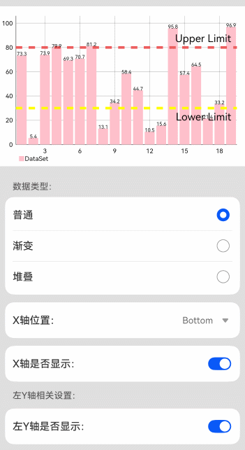

<!-- vscode-markdown-toc -->
* 1. [import](#import)
* 2. [变量申明](#)
* 3. [OnChartValueSelectedListener](#OnChartValueSelectedListener)
* 4. [chartGestureListener](#chartGestureListener)
* 5. [aboutToAppear](#aboutToAppear)
* 6. [getNormalData](#getNormalData)
	* 6.1. [BarEntry](#BarEntry)
	* 6.2. [JArrayList](#JArrayList)
* 7. [getGradientData](#getGradientData)
	* 7.1. [Fill](#Fill)
* 8. [getStackData](#getStackData)
* 9. [refresh](#refresh)
* 10. [@Builder xPositionMenu](#BuilderxPositionMenu)
* 11. [build](#build)

<!-- vscode-markdown-toc-config
	numbering=true
	autoSave=true
	/vscode-markdown-toc-config -->
<!-- /vscode-markdown-toc -->
# barchart

##  1. <a name='import'></a>import
```ts
import {
  BarChart, // 柱状图图表类
  BarChartModel, // 柱状图配置构建类
  BarData, // 柱状图数据包
  BarDataSet, // 柱状图数据集合
  BarEntry, // 柱状图数据结构
  ChartGesture, // 手势事件模式
  Description, // 图表Description(描述)部件
  EntryOhos, // 图表数据结构基础类
  Fill, // 图表填充类型构建类
  Highlight, // 图表高亮数据
  IBarDataSet, // 柱状图数据集合的操作类
  JArrayList, // 工具类：数据集合
  Legend, // 图表Legend(图例)部件
  LimitLabelPosition, // 图表的LimitLine标签位置枚举类
  LimitLine, // 图表LimitLine
  MarkerView, // 图表的Marker(标志气泡)部件
  OnChartGestureListener, // 手势事件监听
  OnChartValueSelectedListener, // 数据选择监听
  XAxis, // 图表X轴部件
  XAxisPosition, // 图表X轴标签位置枚举类
  YAxis, // 图表Y轴部件
  YAxisLabelPosition // 图表Y轴标签位置枚举类
} from '@ohos/mpchart';
```
在这一节中，如果我们查看@ohos/mpchart所指向的配置路径，其使用的是版本为 3.0.1-rc.0 的 @ohos/mpchart 包。其中的3.0.1的格式为主版本号.次版本号.修订号，表示这是一个特定版本。rc.0代表这是一个发布候选（release candidate），这是在正式发布之前的一个版本，用于测试和验证是否存在问题。在这里我们首次通过.ohpm包来导入包，我们同样是通过在当前目录下的oh-package.json5配置ohpm的相关信息完成。
```json
{
  "license": "Apache-2.0",
  "devDependencies": {},
  "author": "",
  "name": "barchart",
  "description": "Please describe the basic information.",
  "main": "Index.ets",
  "version": "1.0.0",
  "dependencies": {
    "@ohos/mpchart": "3.0.1-rc.0",
    // 动态路由模块，用于配置动态路由
    "@ohos/dynamicsrouter": "file:../../feature/routermodule"
  }
}
```
从上面的配置信息，我们能看到我们为@ohos/mpchart配置了相关的依赖项。在deveco配置正确的前提下，成功运行代码之后便会在相关目录先创建oh_modules文件夹。在这里我们需要的mpchart包便在这个文件夹之下。
<br/>

##  2. <a name=''></a>变量申明
关于组件包含的变量和状态这里不多赘述，对于第一次接触TypeScript 的朋友，| 是 TypeScript 的联合类型操作符。联合类型允许一个变量可以是多种类型之一。例如，string | number 表示一个变量可以是字符串类型或数字类型。
<br/>

##  3. <a name='OnChartValueSelectedListener'></a>OnChartValueSelectedListener
[OnChartValueSelectedListener](https://gitee.com/openharmony-sig/ohos-MPChart)是一个用于监听图表数据点选择事件的接口。
1. __onValueSelected__<br/>
当用户选中图表中的某个数据点时触发。<br/>
在图表应用中，valueSelectedListener 可以用于响应用户与图表数据点的交互，例如显示详细信息、更新其他 UI 元素或执行其他逻辑操作。通过实现 OnChartValueSelectedListener 接口，开发者可以定制对数据点选择和取消选择事件的响应。
* e: EntryOhos：被选中的数据条目，包含有关所选数据点的信息。
* h: Highlight：高亮对象，包含有关高亮状态的信息。
2. __onNothingSelected__<br/>
当用户取消选择图表中的数据点时触发。

##  4. <a name='chartGestureListener'></a>chartGestureListener
[OnChartGestureListener](https://gitee.com/openharmony-sig/ohos-MPChart)类型的初始化， 是一个手势事件监听器对象，用于监听和处理图表上的各种手势事件。该对象实现了 OnChartGestureListener 接口，包含多个回调方法，每个方法对应一种手势事件。下面是对于参数的简单介绍:
1. __onChartGestureStart__<br/>
当手势事件开始时触发。
* isTouchEvent：是否是触摸事件。
* me：事件对象，可以是 TouchEvent 或 GestureEvent。
* lastPerformedGestureMode：上一个执行的手势模式。

2. __onChartGestureEnd__<br/>
当手势事件结束时触发。
* isTouchEvent：是否是触摸事件。
* me：事件对象，可以是 TouchEvent 或 GestureEvent。
* lastPerformedGestureMode：上一个执行的手势模式。

3. __onChartLongPressed__<br/>
当长按手势发生时触发。
* isTouchEvent：是否是触摸事件。
* me：事件对象，可以是 TouchEvent 或 GestureEvent。

4. __onChartDoubleTapped__<br/>
当双击手势发生时触发。
* isTouchEvent：是否是触摸事件。
* me：事件对象，可以是 TouchEvent 或 GestureEvent。

5. __onChartSingleTapped__<br/>
当单击手势发生时触发。
* isTouchEvent：是否是触摸事件。
* me：事件对象，可以是 TouchEvent 或 GestureEvent。

6. __onChartFling__<br/>
当快速滑动手势发生时触发。
* isTouchEvent：是否是触摸事件。
* me1：第一次触摸事件对象，可以是 TouchEvent 或 GestureEvent。
* me2：第二次触摸事件对象。
* velocityX：X 轴方向的速度。
* velocityY：Y 轴方向的速度。

7. __onChartScale__<br/>
当缩放手势发生时触发。
* isTouchEvent：是否是触摸事件。
* me：事件对象，可以是 TouchEvent 或 GestureEvent。
* scaleX：X 轴方向的缩放比例。
* scaleY：Y 轴方向的缩放比例。

8. __onChartTranslate__<br/>
当平移手势发生时触发。
* isTouchEvent：是否是触摸事件。
* me：事件对象，可以是 TouchEvent 或 GestureEvent。
* dX：X 轴方向的位移。
* dY：Y 轴方向的位移。
<br/>

__TouchEvent__<br/>
TouchEvent 是用于处理触摸输入的事件对象。它通常在移动设备上使用，用于检测手指在触摸屏上的各种操作。TouchEvent 包含有关单个或多个触点的信息。
* 常见的 TouchEvent 类型
* * touchstart：当一个或多个手指触摸屏幕时触发。
* * touchmove：当一个或多个手指在屏幕上移动时触发。
* * touchend：当一个或多个手指从屏幕上移开时触发。
* * touchcancel：当触摸操作被打断时触发，例如弹出系统警告对话框时。
* TouchEvent 的常见属性
* * touches：表示当前所有触点的列表。
* * targetTouches：表示特定元素上的触点列表。
* * changedTouches：表示自上次触发事件以来发生变化的触点列表。
* * altKey, metaKey, ctrlKey, shiftKey：指示是否按下相应的键（Alt、Meta、Ctrl、Shift）。
<br/>

__GestureEvent__<br/>
GestureEvent 是用于处理复杂手势的事件对象。它通常用于检测诸如旋转、捏合缩放等多点触摸手势。
* 常见的 GestureEvent 类型
* * gesturestart：当手势开始时触发。
* * gesturechange：当手势变化时触发。
* * gestureend：当手势结束时触发。
* GestureEvent 的常见属性
* * rotation：表示旋转角度，以度为单位。
* * scale：表示缩放比例。
* * altKey, metaKey, ctrlKey, shiftKey：指示是否按下相应的键（Alt、Meta、Ctrl、Shift）。
<br/>

##  5. <a name='aboutToAppear'></a>aboutToAppear
aboutToAppear 方法用于初始化柱状图的配置和数据。当组件即将显示时，这个方法会被调用，确保图表的各项配置和数据都已正确初始化。

1. __初始化图表配置构建类__
```ts
this.model = new BarChartModel();
```

2. __配置图表样式和事件监听器__
```ts
//添加数据选择监听器
this.model.setOnChartValueSelectedListener(this.valueSelectedListener);
//添加手势识别监听器
this.model.setOnChartGestureListener(this.chartGestureListener);
```

3. __设置图表描述部件__
```ts
//获取图表描述部件，并将其禁用
const description: Description | null = this.model.getDescription();
if (description) {
  description.setEnabled(false);
}
```

4. __设置图表图例部件__
```ts
//获取图表图例部件，并将其启用
const legend: Legend | null = this.model.getLegend();
if (legend) {
  legend.setEnabled(true);
}
```

5. __配置缩放和手势__
```ts
//禁用 X 轴和 Y 轴方向的同时缩放，但可以单独缩放
this.model.setPinchZoom(false);
//禁用缩放功能
this.model.setScaleEnabled(false);
//设置是否支持双击放大
this.model.setDoubleTapToZoomEnabled(false);
```

6. __设置图表背景__
```ts
// 启用绘制网格背景
this.model.setDrawGridBackground(false);
// 设置网格背景颜色
this.model.setGridBackgroundColor('#500000ff');
```

7. __配置柱状图阴影和高亮__
```ts
// 设置不绘制柱状图的柱体阴影背景
this.model.setDrawBarShadow(false);
// 设置柱状图的高亮范围是否为整个柱体，只在堆叠柱状图中有区别
this.model.setHighlightFullBarEnabled(false);
```

8. __配置左 Y 轴__
```ts
// 为左Y轴设置LimitLine,可设置限制线的宽度，线段样式，限制标签的位置，标签字体大小等
this.limitLine1 = new LimitLine(80, 'Upper Limit');
this.limitLine1.setLineWidth(4);
this.limitLine1.enableDashedLine(10, 10, 0);
this.limitLine1.setLabelPosition(LimitLabelPosition.RIGHT_TOP);
this.limitLine1.setTextSize(vp2px(5));

this.limitLine2 = new LimitLine(30, 'Lower Limit');
this.limitLine2.setLineWidth(4);
this.limitLine2.enableDashedLine(10, 10, 0);
this.limitLine2.setLineColor(Color.Yellow);
this.limitLine2.setLabelPosition(LimitLabelPosition.RIGHT_BOTTOM);
this.limitLine2.setTextSize(vp2px(5));
```

9. __获取配置左Y轴__
```ts
this.leftAxis = this.model.getAxisLeft();
if (this.leftAxis) {
    this.leftAxis.setAxisMinimum(0);
    this.leftAxis.setDrawLimitLinesBehindData(false);

    // 添加LimitLines
    this.leftAxis.addLimitLine(this.limitLine1);
    this.leftAxis.addLimitLine(this.limitLine2);
}
```

10. __配置右Y轴__
```ts
this.rightAxis = this.model.getAxisRight();
if (this.rightAxis) {
  this.rightAxis.setEnabled(false);
  this.rightAxis.setAxisMinimum(0);
}
```

11. __配置 X 轴__
```ts
this.xAxis = this.model.getXAxis();
if (this.xAxis) {
  this.xAxis.setPosition(XAxisPosition.BOTTOM);
}
```

12. __设置 MarkerView__
```ts
this.normalMarker = new MarkerView();
this.model.setMarker(this.normalMarker);
```
MarkerView 是一个用于在图表中显示额外信息的视图组件。当用户在图表上选择一个数据点时，MarkerView 会在该数据点附近显示一个悬浮的视图，用于展示该数据点的详细信息。

13. __生成并设置图表数据__
```ts
this.data = this.getNormalData();
// TODO 知识点：将数据与图表配置类绑定
this.model.setData(this.data);
```

14. __设置图表最大的X轴显示范围__
```ts
this.model.setVisibleXRangeMaximum(this.mMaxVisibleXCount);
```
<br/>

##  6. <a name='getNormalData'></a>getNormalData
getNormalData 方法生成单一颜色数据的柱状图数据。它创建一个包含多个 BarEntry 的数据集，并将这些数据条目添加到 BarDataSet 中，最终返回一个 BarData 对象。
1. __创建数据条目__
```ts
const values: JArrayList<BarEntry> = new JArrayList<BarEntry>();
values.add(new BarEntry(1, 73.3));
values.add(new BarEntry(2, 5.4));
values.add(new BarEntry(3, 73.9));
values.add(new BarEntry(4, 79.9));
// 其他数据条目...
```
[[toc]]
###  6.1. <a name='BarEntry'></a>BarEntry
BarEntry 是在柱状图 (BarChart) 中用于表示数据条目的类。每个 BarEntry 对象表示柱状图中的一个数据点，包括其在 X 轴上的位置以及对应的值。对于堆叠柱状图，每个 BarEntry 可以包含多个值。
```ts
//单一值的柱状图条目
new BarEntry(x: number, y: number)
//多值（堆叠）柱状图条目
new BarEntry(x: number, yVals: number[])
```
<br/>

###  6.2. <a name='JArrayList'></a>JArrayList
JArrayList 是 mpchart 中的一个类，用于表示一个动态数组列表。它类似于 Java 中的 ArrayList，可以存储和管理多个对象。在图表数据处理中，JArrayList 通常用于存储数据条目 (BarEntry) 或数据集 (IBarDataSet)。
```ts
//使用示例
//---------------------------

//创建 JArrayList 对象
const values: JArrayList<BarEntry> = new JArrayList<BarEntry>();
//添加元素到 JArrayList
values.add(new BarEntry(1, 73.3));
values.add(new BarEntry(2, 5.4));
values.add(new BarEntry(3, 73.9));
//使用 JArrayList 创建数据集
const dataSet: BarDataSet = new BarDataSet(values, 'DataSet');
//创建 JArrayList 存储数据集
const dataSetList: JArrayList<IBarDataSet> = new JArrayList<IBarDataSet>();
dataSetList.add(dataSet);
//创建 BarData
const barData: BarData = new BarData(dataSetList);
```
<!-- TOC END -->
<br/>

2. __创建数据集__<br/>
使用 BarDataSet 包装数据条目，并设置一些属性。
```ts
const dataSet: BarDataSet = new BarDataSet(values, 'DataSet');
dataSet.setHighLightColor(Color.Black);
dataSet.setDrawIcons(false);
dataSet.setColorByColor(Color.Pink); // 设置柱体颜色
```

3. __创建数据集列表__<br/>
使用 JArrayList<IBarDataSet> 存储数据集。
```ts
const dataSetList: JArrayList<IBarDataSet> = new JArrayList<IBarDataSet>();
dataSetList.add(dataSet);
```

4. __创建并返回 BarData__<br/>
使用 BarData 包装数据集列表，并设置柱体宽度。
```ts
const barData: BarData = new BarData(dataSetList);
barData.setBarWidth(0.85);
return barData;
```

##  7. <a name='getGradientData'></a>getGradientData
getGradientData 方法生成渐变颜色数据的柱状图数据。它创建一个包含多个 BarEntry 的数据集，并为每个柱体设置渐变颜色。
1. __创建数据条目__
```ts
const values: JArrayList<BarEntry> = new JArrayList<BarEntry>();
values.add(new BarEntry(1, 32.9));
values.add(new BarEntry(2, 44.7));
// 其他数据条目...
```

2. __创建数据集__
```ts
const dataSet: BarDataSet = new BarDataSet(values, 'DataSet');
dataSet.setHighLightColor(Color.Black);
dataSet.setDrawIcons(false);
```

3. __创建渐变填充__
```ts
const START_COLOR1: string = '#ffffbb33';
const START_COLOR2: string = '#ff33b5e5';
const START_COLOR3: string = '#ffffbb33';
const START_COLOR4: string = '#ff99cc00';
const START_COLOR5: string = '#ffff4444';
const END_COLOR1: string = '#ff0099cc';
const END_COLOR2: string = '#ffaa66cc';
const END_COLOR3: string = '#ff669900';
const END_COLOR4: string = '#ffcc0000';
const END_COLOR5: string = '#ffff8800';
const gradientFills: JArrayList<Fill> = new JArrayList<Fill>();
gradientFills.add(new Fill(START_COLOR1, END_COLOR1));
gradientFills.add(new Fill(START_COLOR2, END_COLOR2));
gradientFills.add(new Fill(START_COLOR3, END_COLOR3));
gradientFills.add(new Fill(START_COLOR4, END_COLOR4));
gradientFills.add(new Fill(START_COLOR5, END_COLOR5));
```

###  7.1. <a name='Fill'></a>Fill
Fill 类在 mpchart 库中用于定义图表元素的填充颜色和渐变效果。
```ts
//纯色填充示例
const solidFill = new Fill('#ff0000'); // 使用红色填充
//渐变填充示例
const gradientFill = new Fill('#ff0000', '#0000ff'); // 从红色到蓝色的渐变填充
```

4. __设置渐变填充__
```ts
dataSet.setFills(gradientFills);
```

5. __创建数据集列表并返回 BarData__
```ts
const dataSetList: JArrayList<IBarDataSet> = new JArrayList<IBarDataSet>();
dataSetList.add(dataSet);
const barData: BarData = new BarData(dataSetList);
barData.setBarWidth(0.85);
return barData;
```
<br/>

##  8. <a name='getStackData'></a>getStackData
getStackData 方法生成堆叠颜色数据的柱状图数据。它创建一个包含多个 BarEntry 的数据集，并为每个柱体设置分段的颜色信息。
1. __创建数据条目__
```ts
const values: JArrayList<BarEntry> = new JArrayList<BarEntry>();
values.add(new BarEntry(1, [38.0, 28.0, 39.8]));
values.add(new BarEntry(2, [18.2, 16.1, 16.1]));
// 其他数据条目...
```

2. __创建数据集__
```ts
let dataSet: BarDataSet | null = null;
dataSet = new BarDataSet(values, "Statistics Vienna 2014");
dataSet.setDrawIcons(false);
dataSet.setColorsByArr([Color.Red, Color.Green, Color.Pink]); // 设置分段颜色
dataSet.setStackLabels(["Births", "Divorces", "Marriages"]); // 设置分段标签
```

3. __创建数据集列表并返回 BarData__
```ts
const dataSets: JArrayList<IBarDataSet> = new JArrayList<IBarDataSet>();
dataSets.add(dataSet);
const data: BarData = new BarData(dataSets);
data.setValueTextColor(Color.White);
return data;
```
<br/>

##  9. <a name='refresh'></a>refresh
refresh 方法用于刷新图表数据和视图。当数据或配置发生变化时，可以调用此方法更新图表。
```ts
private refresh(): void {
  if (this.model) {
    this.model.notifyDataSetChanged(); // 通知数据已更改
    this.model.invalidate(); // 重新绘制图表
  }
}
```
<br/>

##  10. <a name='BuilderxPositionMenu'></a>@Builder xPositionMenu
它是一个使用 @Builder 装饰器的方法，用于生成一个包含多个选项的菜单，每个选项代表一个 X 轴位置。
```ts
@Builder
  xPositionMenu() {
    Column() {
      ForEach(this.xPosition, (item: string, index: number) => {
        Column() {
          Flex({
            direction: FlexDirection.Row,
            justifyContent: FlexAlign.SpaceBetween,
            alignItems: ItemAlign.Center
          }) {
            Text(item)
              .fontSize($r('app.integer.bar_chart_menu_text_size'))
              .fontWeight(TEXT_FONT_WEIGHT)
            Image($r('app.media.bar_chart_ok'))
              .visibility(this.xPositionIndex === index ? Visibility.Visible : Visibility.Hidden)
              .width($r('app.integer.bar_chart_menu_image_size'))
              .height($r('app.integer.bar_chart_menu_image_size'))
          }
          .height($r('app.integer.bar_chart_menu_item_height'))

          Divider()
            .visibility(index !== 3 ? Visibility.Visible : Visibility.Hidden)
            .width('100%')
        }
        .width($r('app.integer.bar_chart_menu_item_width'))
        .onClick(() => {
          this.xPositionIndex = index;
          if (this.xAxis) {
            switch (item) {
              case 'Top':
                this.xAxis.setPosition(XAxisPosition.TOP);
                break;
              case 'Bottom':
                this.xAxis.setPosition(XAxisPosition.BOTTOM);
                break;
              case 'Both Side':
                this.xAxis.setPosition(XAxisPosition.BOTH_SIDED);
                break;
              case 'Top InSide':
                this.xAxis.setPosition(XAxisPosition.TOP_INSIDE);
                break;
              case 'Bottom InSide':
                this.xAxis.setPosition(XAxisPosition.BOTTOM_INSIDE);
                break;
            }
            this.refresh();
          }
        })
      })
    }
    .borderRadius($r('app.integer.bar_chart_menu_border_radius'))
    .backgroundColor(Color.White)
    .alignItems(HorizontalAlign.Center)
    .justifyContent(FlexAlign.Center)
    .width($r('app.integer.bar_chart_menu_width'))
  }
```
xPositionMenu 方法使用 Column 作为主容器，将所有菜单项垂直排列。每个菜单项包含在一个 Column 容器中，并使用 Flex 布局将文本和图标横向排列。在 ForEach 循环中，生成每个菜单项，并为其添加分隔线和点击事件。点击事件更新当前选中的 X 轴位置，并刷新图表。整个菜单的样式通过设置圆角边框、背景颜色和对齐方式来实现。
* __Column__: 使用 Column 布局将所有菜单项垂直排列。<br/>
    * __ForEach__: 遍历 this.xPosition 数组，为每个 X 轴位置生成一个菜单项。<br/>
        * __Column__: 包含每个菜单项的内容和布局。<br/>
            * Flex: 使用 Flex 布局横向排列文本和图标。<br/>
                direction: FlexDirection.Row: 设置布局方向为水平方向。<br/>
                justifyContent: FlexAlign.SpaceBetween: 设置子组件在主轴方向上的对齐方式为两端对齐。<br/>
                alignItems: ItemAlign.Center: 设置子组件在交叉轴方向上的对齐方式为居中对齐。<br/>
                * Text(item): 显示当前 X 轴位置的名称。<br/>
                    fontSize: 设置文本字体大小。<br/>
                    fontWeight: 设置文本字体粗细。<br/>
                * Image: 显示选中的标识图标。<br/>
                    visibility: 根据当前选中的索引决定是否显示图标。<br/>
                    width: 设置图标宽度。<br/>
            height: 设置图标高度。<br/>
            * Divider: 添加菜单项之间的分隔线。<br/>
                visibility: 最后一个菜单项不显示分隔线。<br/>
                width: 设置分隔线宽度为100%。<br/>
        width: 设置菜单项的宽度。<br/>
        * onClick(() => { ... }): 为菜单项添加点击事件。<br/>
            * this.xPositionIndex: 更新选中的 X 轴位置索引。<br/>
                switch : 根据选中的菜单项，设置 X 轴的位置。<br/>
                    case 'Top':设置 X 轴位置为顶部。<br/>
                    case 'Bottom':  设置 X 轴位置为底部。<br/>
                    case 'Both Side': 设置 X 轴位置为两侧。<br/>
                    case 'Top InSide':  设置 X 轴位置为顶部内部。<br/>
                    case 'Bottom InSide': 设置 X 轴位置为底部内部。<br/>
                * this.refresh(): 调用 refresh() 方法刷新图表。<br/>
borderRadiu: 设置主容器的圆角边框。<br/>
backgroundColor: 设置主容器的背景颜色为白色。<br/>
alignItems: 设置子组件在交叉轴方向上的对齐方式为居中。<br/>
justifyContent: 设置子组件在主轴方向上的对齐方式为居中。<br/>
width: 设置主容器的宽度。<br/>

##  11. <a name='build'></a>build 
```ts
build() {
    Column() {
      // TODO 知识点：为组件设置配置构建类。可通过在事件中使用this.model.notifyDataSetChanged()触发坐标轴数据更新。通过在事件中使用this.model.invalidate()触发绘制更新。
      BarChart({ model: this.model })
        .width('100%')
        .height($r('app.integer.bar_chart_height'))
        .backgroundColor(Color.White)
        .margin({
          top: $r('app.integer.bar_chart_border_padding'),
          bottom: $r('app.integer.bar_chart_border_padding'),
        })

      Scroll() {
        Column() {
          Column() {
            Text($r('app.string.bar_chart_control_data_type'))
              .fontSize($r('app.integer.bar_chart_list_small_text_size'))
              .opacity(TEXT_OPACITY)
              .fontColor(Color.Black)
              .fontWeight(TEXT_FONT_WEIGHT)
          }
          .justifyContent(FlexAlign.End)
          .margin({ left: $r('app.integer.bar_chart_list_small_text_margin') })
          .height($r('app.integer.bar_chart_list_small_text_height'))

          Column() {
            Column() {
              Flex({
                direction: FlexDirection.Row,
                justifyContent: FlexAlign.SpaceBetween,
                alignItems: ItemAlign.Center
              }) {
                Text($r('app.string.bar_chart_control_normal'))
                  .fontSize($r('app.integer.bar_chart_list_big_text_size'))
                  .fontWeight(TEXT_FONT_WEIGHT)

                Radio({ value: 'normal', group: 'dataType' })
                  .width($r('app.integer.bar_chart_list_checkbox_size'))
                  .height($r('app.integer.bar_chart_list_checkbox_size'))
                  .checked(true)
                  .onChange((isChecked: boolean) => {
                    if (isChecked) {
                      this.data = this.getNormalData();
                      if (this.model) {
                        if (this.normalMarker) {
                          this.model.setMarker(this.normalMarker);
                        }
                        this.model.setData(this.data);
                      }
                    }
                  })
              }
              .height($r('app.integer.bar_chart_list_item_height'))

              Divider()
                .width('100%')
            }
            .padding({
              left: $r('app.integer.bar_chart_list_item_padding'),
              right: $r('app.integer.bar_chart_list_item_padding')
            })

            Column() {
              Flex({
                direction: FlexDirection.Row,
                justifyContent: FlexAlign.SpaceBetween,
                alignItems: ItemAlign.Center
              }) {
                Text($r('app.string.bar_chart_control_gradient'))
                  .fontSize($r('app.integer.bar_chart_list_big_text_size'))
                  .fontWeight(TEXT_FONT_WEIGHT)

                Radio({ value: 'gradient', group: 'dataType' })
                  .width($r('app.integer.bar_chart_list_checkbox_size'))
                  .height($r('app.integer.bar_chart_list_checkbox_size'))
                  .checked(false)
                  .onChange((isChecked: boolean) => {
                    if (isChecked) {
                      this.data = this.getGradientData();
                      if (this.model) {
                        if (this.normalMarker) {
                          this.model.setMarker(this.normalMarker);
                        }
                        this.model.setData(this.data);
                      }
                    }
                  })
              }
              .height($r('app.integer.bar_chart_list_item_height'))

              Divider()
                .width('100%')
            }
            .padding({
              left: $r('app.integer.bar_chart_list_item_padding'),
              right: $r('app.integer.bar_chart_list_item_padding')
            })

            Column() {
              Flex({
                direction: FlexDirection.Row,
                justifyContent: FlexAlign.SpaceBetween,
                alignItems: ItemAlign.Center
              }) {
                Text($r('app.string.bar_chart_control_stack'))
                  .fontSize($r('app.integer.bar_chart_list_big_text_size'))
                  .fontWeight(TEXT_FONT_WEIGHT)

                Radio({ value: 'stack', group: 'dataType' })
                  .width($r('app.integer.bar_chart_list_checkbox_size'))
                  .height($r('app.integer.bar_chart_list_checkbox_size'))
                  .checked(false)
                  .onChange((isChecked: boolean) => {
                    if (isChecked) {
                      this.data = this.getStackData();
                      if (this.model) {
                        this.model.setData(this.data);
                      }
                    }
                  })
              }
              .height($r('app.integer.bar_chart_list_item_height'))
            }
            .padding({
              left: $r('app.integer.bar_chart_list_item_padding'),
              right: $r('app.integer.bar_chart_list_item_padding')
            })
          }
          .padding({
            top: $r('app.integer.bar_chart_list_card_padding'),
            bottom: $r('app.integer.bar_chart_list_card_padding')
          })
          .margin({ top: $r('app.integer.bar_chart_list_card_margin') })
          .borderRadius($r('app.integer.bar_chart_list_card_border_radius'))
          .backgroundColor(Color.White)
          .alignItems(HorizontalAlign.Start)
          .width('100%')

          Column() {
            Column() {
              Flex({
                direction: FlexDirection.Row,
                justifyContent: FlexAlign.SpaceBetween,
                alignItems: ItemAlign.Center
              }) {
                Text($r('app.string.bar_chart_control_XAxis_location'))
                  .fontSize($r('app.integer.bar_chart_list_big_text_size'))
                  .fontWeight(TEXT_FONT_WEIGHT)

                Row() {
                  Text(this.xPosition[this.xPositionIndex])
                    .fontSize($r('app.integer.bar_chart_list_small_text_size'))
                    .fontWeight(400)
                    .fontColor(Color.Black)
                    .opacity(TEXT_OPACITY)

                  Image($r('app.media.bar_chart_spinner'))
                    .width($r('app.integer.bar_chart_spinner_width'))
                    .height($r('app.integer.bar_chart_menu_text_size'))
                    .opacity(0.4)
                    .margin({ left: $r('app.integer.bar_chart_list_card_margin') })
                }
                .bindMenu(this.xPositionMenu())
              }
              .height($r('app.integer.bar_chart_list_item_height'))
            }
            .padding({
              left: $r('app.integer.bar_chart_list_item_padding'),
              right: $r('app.integer.bar_chart_list_item_padding')
            })
          }
          .padding({
            top: $r('app.integer.bar_chart_list_card_padding'),
            bottom: $r('app.integer.bar_chart_list_card_padding')
          })
          .margin({ top: $r('app.integer.bar_chart_list_item_padding') })
          .borderRadius($r('app.integer.bar_chart_list_card_border_radius'))
          .backgroundColor(Color.White)
          .alignItems(HorizontalAlign.Start)
          .width('100%')

          Column() {
            Column() {
              Flex({
                direction: FlexDirection.Row,
                justifyContent: FlexAlign.SpaceBetween,
                alignItems: ItemAlign.Center
              }) {
                Text($r('app.string.bar_chart_control_XAxis_is_display'))
                  .fontSize($r('app.integer.bar_chart_list_big_text_size'))
                  .fontWeight(TEXT_FONT_WEIGHT)

                Toggle({ type: ToggleType.Switch, isOn: true })
                  .selectedColor('#0A59F7')
                  .onChange((isChecked: boolean) => {
                    if (this.xAxis) {
                      this.xAxis.setEnabled(isChecked);
                      this.isEnableXPosition = isChecked;
                      this.refresh();
                    }
                  })
              }
              .height($r('app.integer.bar_chart_list_item_height'))
            }
            .padding({
              left: $r('app.integer.bar_chart_list_item_padding'),
              right: $r('app.integer.bar_chart_list_item_padding')
            })
          }
          .padding({
            top: $r('app.integer.bar_chart_list_card_padding'),
            bottom: $r('app.integer.bar_chart_list_card_padding')
          })
          .margin({ top: $r('app.integer.bar_chart_list_item_padding') })
          .borderRadius($r('app.integer.bar_chart_list_card_border_radius'))
          .backgroundColor(Color.White)
          .alignItems(HorizontalAlign.Start)
          .width('100%')

          Column() {
            Text($r('app.string.bar_chart_control_left_YAxis_sheet'))
              .fontSize($r('app.integer.bar_chart_list_small_text_size'))
              .opacity(TEXT_OPACITY)
              .fontColor(Color.Black)
              .fontWeight(TEXT_FONT_WEIGHT)
          }
          .justifyContent(FlexAlign.End)
          .margin({ left: $r('app.integer.bar_chart_list_item_padding') })
          .height($r('app.integer.bar_chart_list_small_text_height'))

          Column() {
            Column() {
              Flex({
                direction: FlexDirection.Row,
                justifyContent: FlexAlign.SpaceBetween,
                alignItems: ItemAlign.Center
              }) {
                Text($r('app.string.bar_chart_control_leftYAxis_is_display'))
                  .fontSize($r('app.integer.bar_chart_list_big_text_size'))
                  .fontWeight(TEXT_FONT_WEIGHT)

                Toggle({ type: ToggleType.Switch, isOn: true })
                  .selectedColor('#0A59F7')
                  .onChange((isChecked: boolean) => {
                    if (this.leftAxis) {
                      this.leftAxis.setEnabled(isChecked);
                      this.isEnableLeftYAxis = isChecked;
                      this.refresh();
                    }
                  })
              }
              .height($r('app.integer.bar_chart_list_item_height'))
            }
            .padding({
              left: $r('app.integer.bar_chart_list_item_padding'),
              right: $r('app.integer.bar_chart_list_item_padding')
            })
          }
          .padding({
            top: $r('app.integer.bar_chart_list_card_padding'),
            bottom: $r('app.integer.bar_chart_list_card_padding')
          })
          .margin({ top: $r('app.integer.bar_chart_list_item_padding') })
          .borderRadius($r('app.integer.bar_chart_list_card_border_radius'))
          .backgroundColor(Color.White)
          .alignItems(HorizontalAlign.Start)
          .width('100%')

          Column() {
            Column() {
              Flex({
                direction: FlexDirection.Row,
                justifyContent: FlexAlign.SpaceBetween,
                alignItems: ItemAlign.Center
              }) {
                Text($r('app.string.bar_chart_control_leftYAxis_sheet_outside'))
                  .fontSize($r('app.integer.bar_chart_list_big_text_size'))
                  .fontWeight(TEXT_FONT_WEIGHT)

                Radio({ value: 'outSideChart', group: 'leftYAxisLabelPosition' })
                  .checked(this.yAxisLeftPosition === 'leftYAxisOutSide' ? true : false)
                  .enabled(this.isEnableLeftYAxis)
                  .onChange((isChecked: boolean) => {
                    if (this.leftAxis && isChecked) {
                      this.yAxisLeftPosition = 'leftYAxisOutSide';
                      this.leftAxis.setPosition(YAxisLabelPosition.OUTSIDE_CHART);
                      this.refresh();
                    }
                  })
              }
              .height($r('app.integer.bar_chart_list_item_height'))

              Divider()
                .width('100%')
            }
            .padding({
              left: $r('app.integer.bar_chart_list_item_padding'),
              right: $r('app.integer.bar_chart_list_item_padding')
            })

            Column() {
              Flex({
                direction: FlexDirection.Row,
                justifyContent: FlexAlign.SpaceBetween,
                alignItems: ItemAlign.Center
              }) {
                Text($r('app.string.bar_chart_control_leftYAxis_sheet_inside'))
                  .fontSize($r('app.integer.bar_chart_list_big_text_size'))
                  .fontWeight(TEXT_FONT_WEIGHT)

                Radio({ value: 'inSideChart', group: 'leftYAxisLabelPosition' })
                  .checked(this.yAxisLeftPosition === 'leftYAxisInSide' ? true : false)
                  .enabled(this.isEnableLeftYAxis)
                  .onChange((isChecked: boolean) => {
                    if (this.leftAxis && isChecked) {
                      this.yAxisLeftPosition = 'leftYAxisInSide';
                      this.leftAxis.setPosition(YAxisLabelPosition.INSIDE_CHART);
                      this.refresh();
                    }
                  })
              }
              .height($r('app.integer.bar_chart_list_item_height'))
            }
            .padding({
              left: $r('app.integer.bar_chart_list_item_padding'),
              right: $r('app.integer.bar_chart_list_item_padding')
            })
          }
          .padding({
            top: $r('app.integer.bar_chart_list_card_padding'),
            bottom: $r('app.integer.bar_chart_list_card_padding')
          })
          .margin({ top: $r('app.integer.bar_chart_list_item_padding') })
          .borderRadius($r('app.integer.bar_chart_list_card_border_radius'))
          .backgroundColor(Color.White)
          .alignItems(HorizontalAlign.Start)
          .width('100%')

          Column() {
            Column() {
              Flex({
                direction: FlexDirection.Row,
                justifyContent: FlexAlign.SpaceBetween,
                alignItems: ItemAlign.Center
              }) {
                Text($r('app.string.bar_chart_control_is_show_limitline_behinddata'))
                  .fontSize($r('app.integer.bar_chart_list_big_text_size'))
                  .fontWeight(TEXT_FONT_WEIGHT)

                Toggle({ type: ToggleType.Switch, isOn: $$this.toggleFlag })
                  .selectedColor('#007DFF')
                  .enabled(this.isEnableLeftYAxis)
                  .onChange((isChecked: boolean) => {
                    if (this.leftAxis) {
                      this.leftAxis.setDrawLimitLinesBehindData(isChecked);
                      this.refresh();
                    }
                  })
              }
              .height($r('app.integer.bar_chart_list_item_height'))
            }
            .padding({
              left: $r('app.integer.bar_chart_list_item_padding'),
              right: $r('app.integer.bar_chart_list_item_padding')
            })
          }
          .padding({
            top: $r('app.integer.bar_chart_list_card_padding'),
            bottom: $r('app.integer.bar_chart_list_card_padding')
          })
          .margin({ top: $r('app.integer.bar_chart_list_item_padding') })
          .borderRadius($r('app.integer.bar_chart_list_card_border_radius'))
          .backgroundColor(Color.White)
          .alignItems(HorizontalAlign.Start)
          .width('100%')

          Column() {
            Text($r('app.string.bar_chart_control_leftYAxis_limitline_location'))
              .fontSize($r('app.integer.bar_chart_list_small_text_size'))
              .opacity(TEXT_OPACITY)
              .fontColor(Color.Black)
              .fontWeight(TEXT_FONT_WEIGHT)
          }
          .justifyContent(FlexAlign.End)
          .margin({ left: $r('app.integer.bar_chart_list_item_padding') })
          .height($r('app.integer.bar_chart_list_small_text_height'))

          Column() {
            Column() {
              Flex({
                direction: FlexDirection.Row,
                justifyContent: FlexAlign.SpaceBetween,
                alignItems: ItemAlign.Center
              }) {
                Text('Both')
                  .fontSize($r('app.integer.bar_chart_list_big_text_size'))
                  .fontWeight(TEXT_FONT_WEIGHT)

                Radio({ value: 'both', group: 'limitLinePosition' })
                  .checked(this.limitLinePosition === 'Both' ? true : false)
                  .enabled(this.isEnableLeftYAxis)
                  .onChange((isChecked: boolean) => {
                    if (this.leftAxis && isChecked) {
                      this.limitLinePosition = 'Both';
                      this.leftAxis.removeAllLimitLines();
                      if (this.limitLine1) {
                        this.leftAxis.addLimitLine(this.limitLine1);
                      }
                      if (this.limitLine2) {
                        this.leftAxis.addLimitLine(this.limitLine2);
                      }
                      this.refresh();
                    }
                  })
              }
              .height($r('app.integer.bar_chart_list_item_height'))

              Divider()
                .width('100%')
            }
            .padding({
              left: $r('app.integer.bar_chart_list_item_padding'),
              right: $r('app.integer.bar_chart_list_item_padding')
            })

            Column() {
              Flex({
                direction: FlexDirection.Row,
                justifyContent: FlexAlign.SpaceBetween,
                alignItems: ItemAlign.Center
              }) {
                Text('None')
                  .fontSize($r('app.integer.bar_chart_list_big_text_size'))
                  .fontWeight(TEXT_FONT_WEIGHT)

                Radio({ value: 'none', group: 'limitLinePosition' })
                  .checked(this.limitLinePosition === 'None' ? true : false)
                  .enabled(this.isEnableLeftYAxis)
                  .onChange((isChecked: boolean) => {
                    if (this.leftAxis && isChecked) {
                      this.limitLinePosition = 'None';
                      this.leftAxis.removeAllLimitLines();
                      this.refresh();
                    }
                  })
              }
              .height($r('app.integer.bar_chart_list_item_height'))

              Divider()
                .width('100%')
            }
            .padding({
              left: $r('app.integer.bar_chart_list_item_padding'),
              right: $r('app.integer.bar_chart_list_item_padding')
            })

            Column() {
              Flex({
                direction: FlexDirection.Row,
                justifyContent: FlexAlign.SpaceBetween,
                alignItems: ItemAlign.Center
              }) {
                Text('Upper')
                  .fontSize($r('app.integer.bar_chart_list_big_text_size'))
                  .fontWeight(TEXT_FONT_WEIGHT)

                Radio({ value: 'upper', group: 'limitLinePosition' })
                  .checked(this.limitLinePosition === 'Upper' ? true : false)
                  .enabled(this.isEnableLeftYAxis)
                  .onChange((isChecked: boolean) => {
                    if (this.leftAxis && isChecked) {
                      this.limitLinePosition = 'Upper';
                      this.leftAxis.removeAllLimitLines();
                      if (this.limitLine1) {
                        this.leftAxis.addLimitLine(this.limitLine1);
                      }
                      this.refresh();
                    }
                  })
              }
              .height($r('app.integer.bar_chart_list_item_height'))

              Divider()
                .width('100%')
            }
            .padding({
              left: $r('app.integer.bar_chart_list_item_padding'),
              right: $r('app.integer.bar_chart_list_item_padding')
            })

            Column() {
              Flex({
                direction: FlexDirection.Row,
                justifyContent: FlexAlign.SpaceBetween,
                alignItems: ItemAlign.Center
              }) {
                Text('Lower')
                  .fontSize($r('app.integer.bar_chart_list_big_text_size'))
                  .fontWeight(TEXT_FONT_WEIGHT)

                Radio({ value: 'lower', group: 'limitLinePosition' })
                  .checked(this.limitLinePosition === 'Lower' ? true : false)
                  .enabled(this.isEnableLeftYAxis)
                  .onChange((isChecked: boolean) => {
                    if (this.leftAxis && isChecked) {
                      this.limitLinePosition = 'Lower';
                      this.leftAxis.removeAllLimitLines();
                      if (this.limitLine2) {
                        this.leftAxis.addLimitLine(this.limitLine2);
                      }
                      this.refresh();
                    }
                  })
              }
              .height($r('app.integer.bar_chart_list_item_height'))
            }
            .padding({
              left: $r('app.integer.bar_chart_list_item_padding'),
              right: $r('app.integer.bar_chart_list_item_padding')
            })
          }
          .padding({
            top: $r('app.integer.bar_chart_list_card_padding'),
            bottom: $r('app.integer.bar_chart_list_card_padding')
          })
          .margin({ top: $r('app.integer.bar_chart_list_card_margin') })
          .borderRadius($r('app.integer.bar_chart_list_card_border_radius'))
          .backgroundColor(Color.White)
          .alignItems(HorizontalAlign.Start)
          .width('100%')

          Column() {
            Text($r('app.string.bar_chart_control_right_YAxis_sheet'))
              .fontSize($r('app.integer.bar_chart_list_small_text_size'))
              .opacity(TEXT_OPACITY)
              .fontColor(Color.Black)
              .fontWeight(TEXT_FONT_WEIGHT)
          }
          .justifyContent(FlexAlign.End)
          .margin({ left: $r('app.integer.bar_chart_list_item_padding') })
          .height($r('app.integer.bar_chart_list_small_text_height'))

          Column() {
            Column() {
              Flex({
                direction: FlexDirection.Row,
                justifyContent: FlexAlign.SpaceBetween,
                alignItems: ItemAlign.Center
              }) {
                Text($r('app.string.bar_chart_control_rightYAxis_is_display'))
                  .fontSize($r('app.integer.bar_chart_list_big_text_size'))
                  .fontWeight(TEXT_FONT_WEIGHT)

                Toggle({ type: ToggleType.Switch, isOn: false })
                  .selectedColor('#0A59F7')
                  .onChange((isChecked: boolean) => {
                    if (this.rightAxis) {
                      this.rightAxis.setEnabled(isChecked);
                      this.isEnableRightYAxis = isChecked;
                      this.refresh();
                    }
                  })
              }
              .height($r('app.integer.bar_chart_list_item_height'))
            }
            .padding({
              left: $r('app.integer.bar_chart_list_item_padding'),
              right: $r('app.integer.bar_chart_list_item_padding')
            })
          }
          .padding({
            top: $r('app.integer.bar_chart_list_card_padding'),
            bottom: $r('app.integer.bar_chart_list_card_padding')
          })
          .margin({ top: $r('app.integer.bar_chart_list_item_padding') })
          .borderRadius($r('app.integer.bar_chart_list_card_border_radius'))
          .backgroundColor(Color.White)
          .alignItems(HorizontalAlign.Start)
          .width('100%')

          Column() {
            Column() {
              Flex({
                direction: FlexDirection.Row,
                justifyContent: FlexAlign.SpaceBetween,
                alignItems: ItemAlign.Center
              }) {
                Text($r('app.string.bar_chart_control_rightYAxis_sheet_outside'))
                  .fontSize($r('app.integer.bar_chart_list_big_text_size'))
                  .fontWeight(TEXT_FONT_WEIGHT)

                Radio({ value: 'outSideChart', group: 'rightYAxisLabelPosition' })
                  .checked(this.yAxisRightPosition === 'RightYAxisOutSide' ? true : false)
                  .enabled(this.isEnableRightYAxis)
                  .onChange((isChecked: boolean) => {
                    if (this.rightAxis && isChecked) {
                      this.yAxisRightPosition = 'RightYAxisOutSide';
                      this.rightAxis.setPosition(YAxisLabelPosition.OUTSIDE_CHART);
                      this.refresh();
                    }
                  })
              }
              .height($r('app.integer.bar_chart_list_item_height'))

              Divider()
                .width('100%')
            }
            .padding({
              left: $r('app.integer.bar_chart_list_item_padding'),
              right: $r('app.integer.bar_chart_list_item_padding')
            })

            Column() {
              Flex({
                direction: FlexDirection.Row,
                justifyContent: FlexAlign.SpaceBetween,
                alignItems: ItemAlign.Center
              }) {
                Text($r('app.string.bar_chart_control_rightYAxis_sheet_inside'))
                  .fontSize($r('app.integer.bar_chart_list_big_text_size'))
                  .fontWeight(TEXT_FONT_WEIGHT)

                Radio({ value: 'inSideChart', group: 'rightYAxisLabelPosition' })
                  .checked(this.yAxisRightPosition === 'RightYAxisInSide' ? true : false)
                  .enabled(this.isEnableRightYAxis)
                  .onChange((isChecked: boolean) => {
                    if (this.rightAxis && isChecked) {
                      this.yAxisRightPosition = 'RightYAxisInSide';
                      this.rightAxis.setPosition(YAxisLabelPosition.INSIDE_CHART);
                      this.refresh();
                    }
                  })
              }
              .height($r('app.integer.bar_chart_list_item_height'))
            }
            .padding({
              left: $r('app.integer.bar_chart_list_item_padding'),
              right: $r('app.integer.bar_chart_list_item_padding')
            })
          }
          .padding({
            top: $r('app.integer.bar_chart_list_card_padding'),
            bottom: $r('app.integer.bar_chart_list_card_padding')
          })
          .margin({ top: $r('app.integer.bar_chart_list_item_padding') })
          .borderRadius($r('app.integer.bar_chart_list_card_border_radius'))
          .backgroundColor(Color.White)
          .alignItems(HorizontalAlign.Start)
          .width('100%')

          Column() {
            Column() {
              Flex({
                direction: FlexDirection.Row,
                justifyContent: FlexAlign.SpaceBetween,
                alignItems: ItemAlign.Center
              }) {
                Text($r('app.string.bar_chart_control_is_draw_background'))
                  .fontSize($r('app.integer.bar_chart_list_big_text_size'))
                  .fontWeight(TEXT_FONT_WEIGHT)

                Toggle({ type: ToggleType.Switch, isOn: false })
                  .selectedColor('#007DFF')
                  .onChange((isChecked: boolean) => {
                    if (this.model) {
                      this.model.setDrawGridBackground(isChecked);
                      this.model.notifyDataSetChanged();
                      this.model.invalidate();
                    }
                  })
              }
              .height($r('app.integer.bar_chart_list_item_height'))
            }
            .padding({
              left: $r('app.integer.bar_chart_list_item_padding'),
              right: $r('app.integer.bar_chart_list_item_padding')
            })
          }
          .padding({
            top: $r('app.integer.bar_chart_list_card_padding'),
            bottom: $r('app.integer.bar_chart_list_card_padding')
          })
          .margin({ top: $r('app.integer.bar_chart_list_item_padding') })
          .borderRadius($r('app.integer.bar_chart_list_card_border_radius'))
          .backgroundColor(Color.White)
          .alignItems(HorizontalAlign.Start)
          .width('100%')

          Column() {
            Column() {
              Flex({
                direction: FlexDirection.Row,
                justifyContent: FlexAlign.SpaceBetween,
                alignItems: ItemAlign.Center
              }) {
                Text($r('app.string.bar_chart_control_is_show_markerview'))
                  .fontSize($r('app.integer.bar_chart_list_big_text_size'))
                  .fontWeight(TEXT_FONT_WEIGHT)

                Toggle({ type: ToggleType.Switch, isOn: true })
                  .selectedColor('#007DFF')
                  .onChange((isChecked: boolean) => {
                    if (this.model) {
                      // 使用setDrawMarkerViews设置true，点击柱状图中柱子会有弹窗效果
                      this.model.setDrawMarkerViews(isChecked);
                      this.model.notifyDataSetChanged();
                      this.model.invalidate();
                    }
                  })
              }
              .height($r('app.integer.bar_chart_list_item_height'))
            }
            .padding({
              left: $r('app.integer.bar_chart_list_item_padding'),
              right: $r('app.integer.bar_chart_list_item_padding')
            })
          }
          .padding({
            top: $r('app.integer.bar_chart_list_card_padding'),
            bottom: $r('app.integer.bar_chart_list_card_padding')
          })
          .margin({ top: $r('app.integer.bar_chart_list_item_padding') })
          .borderRadius($r('app.integer.bar_chart_list_card_border_radius'))
          .backgroundColor(Color.White)
          .alignItems(HorizontalAlign.Start)
          .width('100%')
        }
        .width('100%')
        .alignItems(HorizontalAlign.Start)
        .padding({
          left: $r('app.integer.bar_chart_border_padding'),
          right: $r('app.integer.bar_chart_border_padding')
        })
      }
    }
    .backgroundColor($r('app.color.bar_chart_background_color'))
    .padding({ bottom: $r('app.integer.bar_chart_padding_bottom') })
    .width('100%')
    .height('100%')
  }
```
* __Column__: 使用 Column 布局将 BarChart 和 Scroll 组件垂直排列。<br/>
<span style="color: red;">__"表格窗口"__</span>
    * __BarChart__: 设置柱状图组件的配置构建类。<br/>
        * __width__: 设置宽度为 100%。<br/>
        * __height__: 设置高度。<br/>
        * __backgroundColor__: 设置背景颜色为白色。<br/>
        * __margin__: 设置上下边距。<br/>
<span style="color: red;">__"滑动窗口"__</span>
    * __Scroll__: 包含可滚动区域的布局。<br/>
        * __Column__: 使用 Column 布局将所有内容垂直排列。<br/>
            * __Column__: 包含数据类型控制项的标题。<br/>
<span style="color: red;">__"数据类型"__</span>
                * __Text__: 显示控制项的“__数据类型__”标题文本 。<br/>
                    * __fontSize__: 设置字体大小。<br/>
                    * __opacity__: 设置文本不透明度。<br/>
                    * __fontColor__: 设置字体颜色为黑色。<br/>
                    * __fontWeight__: 设置字体粗细。<br/>
            * __justifyContent__: 设置内容在主轴方向上的对齐方式，将子组件靠下排列。<br/>
            * __margin__: 设置左边距。<br/>
            * __height__: 设置高度。<br/>
            * __Column__: 使用 Column 布局将所有内容垂直排列。<br/>
<span style="color: red;">__"普通"__</span>
                * __Column__: 包含数据类型控制项的子组件。<br/>
                    * __Flex__: 使用 Flex 布局将文本和单选按钮横向排列。<br/>
                        * __direction__: 设置方向为横向排列。<br/>
                        * __justifyContent__: 设置主轴方向上的对齐方式，表示在主轴方向上均匀分布子组件。<br/>
                        * __alignItems__: 设置交叉轴方向上的对齐方式，表示在交叉轴方向上居中对齐。<br/>
                        * __Text__: 显示数据类型 "__普通__" 的文本。<br/>
                            * __fontSize__: 设置字体大小。<br/>
                            * __fontWeight__: 设置字体粗细。<br/>
                        * __Radio__: 创建一个单选按钮，选择 "Normal" 数据类型。<br/>
                            * __value__: 设置单选按钮的值为 'normal'。<br/>
                            * __group__: 设置单选按钮组名为 'dataType'。<br/>
                            * __width__: 设置宽度。<br/>
                            * __height__: 设置高度。<br/>
                            * __checked__: 设置默认选中状态为 true。<br/>
                            * __onChange__: 当单选按钮状态改变时触发事件，更新数据为普通颜色数据。<br/>
                    * __height__: 设置 Flex 布局的高度。<br/>
                    * __Divider__: 添加一个分割线。<br/>
                        * __width__: 设置分割线的宽度为 100%。<br/>
                * __padding__: 设置内边距。<br/>
                    * __left__: 设置左内边距。<br/>
                    * __right__: 设置右内边距。<br/>
<span style="color: red;">__"渐变"__</span>
                * __Column__: 使用 Column 布局将所有内容垂直排列。<br/>
                    * __Flex__: 使用 Flex 布局将文本和单选按钮横向排列。<br/>
                        * __direction__: 设置方向为横向排列。<br/>
                        * __justifyContent__: 设置主轴方向上的对齐方式，表示在主轴方向上均匀分布子组件。<br/>
                        * __alignItems__: 设置交叉轴方向上的对齐方式，表示在交叉轴方向上居中对齐。<br/>
                        * __Text__: 显示数据类型 "__渐变__" 的文本。<br/>
                            * __fontSize__: 设置字体大小。<br/>
                            * __fontWeight__: 设置字体粗细。<br/>
                        * __Radio__: 创建一个单选按钮，选择 "Gradient" 数据类型。<br/>
                            * __value__: 设置单选按钮的值为 'gradient'。<br/>
                            * __group__: 设置单选按钮组名为 'dataType'。<br/>
                            * __width__: 设置宽度。<br/>
                            * __height__: 设置高度。<br/>
                            * __checked__: 设置默认选中状态为 false。<br/>
                            * __onChange__: 当单选按钮状态改变时触发事件，更新数据为渐变颜色数据。<br/>
                    * __height__: 设置 Flex 布局的高度。<br/>
                    * __Divider__: 添加一个分割线。<br/>
                        * __width__: 设置分割线的宽度为 100%。<br/>
                * __padding__: 设置内边距。<br/>
                    * __left__: 设置左内边距。<br/>
                    * __right__: 设置右内边距。<br/>
<span style="color: red;">__"堆叠"__</span>
                * __Column__: 使用 Column 布局将所有内容垂直排列。<br/>
                    * __Flex__: 使用 Flex 布局将文本和单选按钮横向排列。<br/>
                        * __direction__: 设置方向，表示横向排列。<br/>
                        * __justifyContent__: 设置主轴方向上的对齐方式为，表示在主轴方向上均匀分布子组件。<br/>
                        * __alignItems__: 设置交叉轴方向上的对齐方式，表示在交叉轴方向上居中对齐。<br/>
                        * __Text__: 显示数据类型 "__堆叠__" 的文本。<br/>
                            * __fontSize__: 设置字体大小为。<br/>
                            * __fontWeight__: 设置字体粗细。<br/>
                        * __Radio__: 创建一个单选按钮，选择 "Stack" 数据类型。<br/>
                            * __value__: 设置单选按钮的值为 'stack'。<br/>
                            * __group__: 设置单选按钮组名为 'dataType'。<br/>
                            * __width__: 设置宽度。<br/>
                            * __height__: 设置高度。<br/>
                            * __checked__: 设置默认选中状态为 false。<br/>
                            * __onChange__: 当单选按钮状态改变时触发事件，更新数据为堆叠颜色数据。<br/>
                    * __height__: 设置 Flex 布局的高度。<br/>
                * __padding__: 设置内边距。<br/>
                    * __left__: 设置左内边距。<br/>
                    * __right__: 设置右内边距。<br/>
            * __padding__: 设置外边距。<br/>
                * __top__: 设置上内边距。<br/>
                * __bottom__: 设置下内边距。<br/>
            * __margin__: 设置外边距。<br/>
                * __top__: 设置上外边距。<br/>
            * __borderRadius__: 设置边框圆角。<br/>
            * __backgroundColor__: 设置背景颜色为白色。<br/>
            * __alignItems__: 设置子组件在交叉轴方向上的对齐方式。<br/>
            * __width__: 设置 Column 布局的宽度为 100%。<br/>
<span style="color: red;">"__X轴位置__"</span>
            * __Column__: 使用 Column 布局将所有内容垂直排列。<br/>
                * __Column__: 内部 Column 用于包含文本和下拉菜单。<br/>
                    * __Flex__: 使用 Flex 布局将文本和下拉菜单项横向排列。<br/>
                        * __direction__: 设置方向横向排列。<br/>
                        * __justifyContent__: 设置主轴方向上的对齐方式，表示在主轴方向上均匀分布子组件。<br/>
                        * __alignItems__: 设置交叉轴方向上的对齐方式，表示在交叉轴方向上居中对齐。<br/>
                        * __Text__: 显示 "__X轴位置__" 的文本。<br/>
                            * __fontSize__: 设置字体大小。<br/>
                            * __fontWeight__: 设置字体粗细。<br/>
                        * __Row__: 包含下拉菜单项。<br/>
                            * __Text__: 显示当前 X 轴位置的文本。<br/>
                                * __fontSize__: 设置字体大小。<br/>
                                * __fontWeight__: 设置字体粗细为 400。<br/>
                                * __fontColor__: 设置字体颜色为黑色。<br/>
                                * __opacity__: 设置不透明度。<br/>
                            * __Image__: 显示下拉菜单图标。<br/>
                                * __width__: 设置宽度。<br/>
                                * __height__: 设置高度。<br/>
                                * __opacity__: 设置不透明度为 0.4。<br/>
                                * __margin__: 设置左外边距。<br/>
                        * __bindMenu__: 绑定菜单项到下拉菜单。<br/>
                            * __this.xPositionMenu__: 下拉菜单的内容。<br/>
                    * __height__: 设置 Flex 布局的高度。<br/>
                * __padding__: 设置内边距。<br/>
                    * __left__: 设置左内边距。<br/>
                    * __right__: 设置右内边距。<br/>
            * __padding__: 设置内边距。<br/>
                * __top__: 设置上内边距。<br/>
                * __bottom__: 设置下内边距。<br/>
            * __margin__: 设置外边距。<br/>
                * __top__: 设置上外边距。<br/>
            * __borderRadius__: 设置边框圆角。<br/>
            * __backgroundColor__: 设置背景颜色为白色。<br/>
            * __alignItems__: 设置子组件在交叉轴方向上的对齐方式。<br/>
            * __width__: 设置 Column 布局的宽度为 100%。<br/>
            * __Column__: 使用 Column 布局将所有内容垂直排列。<br/>
<span style="color: red;">"__X轴是否显示__"</span>
                * __Column__: 内部 Column 用于包含文本和开关。<br/>
                    * __Flex__: 使用 Flex 布局将文本和开关横向排列。<br/>
                        * __direction__: 设置方向为横向排列。<br/>
                        * __justifyContent__: 设置主轴方向上的对齐方式，表示在主轴方向上均匀分布子组件。<br/>
                        * __alignItems__: 设置交叉轴方向上的对齐方式，表示在交叉轴方向上居中对齐。<br/>
                        * __Text__: 显示 "X轴是否显示" 的文本。<br/>
                            * __fontSize__: 设置字体大小。<br/>
                            * __fontWeight__: 设置字体粗细。<br/>
                        * __Toggle__: 显示一个开关。<br/>
                            * __type__: 设置开关类型。<br/>
                            * __isOn__: 设置初始状态为开启。<br/>
                            * __selectedColor__: 设置选中时的颜色。<br/>
                            * __onChange__: 当开关状态改变时触发的事件。<br/>
                                * 检查 `this.xAxis` 是否存在，如果存在则调用 `this.xAxis.setEnabled(isChecked)` 来启用或禁用 X 轴。
                                * 更新 `this.isEnableXPosition` 的状态。
                                * 调用 `this.refresh()` 方法刷新图表。<br/>
                    * __height__: 设置 Flex 布局的高度。<br/>
                * __padding__: 设置内边距。<br/>
                    * __left__: 设置左内边距。<br/>
                    * __right__: 设置右内边距。<br/>
            * __padding__: 设置内边距。<br/>
                * __top__: 设置上内边距。<br/>
                * __bottom__: 设置下内边距。<br/>
            * __margin__: 设置外边距。<br/>
                * __top__: 设置上外边距。<br/>
            * __borderRadius__: 设置边框圆角。<br/>
            * __backgroundColor__: 设置背景颜色为白色。<br/>
            * __alignItems__: 设置子组件在交叉轴方向上的对齐方式。<br/>
            * __width__: 设置 Column 布局的宽度为 100%。<br/>
<span style="color: red;">"__左Y轴相关设置__"</span>
            * __Column__: 使用 Column 布局将所有内容垂直排列。<br/>
                * __Text__: 显示 "左Y轴相关设置" 的文本。<br/>
                    * __fontSize__: 设置字体大小。<br/>
                    * __opacity__: 设置文本的不透明度。<br/>
                    * __fontColor__: 设置文本颜色为黑色。<br/>
                    * __fontWeight__: 设置字体粗细。<br/>
            * __justifyContent__: 设置子组件在主轴方向上的对齐方式为 在主轴方向上居于底部对齐。<br/>
            * __margin__: 设置外边距。<br/>
                * __left__: 设置左外边距。<br/>
            * __height__: 设置高度。<br/>
<span style="color: red;">"__左Y轴相关设置(具体选项框)__"</span>
            * __Column__: 使用 Column 布局将所有内容垂直排列。<br/>
                * __Column__: 包含左 Y 轴显示控制的内容和布局。<br/>
                    * __Flex__: 使用 Flex 布局横向排列文本和开关组件。<br/>
                        * __direction__: 设置布局方向为 Row，表示水平排列子组件。<br/>
                        * __justifyContent__: 设置子组件在主轴方向上的对齐方式为 SpaceBetween，表示在主轴方向上均匀分布，末尾留有空白。<br/>
                        * __alignItems__: 设置子组件在交叉轴方向上的对齐方式为 Center，表示在交叉轴方向上居中对齐。<br/>
                        * __Text__: 显示 "左Y轴相关设置" 的文本。<br/>
                            * __fontSize__: 设置字体大小。<br/>
                            * __fontWeight__: 设置字体粗细为。<br/>
                        * __Toggle__: 创建一个切换开关。<br/>
                            * __type__: 设置切换开关类型为 Switch。<br/>
                            * __isOn__: 设置初始状态为 true。<br/>
                            * __selectedColor__: 设置选中状态下的颜色。<br/>
                            * __onChange__: 设置状态变化时的回调函数。<br/>
                                * 如果 `isChecked` 为 true，则启用左 Y 轴并刷新图表。<br/>
                                * 如果 `isChecked` 为 false，则禁用左 Y 轴并刷新图表。<br/>
                * __height__: 设置 Flex 布局的高度。<br/>
            * __padding__: 设置内边距。<br/>
                * __left__: 设置左内边距。<br/>
                * __right__: 设置右内边距。<br/>
            * __padding__: 设置外层 Column 的内边距。<br/>
                * __top__: 设置顶部内边距。<br/>
                * __bottom__: 设置底部内边距。<br/>
            * __margin__: 设置外层 Column 的外边距。<br/>
                * __top__: 设置顶部外边距。<br/>
            * __borderRadius__: 设置外层 Column 的圆角。<br/>
            * __backgroundColor__: 设置外层 Column 的背景颜色为白色。<br/>
            * __alignItems__: 设置子组件在交叉轴方向上的对齐方式为 Start，表示在交叉轴方向上居于顶部对齐。<br/>
            * __width__: 设置外层 Column 的宽度为 `100%`。<br/>
<span style="color: red;">"__左Y轴表外__"</span>
            * __Column__: 使用 Column 布局将所有内容垂直排列。<br/>
                * __Column__: 包含左 Y 轴标签位置设置的内容和布局。<br/>
                    * __Flex__: 使用 Flex 布局横向排列文本和单选按钮。<br/>
                        * __direction__: 设置布局方向为 Row，表示水平排列子组件。<br/>
                        * __justifyContent__: 设置子组件在主轴方向上的对齐方式为 SpaceBetween，表示在主轴方向上均匀分布，末尾留有空白。<br/>
                        * __alignItems__: 设置子组件在交叉轴方向上的对齐方式为 Center，表示在交叉轴方向上居中对齐。<br/>
                        * __Text__: 显示 "左Y轴表外" 的文本。<br/>
                            * __fontSize__: 设置字体大小。<br/>
                            * __fontWeight__: 设置字体粗细。<br/>
                        * __Radio__: 创建一个单选按钮。<br/>
                            * __value__: 设置单选按钮的值为 'outSideChart'。<br/>
                            * __group__: 设置单选按钮所属的组为 'leftYAxisLabelPosition'。<br/>
                            * __checked__: 设置单选按钮的初始选中状态。<br/>
                                * 如果 `this.yAxisLeftPosition` 为 'leftYAxisOutSide'，则选中。<br/>
                                * 否则，不选中。<br/>
                            * __enabled__: 设置单选按钮的可用状态。<br/>
                                * 如果 `this.isEnableLeftYAxis` 为 true，则可用。<br/>
                                * 否则，不可用。<br/>
                            * __onChange__: 设置状态变化时的回调函数。<br/>
                                * 如果 `isChecked` 为 true，则将 `this.yAxisLeftPosition` 设置为 'leftYAxisOutSide'。<br/>
                                * 将左 Y 轴的标签位置设置为 OUTSIDE_CHART。<br/>
                                * 调用 `this.refresh()` 刷新图表。<br/>
                * __height__: 设置 Flex 布局的高度。<br/>
                * __Divider__: 创建一个分隔线。<br/>
                    * __width__: 设置分隔线的宽度为 `100%`。<br/>
            * __padding__: 设置内边距。<br/>
                * __left__: 设置左内边距为 `app.integer.bar_chart_list_item_padding`。<br/>
                * __right__: 设置右内边距为 `app.integer.bar_chart_list_item_padding`。<br/>
<span style="color: red;">"__左Y轴表内__"</span>
                * __Column__: 包含左 Y 轴标签位置设置的内容和布局。<br/>
                    * __Flex__: 使用 Flex 布局横向排列文本和单选按钮。<br/>
                        * __direction__: 设置布局方向为 Row，表示水平排列子组件。<br/>
                        * __justifyContent__: 设置子组件在主轴方向上的对齐方式为 SpaceBetween，表示在主轴方向上均匀分布，末尾留有空白。<br/>
                        * __alignItems__: 设置子组件在交叉轴方向上的对齐方式为 Center，表示在交叉轴方向上居中对齐。<br/>
                        * __Text__: 显示 "左Y轴表内" 的文本。<br/>
                            * __fontSize__: 设置字体大小。<br/>
                            * __fontWeight__: 设置字体粗细为 `TEXT_FONT_WEIGHT`。<br/>
                        * __Radio__: 创建一个单选按钮。<br/>
                            * __value__: 设置单选按钮的值为 'inSideChart'。<br/>
                            * __group__: 设置单选按钮所属的组为 'leftYAxisLabelPosition'。<br/>
                            * __checked__: 设置单选按钮的初始选中状态。<br/>
                                * 如果 `this.yAxisLeftPosition` 为 'leftYAxisInSide'，则选中。<br/>
                                * 否则，不选中。<br/>
                            * __enabled__: 设置单选按钮的可用状态。<br/>
                                * 如果 `this.isEnableLeftYAxis` 为 true，则可用。<br/>
                                * 否则，不可用。<br/>
                            * __onChange__: 设置状态变化时的回调函数。<br/>
                                * 如果 `isChecked` 为 true，则将 `this.yAxisLeftPosition` 设置为 'leftYAxisInSide'。<br/>
                                * 将左 Y 轴的标签位置设置为 INSIDE_CHART。<br/>
                                * 调用 `this.refresh()` 刷新图表。<br/>
                    * __height__: 设置 Flex 布局的高度。<br/>
                * __padding__: 设置内边距。<br/>
                    * __left__: 设置左内边距。<br/>
                    * __right__: 设置右内边距。<br/>
            * __padding__: 设置外层 Column 的内边距。<br/>
                * __top__: 设置顶部内边距。<br/>
                * __bottom__: 设置底部内边距。<br/>
            * __margin__: 设置外层 Column 的外边距。<br/>
                * __top__: 设置顶部外边距。<br/>
            * __borderRadius__: 设置外层 Column 的圆角。<br/>
            * __backgroundColor__: 设置外层 Column 的背景颜色为白色。<br/>
            * __alignItems__: 设置子组件在交叉轴方向上的对齐方式为 Start，表示在交叉轴方向上居于顶部对齐。<br/>
            * __width__: 设置外层 Column 的宽度为 `100%`。<br/>
<span style="color: red;">"__在Y轴LimitLine是否在数据后__"</span>
            * __Column__: 使用 Column 布局将所有内容垂直排列。<br/>
                * __Column__: 包含是否显示限制线在数据后的设置。<br/>
                    * __Flex__: 使用 Flex 布局横向排列文本和开关按钮。<br/>
                        * __direction__: 设置布局方向为 Row，表示水平排列子组件。<br/>
                        * __justifyContent__: 设置子组件在主轴方向上的对齐方式为 SpaceBetween，表示在主轴方向上均匀分布，末尾留有空白。<br/>
                        * __alignItems__: 设置子组件在交叉轴方向上的对齐方式为 Center，表示在交叉轴方向上居中对齐。<br/>
                        * __Text__: 显示 "在Y轴LimitLine是否在数据后" 的文本。<br/>
                            * __fontSize__: 设置字体大小为。<br/>
                            * __fontWeight__: 设置字体粗细。<br/>
                        * __Toggle__: 创建一个开关按钮。<br/>
                            * __type__: 设置开关按钮的类型为 Switch。<br/>
                            * __isOn__: 设置开关按钮的初始状态。<br/>
                            * __selectedColor__: 设置选中时的颜色。<br/>
                            * __enabled__: 设置开关按钮的可用状态。<br/>
                                * 如果 `this.isEnableLeftYAxis` 为 true，则可用。<br/>
                                * 否则，不可用。<br/>
                            * __onChange__: 设置状态变化时的回调函数。<br/>
                                * 如果 `isChecked` 为 true，则将左 Y 轴的绘制限制线设置为在数据后。<br/>
                                * 调用 `this.refresh()` 刷新图表。<br/>
                * __height__: 设置 Flex 布局的高度。<br/>
            * __padding__: 设置内边距。<br/>
                * __left__: 设置左内边距。<br/>
                * __right__: 设置右内边距。<br/>
            * __padding__: 设置外层 Column 的内边距。<br/>
                * __top__: 设置顶部内边距。<br/>
                * __bottom__: 设置底部内边距。<br/>
            * __margin__: 设置外层 Column 的外边距。<br/>
                * __top__: 设置顶部外边距。<br/>
            * __borderRadius__: 设置外层 Column 的圆角。<br/>
            * __backgroundColor__: 设置外层 Column 的背景颜色为白色。<br/>
            * __alignItems__: 设置子组件在交叉轴方向上的对齐方式为 Start，表示在交叉轴方向上居于顶部对齐。<br/>
            * __width__: 设置外层 Column 的宽度为 `100%`。<br/>
<span style="color: red;">"__在Y轴LimitLine位置__"</span>
            * __Column__: 使用 Column 布局将所有内容垂直排列。<br/>
                * __Text__: 显示 "在Y轴LimitLine位置" 的文本。<br/>
                    * __fontSize__: 设置字体大小为 `app.integer.bar_chart_list_small_text_size`。<br/>
                    * __opacity__: 设置文本不透明度为 `TEXT_OPACITY`。<br/>
                    * __fontColor__: 设置文本颜色为黑色。<br/>
                    * __fontWeight__: 设置字体粗细为 `TEXT_FONT_WEIGHT`。<br/>
            * __justifyContent__: 设置子组件在主轴方向上的对齐方式为 FlexAlign.End，表示在主轴方向上末尾对齐。<br/>
            * __margin__: 设置外边距。<br/>
                * __left__: 设置左外边距。<br/>
            * __height__: 设置 Column 布局的高度。<br/>
<span style="color: red;">"__Both__"</span>
            * __Column__: 使用 Column 布局将所有内容垂直排列。<br/>
                * __Column__: 包含每个限制线位置的选项。<br/>
                    * __Flex__: 使用 Flex 布局横向排列文本和单选按钮。<br/>
                        * __direction__: 设置布局方向为横向 (Row)。<br/>
                        * __justifyContent__: 设置子组件在主轴方向上的对齐方式为 FlexAlign.SpaceBetween，表示在主轴方向上均匀分布。<br/>
                        * __alignItems__: 设置子组件在交叉轴方向上的对齐方式为 ItemAlign.Center，表示在交叉轴方向上居中对齐。<br/>
                        * __Text__: 显示 "Both" 的文本。<br/>
                            * __fontSize__: 设置字体大小。<br/>
                            * __fontWeight__: 设置字体粗细。<br/>
                        * __Radio__: 创建一个单选按钮。<br/>
                            * __value__: 设置单选按钮的值为 'both'。<br/>
                            * __group__: 设置单选按钮的组名为 'limitLinePosition'。<br/>
                            * __checked__: 设置单选按钮的选中状态，根据 `this.limitLinePosition` 是否为 'Both' 来决定。<br/>
                            * __enabled__: 根据 `this.isEnableLeftYAxis` 的状态决定单选按钮是否可用。<br/>
                            * __onChange__: 当单选按钮状态改变时执行的函数。<br/>
                                * __if (this.leftAxis && isChecked)__: 如果 `leftAxis` 存在且按钮被选中。<br/>
                                    * 设置 `this.limitLinePosition` 为 'Both'。<br/>
                                    * 调用 `this.leftAxis.removeAllLimitLines()` 移除所有限制线。<br/>
                                    * 如果 `this.limitLine1` 存在，调用 `this.leftAxis.addLimitLine(this.limitLine1)` 添加限制线1。<br/>
                                    * 如果 `this.limitLine2` 存在，调用 `this.leftAxis.addLimitLine(this.limitLine2)` 添加限制线2。<br/>
                                    * 调用 `this.refresh()` 刷新图表。<br/>
                    * __height__: 设置 Flex 布局的高度。<br/>
                    * __Divider__: 添加一个分割线。<br/>
                        * __width__: 设置分割线宽度为 100%。<br/>
                * __padding__: 设置内边距。<br/>
                    * __left__: 设置左内边距。<br/>
                    * __right__: 设置右内边距。<br/>
<span style="color: red;">"__None__"</span>
                * __Column__: 包含每个限制线位置的选项。<br/>
                    * __Flex__: 使用 Flex 布局横向排列文本和单选按钮。<br/>
                        * __direction__: 设置布局方向为横向 (Row)。<br/>
                        * __justifyContent__: 设置子组件在主轴方向上的对齐方式为 FlexAlign.SpaceBetween，表示在主轴方向上均匀分布。<br/>
                        * __alignItems__: 设置子组件在交叉轴方向上的对齐方式为 ItemAlign.Center，表示在交叉轴方向上居中对齐。<br/>
                        * __Text__: 显示 "None" 的文本。<br/>
                            * __fontSize__: 设置字体大小为 `app.integer.bar_chart_list_big_text_size`。<br/>
                            * __fontWeight__: 设置字体粗细为 `TEXT_FONT_WEIGHT`。<br/>
                        * __Radio__: 创建一个单选按钮。<br/>
                            * __value__: 设置单选按钮的值为 'none'。<br/>
                            * __group__: 设置单选按钮的组名为 'limitLinePosition'。<br/>
                            * __checked__: 设置单选按钮的选中状态，根据 `this.limitLinePosition` 是否为 'None' 来决定。<br/>
                            * __enabled__: 根据 `this.isEnableLeftYAxis` 的状态决定单选按钮是否可用。<br/>
                            * __onChange__: 当单选按钮状态改变时执行的函数。<br/>
                                * __if (this.leftAxis && isChecked)__: 如果 `leftAxis` 存在且按钮被选中。<br/>
                                    * 设置 `this.limitLinePosition` 为 'None'。<br/>
                                    * 调用 `this.leftAxis.removeAllLimitLines()` 移除所有限制线。<br/>
                                    * 调用 `this.refresh()` 刷新图表。<br/>
                    * __height__: 设置 Flex 布局的高度为 `app.integer.bar_chart_list_item_height`。<br/>
                    * __Divider__: 添加一个分割线。<br/>
                        * __width__: 设置分割线宽度为 100%。<br/>
                * __padding__: 设置内边距。<br/>
                    * __left__: 设置左内边距为 `app.integer.bar_chart_list_item_padding`。<br/>
                    * __right__: 设置右内边距为 `app.integer.bar_chart_list_item_padding`。<br/>
<span style="color: red;">"__Upper__"</span>
                * __Column__: 包含每个限制线位置的选项。<br/>
                    * __Flex__: 使用 Flex 布局横向排列文本和单选按钮。<br/>
                        * __direction__: 设置布局方向为横向 (Row)。<br/>
                        * __justifyContent__: 设置子组件在主轴方向上的对齐方式为 FlexAlign.SpaceBetween，表示在主轴方向上均匀分布。<br/>
                        * __alignItems__: 设置子组件在交叉轴方向上的对齐方式为 ItemAlign.Center，表示在交叉轴方向上居中对齐。<br/>
                        * __Text__: 显示 "Upper" 的文本。<br/>
                            * __fontSize__: 设置字体大小。<br/>
                            * __fontWeight__: 设置字体粗细为 `TEXT_FONT_WEIGHT`。<br/>
                        * __Radio__: 创建一个单选按钮。<br/>
                            * __value__: 设置单选按钮的值为 'upper'。<br/>
                            * __group__: 设置单选按钮的组名为 'limitLinePosition'。<br/>
                            * __checked__: 设置单选按钮的选中状态，根据 `this.limitLinePosition` 是否为 'Upper' 来决定。<br/>
                            * __enabled__: 根据 `this.isEnableLeftYAxis` 的状态决定单选按钮是否可用。<br/>
                            * __onChange__: 当单选按钮状态改变时执行的函数。<br/>
                                * __if (this.leftAxis && isChecked)__: 如果 `leftAxis` 存在且按钮被选中。<br/>
                                    * 设置 `this.limitLinePosition` 为 'Upper'。<br/>
                                    * 调用 `this.leftAxis.removeAllLimitLines()` 移除所有限制线。<br/>
                                    * 如果 `limitLine1` 存在，则添加 `limitLine1`。<br/>
                                    * 调用 `this.refresh()` 刷新图表。<br/>
                    * __height__: 设置 Flex 布局的高度。<br/>
                    * __Divider__: 添加一个分割线。<br/>
                        * __width__: 设置分割线宽度为 100%。<br/>
                * __padding__: 设置内边距。<br/>
                    * __left__: 设置左内边距。<br/>
                    * __right__: 设置右内边距。<br/>
<span style="color: red;">"__Lower__"</span>
                * __Column__: 包含每个限制线位置的选项。<br/>
                    * __Flex__: 使用 Flex 布局横向排列文本和单选按钮。<br/>
                        * __direction__: 设置布局方向为横向 (Row)。<br/>
                        * __justifyContent__: 设置子组件在主轴方向上的对齐方式为 FlexAlign.SpaceBetween，表示在主轴方向上均匀分布。<br/>
                        * __alignItems__: 设置子组件在交叉轴方向上的对齐方式为 ItemAlign.Center，表示在交叉轴方向上居中对齐。<br/>
                        * __Text__: 显示 "Lower" 的文本。<br/>
                            * __fontSize__: 设置字体大小。<br/>
                            * __fontWeight__: 设置字体粗细为 `TEXT_FONT_WEIGHT`。<br/>
                        * __Radio__: 创建一个单选按钮。<br/>
                            * __value__: 设置单选按钮的值为 'lower'。<br/>
                            * __group__: 设置单选按钮的组名为 'limitLinePosition'。<br/>
                            * __checked__: 设置单选按钮的选中状态，根据 `this.limitLinePosition` 是否为 'Lower' 来决定。<br/>
                            * __enabled__: 根据 `this.isEnableLeftYAxis` 的状态决定单选按钮是否可用。<br/>
                            * __onChange__: 当单选按钮状态改变时执行的函数。<br/>
                                * __if (this.leftAxis && isChecked)__: 如果 `leftAxis` 存在且按钮被选中。<br/>
                                    * 设置 `this.limitLinePosition` 为 'Lower'。<br/>
                                    * 调用 `this.leftAxis.removeAllLimitLines()` 移除所有限制线。<br/>
                                    * 如果 `limitLine2` 存在，则添加 `limitLine2`。<br/>
                                    * 调用 `this.refresh()` 刷新图表。<br/>
                    * __height__: 设置 Flex 布局的高度为 `app.integer.bar_chart_list_item_height`。<br/>
                * __padding__: 设置内边距。<br/>
                    * __left__: 设置左内边距为 `app.integer.bar_chart_list_item_padding`。<br/>
                    * __right__: 设置右内边距为 `app.integer.bar_chart_list_item_padding`。<br/>
            * __padding__: 设置 Column 的上下内边距。<br/>
                * __top__: 设置上内边距为 `app.integer.bar_chart_list_card_padding`。<br/>
                * __bottom__: 设置下内边距为 `app.integer.bar_chart_list_card_padding`。<br/>
            * __margin__: 设置 Column 的上外边距为 `app.integer.bar_chart_list_card_margin`。<br/>
            * __borderRadius__: 设置 Column 的圆角为 `app.integer.bar_chart_list_card_border_radius`。<br/>
            * __backgroundColor__: 设置 Column 的背景颜色为 Color.White。<br/>
            * __alignItems__: 设置 Column 的子组件在横轴方向上的对齐方式为 HorizontalAlign.Start。<br/>
            * __width__: 设置 Column 的宽度为 100%。<br/>
<span style="color: red;">"__右Y轴相关设置__"</span>                
            * __Column__: 包含右 Y 轴标题。<br/>
                * __Text__: 显示 "Right Y Axis" 的文本。<br/>
                    * __fontSize__: 设置字体大小为 `app.integer.bar_chart_list_small_text_size`。<br/>
                    * __opacity__: 设置文本透明度为 `TEXT_OPACITY`。<br/>
                    * __fontColor__: 设置字体颜色为 Color.Black。<br/>
                    * __fontWeight__: 设置字体粗细为 `TEXT_FONT_WEIGHT`。<br/>
            * __justifyContent__: 设置子组件在主轴方向上的对齐方式为 FlexAlign.End。<br/>
            * __margin__: 设置 Column 的左外边距。<br/>
            * __height__: 设置 Column 的高度。<br/>
<span style="color: red;">"__右Y轴是否显示__"</span> 
            * __Column__: 使用 Column 布局将所有内容垂直排列。<br/>
                * __Column__: 包含右 Y 轴显示设置的选项。<br/>
                    * __Flex__: 使用 Flex 布局横向排列文本和切换按钮。<br/>
                        * __direction__: 设置布局方向为横向 (Row)。<br/>
                        * __justifyContent__: 设置子组件在主轴方向上的对齐方式为 FlexAlign.SpaceBetween，表示在主轴方向上均匀分布。<br/>
                        * __alignItems__: 设置子组件在交叉轴方向上的对齐方式为 ItemAlign.Center，表示在交叉轴方向上居中对齐。<br/>
                        * __Text__: 显示 "右Y轴是否显示" 的文本。<br/>
                            * __fontSize__: 设置字体大小。<br/>
                            * __fontWeight__: 设置字体粗细为 `TEXT_FONT_WEIGHT`。<br/>
                        * __Toggle__: 创建一个切换按钮。<br/>
                            * __type__: 设置切换按钮类型为 Switch。<br/>
                            * __isOn__: 设置切换按钮的初始状态为 false。<br/>
                            * __selectedColor__: 设置切换按钮选中时的颜色。<br/>
                            * __onChange__: 当切换按钮状态改变时执行的函数。<br/>
                                * __if (this.rightAxis)__: 如果 `rightAxis` 存在。<br/>
                                    * 调用 `this.rightAxis.setEnabled(isChecked)` 设置右 Y 轴的启用状态。<br/>
                                    * 设置 `this.isEnableRightYAxis` 为 `isChecked`。<br/>
                                    * 调用 `this.refresh()` 刷新图表。<br/>
                    * __height__: 设置 Flex 布局的高度。<br/>
                * __padding__: 设置内边距。<br/>
                    * __left__: 设置左内边距。<br/>
                    * __right__: 设置右内边距。<br/>
            * __padding__: 设置 Column 的上下内边距。<br/>
                * __top__: 设置上内边距。<br/>
                * __bottom__: 设置下内边距。<br/>
            * __margin__: 设置 Column 的上外边距。<br/>
            * __borderRadius__: 设置 Column 的圆角。<br/>
            * __backgroundColor__: 设置 Column 的背景颜色为 Color.White。<br/>
            * __alignItems__: 设置 Column 的子组件在横轴方向上的对齐方式为 HorizontalAlign.Start。<br/>
            * __width__: 设置 Column 的宽度为 100%。<br/>
<span style="color: red;">"__右Y轴表外__"</span>
            * __Column__: 使用 Column 布局将所有内容垂直排列。<br/>
                * __Column__: 包含右 Y 轴标签位置设置的选项。<br/>
                    * __Flex__: 使用 Flex 布局横向排列文本和单选按钮。<br/>
                        * __direction__: 设置布局方向为横向 (Row)。<br/>
                        * __justifyContent__: 设置子组件在主轴方向上的对齐方式为 FlexAlign.SpaceBetween，表示在主轴方向上均匀分布。<br/>
                        * __alignItems__: 设置子组件在交叉轴方向上的对齐方式为 ItemAlign.Center，表示在交叉轴方向上居中对齐。<br/>
                        * __Text__: 显示 "右Y轴表外" 的文本。<br/>
                            * __fontSize__: 设置字体大小。<br/>
                            * __fontWeight__: 设置字体粗细为 `TEXT_FONT_WEIGHT`。<br/>
                        * __Radio__: 创建一个单选按钮。<br/>
                            * __value__: 设置单选按钮的值为 'outSideChart'。<br/>
                            * __group__: 设置单选按钮所属的组为 'rightYAxisLabelPosition'。<br/>
                            * __checked__: 设置单选按钮的初始状态。<br/>
                                * 如果 `yAxisRightPosition` 为 'RightYAxisOutSide'，则设置为 true，否则为 false。<br/>
                            * __enabled__: 设置单选按钮的启用状态为 `isEnableRightYAxis`。<br/>
                            * __onChange__: 当单选按钮状态改变时执行的函数。<br/>
                                * __if (this.rightAxis && isChecked)__: 如果 `rightAxis` 存在且按钮被选中。<br/>
                                    * 设置 `yAxisRightPosition` 为 'RightYAxisOutSide'。<br/>
                                    * 调用 `this.rightAxis.setPosition(YAxisLabelPosition.OUTSIDE_CHART)` 设置右 Y 轴标签位置为外侧。<br/>
                                    * 调用 `this.refresh()` 刷新图表。<br/>
                    * __height__: 设置 Flex 布局的高度。<br/>
                    * __Divider__: 创建一个分隔线。<br/>
                        * __width__: 设置分隔线的宽度为 100%。<br/>
                * __padding__: 设置内边距。<br/>
                    * __left__: 设置左内边距。<br/>
                    * __right__: 设置右内边距。<br/>
<span style="color: red;">"__右Y轴表内__"</span>
                * __Column__: 包含右 Y 轴标签位置设置的另一个选项。<br/>
                    * __Flex__: 使用 Flex 布局横向排列文本和单选按钮。<br/>
                        * __direction__: 设置布局方向为横向 (Row)。<br/>
                        * __justifyContent__: 设置子组件在主轴方向上的对齐方式为 FlexAlign.SpaceBetween，表示在主轴方向上均匀分布。<br/>
                        * __alignItems__: 设置子组件在交叉轴方向上的对齐方式为 ItemAlign.Center，表示在交叉轴方向上居中对齐。<br/>
                        * __Text__: 显示 "右Y轴表内" 的文本。<br/>
                            * __fontSize__: 设置字体大小。<br/>
                            * __fontWeight__: 设置字体粗细为 `TEXT_FONT_WEIGHT`。<br/>
                        * __Radio__: 创建一个单选按钮。<br/>
                            * __value__: 设置单选按钮的值为 'inSideChart'。<br/>
                            * __group__: 设置单选按钮所属的组为 'rightYAxisLabelPosition'。<br/>
                            * __checked__: 设置单选按钮的初始状态。<br/>
                                * 如果 `yAxisRightPosition` 为 'RightYAxisInSide'，则设置为 true，否则为 false。<br/>
                            * __enabled__: 设置单选按钮的启用状态为 `isEnableRightYAxis`。<br/>
                            * __onChange__: 当单选按钮状态改变时执行的函数。<br/>
                                * __if (this.rightAxis && isChecked)__: 如果 `rightAxis` 存在且按钮被选中。<br/>
                                    * 设置 `yAxisRightPosition` 为 'RightYAxisInSide'。<br/>
                                    * 调用 `this.rightAxis.setPosition(YAxisLabelPosition.INSIDE_CHART)` 设置右 Y 轴标签位置为内侧。<br/>
                                    * 调用 `this.refresh()` 刷新图表。<br/>
                        * __height__: 设置 Flex 布局的高度。<br/>
                    * __padding__: 设置内边距。<br/>
                        * __left__: 设置左内边距。<br/>
                        * __right__: 设置右内边距。<br/>
            * __padding__: 设置 Column 的上下内边距。<br/>
                * __top__: 设置上内边距。<br/>
                * __bottom__: 设置下内边距。<br/>
            * __margin__: 设置 Column 的上外边距。<br/>
            * __borderRadius__: 设置 Column 的圆角。<br/>
            * __backgroundColor__: 设置 Column 的背景颜色为 Color.White。<br/>
            * __alignItems__: 设置 Column 的子组件在横轴方向上的对齐方式为 HorizontalAlign.Start。<br/>
            *  __width__: 设置 Column 的宽度为 100%。<br/>
<span style="color: red;">"__是否绘制背景色__"</span>
            * __Column__: 使用 Column 布局将所有内容垂直排列。<br/>
                * __Column__: 包含是否绘制背景网格的选项。<br/>
                    * __Flex__: 使用 Flex 布局横向排列文本和切换按钮。<br/>
                        * __direction__: 设置布局方向为横向 (Row)。<br/>
                        * __justifyContent__: 设置子组件在主轴方向上的对齐方式为 FlexAlign.SpaceBetween，表示在主轴方向上均匀分布。<br/>
                        * __alignItems__: 设置子组件在交叉轴方向上的对齐方式为 ItemAlign.Center，表示在交叉轴方向上居中对齐。<br/>
                        * __Text__: 显示 "是否绘制背景色" 的文本。<br/>
                            * __fontSize__: 设置字体大小。<br/>
                            * __fontWeight__: 设置字体粗细为 `TEXT_FONT_WEIGHT`。<br/>
                        * __Toggle__: 创建一个切换按钮。<br/>
                            * __type__: 设置切换按钮类型为 Switch。<br/>
                            * __isOn__: 设置切换按钮的初始状态为 false。<br/>
                            * __selectedColor__: 设置选中状态的颜色。<br/>
                            * __onChange__: 当切换按钮状态改变时执行的函数。<br/>
                                * __if (this.model)__: 如果 `model` 存在。<br/>
                                    * 调用 `this.model.setDrawGridBackground(isChecked)` 设置是否绘制背景网格。<br/>
                                    * 调用 `this.model.notifyDataSetChanged()` 通知数据发生改变。<br/>
                                    * 调用 `this.model.invalidate()` 使图表重新绘制。<br/>
                    * __height__: 设置 Flex 布局的高度。<br/>
                * __padding__: 设置内边距。<br/>
                    * __left__: 设置左内边距。<br/>
                    * __right__: 设置右内边距。<br/>
            * __padding__: 设置 Column 的上下内边距。<br/>
                * __top__: 设置上内边距。<br/>
                * __bottom__: 设置下内边距。<br/>
            * __margin__: 设置 Column 的上外边距。<br/>
            * __borderRadius__: 设置 Column 的圆角。<br/>
            * __backgroundColor__: 设置 Column 的背景颜色为 Color.White。<br/>
            * __alignItems__: 设置 Column 的子组件在横轴方向上的对齐方式为 HorizontalAlign.Start。<br/>
            * __width__: 设置 Column 的宽度为 100%。<br/>
<span style="color: red;">"__是否设置MarkView(点击柱子弹窗)__"</span>
            * __Column__: 使用 Column 布局将所有内容垂直排列。<br/>
                * __Column__: 包含是否显示 MarkerView 的选项。<br/>
                    * __Flex__: 使用 Flex 布局横向排列文本和切换按钮。<br/>
                        * __direction__: 设置布局方向为横向 (Row)。<br/>
                        * __justifyContent__: 设置子组件在主轴方向上的对齐方式为 FlexAlign.SpaceBetween，表示在主轴方向上均匀分布。<br/>
                        * __alignItems__: 设置子组件在交叉轴方向上的对齐方式为 ItemAlign.Center，表示在交叉轴方向上居中对齐。<br/>
                        * __Text__: 显示 "是否设置MarkView(点击柱子弹窗)" 的文本。<br/>
                            * __fontSize__: 设置字体大小为 `app.integer.bar_chart_list_big_text_size`。<br/>
                            * __fontWeight__: 设置字体粗细为 `TEXT_FONT_WEIGHT`。<br/>
                        * __Toggle__: 创建一个切换按钮。<br/>
                            * __type__: 设置切换按钮类型为 Switch。<br/>
                            * __isOn__: 设置切换按钮的初始状态为 true。<br/>
                            * __selectedColor__: 设置选中状态的颜色。<br/>
                            * __onChange__: 当切换按钮状态改变时执行的函数。<br/>
                                * __if (this.model)__: 如果 `model` 存在。<br/>
                                    * 调用 `this.model.setDrawMarkerViews(isChecked)` 设置是否绘制 MarkerView。<br/>
                                    * 调用 `this.model.notifyDataSetChanged()` 通知数据发生改变。<br/>
                                    * 调用 `this.model.invalidate()` 使图表重新绘制。<br/>
                    * __height__: 设置 Flex 布局的高度。<br/>
                    * __padding__: 设置内边距。<br/>
                        * __left__: 设置左内边距。<br/>
                        * __right__: 设置右内边距。<br/>
                * __padding__: 设置 Column 的上下内边距。<br/>
                    * __top__: 设置上内边距。<br/>
                    * __bottom__: 设置下内边距。<br/>
                * __margin__: 设置 Column 的上外边距。<br/>
                * __borderRadius__: 设置 Column 的圆角。<br/>
                * __backgroundColor__: 设置 Column 的背景颜色为 Color.White。<br/>
                * __alignItems__: 设置 Column 的子组件在横轴方向上的对齐方式为 HorizontalAlign.Start。<br/>
                * __width__: 设置 Column 的宽度为 100%。<br/>
            
            * __width__: 设置 Scroll 组件的宽度为 100%。<br/>
            * __alignItems__: 设置 Scroll 组件的子组件在横轴方向上的对齐方式为 HorizontalAlign.Start。<br/>
            * __padding__: 设置 Scroll 组件的左右内边距。<br/>
                * __left__: 设置左内边距。<br/>
                * __right__: 设置右内边距。<br/>
        * __backgroundColor__: 设置 Column 的背景颜色。<br/>
        * __padding__: 设置 Column 的下内边距。<br/>
        * __width__: 设置 Column 的宽度为 100%。<br/>
        * __height__: 设置 Column 的高度为 100%。<br/>


